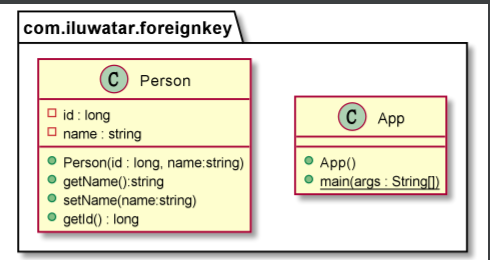

## Intent
Saves a database ID field in an object to maintain an identity between an in-memory object and a database row.

Representing the Identity Field in an Object:

The simplest form of Identity Field is a field that matches the type of key in the database. Thus, if you use a simple integral key, an integral field will work very nicely.

There are three basic choices to get the key:
- Get the database to auto-generate
- Use a GUID
- Generate your own

## Class diagram

## Applicability
Use the Identity-Field idiom when

* Use Identity Field when there’s a mapping between objects in memory and rows in a database.
 