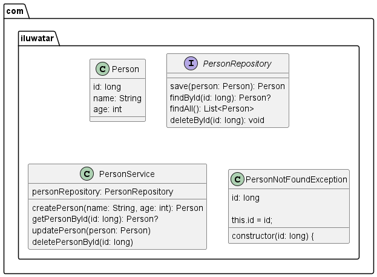

## Also known as

> P of EAA

## Intent

> Saves a database ID field in an object to maintain an identity between an in-memory object and a database row.

## Explanation

>The Identity Field design pattern is a structural design pattern that allows you to maintain the identity of an object between the application and the database. It is also known as P of EAA, which stands for Primary Key of Entity-Attribute-Association.

>The Identity Field design pattern works by adding a field to your object that matches the primary key of the corresponding database table. This field is then used to identify the object in the database.

## Class diagram

## Applicability

> Use Identity Field when there’s a mapping between objects in memory and rows in a database.

## Credits

* [P of EAA](https://martinfowler.com/eaaCatalog/identityField.html)
* [Identity field design pattern](https://www.sourcecodeexamples.net/2018/05/identity-field-pattern.html)