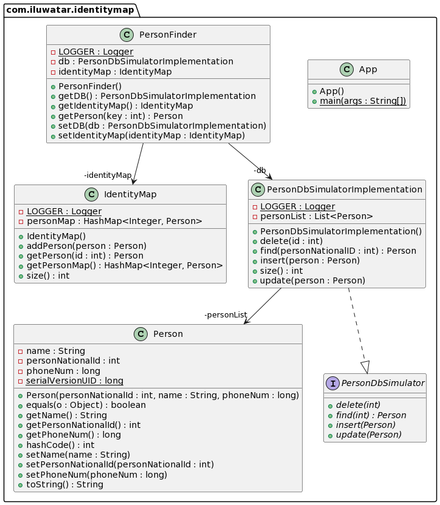

## Intent

Ensures that each object gets loaded only once by keeping every loaded object in a map. 
Looks up objects using the map when referring to them.

## Explanation

Real world example

> We are writing a program which the user may use to find the records of a given person in a database.

In plain words

> Construct an Identity map which stores the records of recently searched for items in the database. When we look
> for the same record next time load it from the map do not go to the database.

Wikipedia says

> In the design of DBMS, the identity map pattern is a database access design pattern used to improve performance by providing
a context-specific, in-memory cache to prevent duplicate retrieval of the same object data from the database

**Programmatic Example**

* For the purpose of this demonstration assume we have already created a database instance **db**.
* Let's first look at the implementation of a person entity, and it's fields:

```java
@EqualsAndHashCode(onlyExplicitlyIncluded = true)
@Getter
@Setter
@AllArgsConstructor
public final class Person implements Serializable {

  private static final long serialVersionUID = 1L;

  @EqualsAndHashCode.Include
  private int personNationalId;
  private String name;
  private long phoneNum;

  @Override
  public String toString() {

    return "Person ID is : " + personNationalId + " ; Person Name is : " + name + " ; Phone Number is :" + phoneNum;

  }

}

```

* The following is the implementation of the personFinder which is the entity that the user will utilize in order
to search for a record in our database. It has the relevant DB attached to it. It also maintains an IdentityMap
to store the recently read records.

```java
@Slf4j
@Getter
@Setter
public class PersonFinder {
  private static final long serialVersionUID = 1L;
  //  Access to the Identity Map
  private IdentityMap identityMap = new IdentityMap();
  private PersonDbSimulatorImplementation db = new PersonDbSimulatorImplementation();
  /**
   * get person corresponding to input ID.
   *
   * @param key : personNationalId to look for.
   */
  public Person getPerson(int key) {
    // Try to find person in the identity map
    Person person = this.identityMap.getPerson(key);
    if (person != null) {
      LOGGER.info("Person found in the Map");
      return person;
    } else {
      // Try to find person in the database
      person = this.db.find(key);
      if (person != null) {
        this.identityMap.addPerson(person);
        LOGGER.info("Person found in DB.");
        return person;
      }
      LOGGER.info("Person with this ID does not exist.");
      return null;
    }
  }
}

```

* The identity map field in the above class is simply an abstraction of a hashMap with **personNationalId**
as the keys and the corresponding person object as the value. Here is its implementation:

```java
@Slf4j
@Getter
public class IdentityMap {
  private Map<Integer, Person> personMap = new HashMap<>();
  /**
   * Add person to the map.
   */
  public void addPerson(Person person) {
    if (!personMap.containsKey(person.getPersonNationalId())) {
      personMap.put(person.getPersonNationalId(), person);
    } else { // Ensure that addPerson does not update a record. This situation will never arise in our implementation. Added only for testing purposes.
      LOGGER.info("Key already in Map");
    }
  }

  /**
   * Get Person with given id.
   *
   * @param id : personNationalId as requested by user.
   */
  public Person getPerson(int id) {
    Person person = personMap.get(id);
    if (person == null) {
      LOGGER.info("ID not in Map.");
    }
    return person;
  }

  /**
   * Get the size of the map.
   */
  public int size() {
    if (personMap == null) {
      return 0;
    }
    return personMap.size();
  }

}

```

* Now we should construct a dummy person for demonstration purposes and put that person in our database.

```java
  Person person1 = new Person(1, "John", 27304159);
  db.insert(person1);
```

* Now let's create a person finder object and look for person with personNationalId = 1(assume that the personFinder
object already has the db and an IdentityMap attached to it.):
  
```java
  PersonFinder finder = new PersonFinder();
  finder.getPerson(1);
```

* At this stage this record will be loaded from the database and the output would be:

```java
  ID not in Map.
  Person ID is:1;Person Name is:John;Phone Number is:27304159
  Person found in DB.
```

* However, the next we search for this record again we will find it in the map hence we will not need to go
to the database.

```java
  Person ID is:1;Person Name is:John;Phone Number is:27304159
  Person found in Map.
```

* If the corresponding record is not in the DB at all then an Exception is thrown. Here is its implementation.

```java
public class IdNotFoundException extends RuntimeException {
  public IdNotFoundException(final String message) {
    super(message);
  }
}
```
## Class diagram



## Applicability

* The idea behind the Identity Map pattern is that every time we read a record from the database,
  we first check the Identity Map to see if the record has already been retrieved.
  This allows us to simply return a new reference to the in-memory record rather than creating a new object,
  maintaining referential integrity.
* A secondary benefit to the Identity Map is that, since it acts as a cache,
  it reduces the number of database calls needed to retrieve objects, which yields a performance enhancement.

## Credits

* [Identity Map](https://www.sourcecodeexamples.net/2018/04/identity-map-pattern.html)
