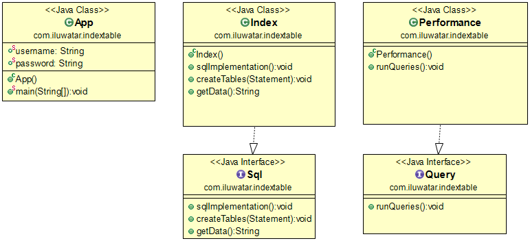

## Also known as
Cluster

## Intent
Create indexes over the fields in data stores that are frequently referenced by query criteria. This pattern can improve query performance by allowing applications to more quickly locate the data to retrieve from a data store.

## Applicability
Use Index Table pattern when

* Query performance needs to be improved when an application frequently needs to retrieve data by using a key other than the primary (or shard) key.

This pattern might not be suitable when

* Data is volatile.
* A field selected as the secondary key for an index table is very non-discriminating and can only have a small set of values.
* The balance of the data values for a field selected as the secondary key for an index table are highly skewed.

## Real world examples

* [java.lang.Object](https://docs.datastax.com/en/drivers/java/3.0/com/datastax/driver/core/schemabuilder/CreateIndex.html)

## Credits

* [Index Table Pattern](https://msdn.microsoft.com/en-us/library/dn589791.aspx)
