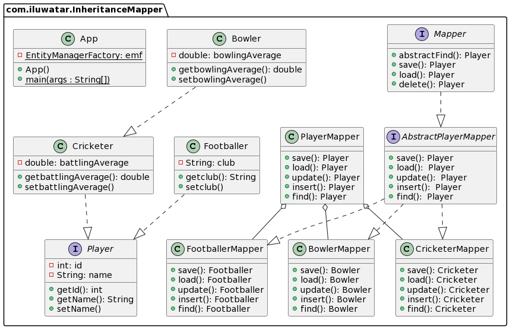

## Intent

Map all class's attribute to table based on the inheritance scheme chosen

## Explanation
In order to capture the inhiritance relationship of class hierarchy in a relational database, three mapping scheme can be us: <br/>
- Single Table Inheritance: Map all class in the hierarchy to the same table <br/>
- Class Table Inheritance: Each class is map to its own table containing its own attribute (inherited attribute is excluded). Join operation is needed to query object from the database<br/>
- Concrete Table Inheritance: Each class is map to its own table containing its own attribute and inherited attribute

## Class diagram



## Programmatic Example
Choosing an Inheritance scheme<br/>
To pick an Inheritance scheme, uncomment 1 of the following 3 @Inheritance annotation (Concrete Table Inheritance is chosen as an example)<br/>

| Annotation   | Second Header                |
|--------------|------------------------------|
| @Inheritance(strategy = InheritanceType.SINGLE_TABLE) | for Single Table Inheritance |
| @Inheritance(strategy = InheritanceType.JOINED) | for Class Table Inheritance  |
| @Inheritance(strategy = InheritanceType.TABLE_PER_CLASS) |for Concrete Table Inheritance                |
```java
//@Inheritance(strategy = InheritanceType.JOINED)
//@Inheritance(strategy = InheritanceType.SINGLE_TABLE)
@Inheritance(strategy = InheritanceType.TABLE_PER_CLASS)
@Table(name = "Player")
@DiscriminatorColumn(name = "PLAYER_TYPE")
public abstract class Player{
    ...
}
```
Finding object in database
```java
    PlayerMapper pm = new PlayerMapper();
    Player p = pm.find(1);//1 is the Player id
```
Inserting new object into a database
```java
    PlayerMapper pm = new PlayerMapper();
    Footballer f = new Footballer();
    f.setClub("lost apple tree");
    f.setName("lost apple");
    pm.insert(f);
```

Updating Object in database
```java
    PlayerMapper pm = new PlayerMapper();
    Footballer f = (Footballer) pm.find(1)
    f.setName("apple");
    f.setClub("apple tree")
    pm.update(f);
```

Deleting Object in database
```java
    PlayerMapper pm = new PlayerMapper();
    Footballer f = pm.find(1);
    pm.delete(f);
```

Use the Inheritance Mapper pattern when

* This is a general pattern use for Single Table Inheritance,  Class Table Inheritance and Concrete Table Inheritance.
* The usage of this pattern depend on the type of inheritance scheme needed

## Reference
https://books.google.fi/books?id=vqTfNFDzzdIC&pg=PA303#v=onepage&q&f=false


