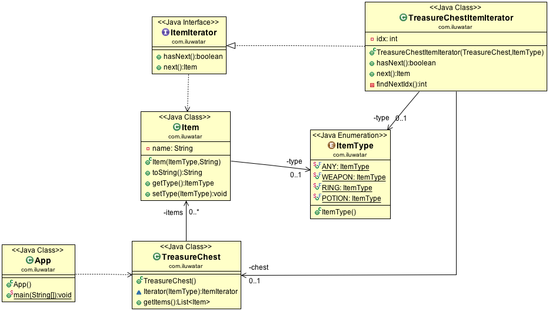

## Also known as

* Cursor

## Intent

The Iterator pattern provides a way to access elements of an aggregate object sequentially without exposing its underlying representation.

## Explanation

Real-world example

> Imagine visiting a library with a vast collection of books organized in different sections such as fiction, non-fiction, science, etc. Instead of searching through every shelf yourself, the librarian provides you with a specific guidebook or a digital catalog for each section. This guidebook acts as an "iterator," allowing you to go through the books section by section, or even skip to specific types of books, without needing to know how the books are organized on the shelves. Each guidebook handles the traversal through its section, providing a consistent and efficient way to access the books, much like how the Iterator design pattern offers a uniform method to traverse different data structures in a software application.

In plain words

> The Iterator design pattern provides a way to access the elements of a collection sequentially without exposing the underlying structure of the collection.

Wikipedia says

> In object-oriented programming, the iterator pattern is a design pattern in which an iterator is used to traverse a container and access the container's elements.

**Programmatic Example**

The main class in our example is the `TreasureChest` that contains items.

```java
public class TreasureChest {

  private final List<Item> items;

  public TreasureChest() {
    items = List.of(
        new Item(ItemType.POTION, "Potion of courage"),
        new Item(ItemType.RING, "Ring of shadows"),
        new Item(ItemType.POTION, "Potion of wisdom"),
        new Item(ItemType.POTION, "Potion of blood"),
        new Item(ItemType.WEAPON, "Sword of silver +1"),
        new Item(ItemType.POTION, "Potion of rust"),
        new Item(ItemType.POTION, "Potion of healing"),
        new Item(ItemType.RING, "Ring of armor"),
        new Item(ItemType.WEAPON, "Steel halberd"),
        new Item(ItemType.WEAPON, "Dagger of poison"));
  }

  public Iterator<Item> iterator(ItemType itemType) {
    return new TreasureChestItemIterator(this, itemType);
  }

  public List<Item> getItems() {
    return new ArrayList<>(items);
  }
}
```

Here's the `Item` class:

```java
public class Item {

  private ItemType type;
  private final String name;

  public Item(ItemType type, String name) {
    this.setType(type);
    this.name = name;
  }

  @Override
  public String toString() {
    return name;
  }

  public ItemType getType() {
    return type;
  }

  public final void setType(ItemType type) {
    this.type = type;
  }
}

public enum ItemType {

  ANY, WEAPON, RING, POTION

}
```

The `Iterator` interface is extremely simple.

```java
public interface Iterator<T> {

  boolean hasNext();

  T next();
}
```

In the following example, we demonstrate different kinds of iterators.

```java
@Slf4j
public class App {

    private static final TreasureChest TREASURE_CHEST = new TreasureChest();

    private static void demonstrateTreasureChestIteratorForType(ItemType itemType) {
        LOGGER.info("------------------------");
        LOGGER.info("Item Iterator for ItemType " + itemType + ": ");
        var itemIterator = TREASURE_CHEST.iterator(itemType);
        while (itemIterator.hasNext()) {
            LOGGER.info(itemIterator.next().toString());
        }
    }

    private static void demonstrateBstIterator() {
        LOGGER.info("------------------------");
        LOGGER.info("BST Iterator: ");
        var root = buildIntegerBst();
        var bstIterator = new BstIterator<>(root);
        while (bstIterator.hasNext()) {
            LOGGER.info("Next node: " + bstIterator.next().getVal());
        }
    }

    private static TreeNode<Integer> buildIntegerBst() {
        var root = new TreeNode<>(8);

        root.insert(3);
        root.insert(10);
        root.insert(1);
        root.insert(6);
        root.insert(14);
        root.insert(4);
        root.insert(7);
        root.insert(13);

        return root;
    }

    public static void main(String[] args) {
        demonstrateTreasureChestIteratorForType(RING);
        demonstrateTreasureChestIteratorForType(POTION);
        demonstrateTreasureChestIteratorForType(WEAPON);
        demonstrateTreasureChestIteratorForType(ANY);
        demonstrateBstIterator();
    }
}
```

Program output:

```
13:36:37.087 [main] INFO com.iluwatar.iterator.App -- ------------------------
13:36:37.089 [main] INFO com.iluwatar.iterator.App -- Item Iterator for ItemType RING: 
13:36:37.089 [main] INFO com.iluwatar.iterator.App -- Ring of shadows
13:36:37.089 [main] INFO com.iluwatar.iterator.App -- Ring of armor
13:36:37.089 [main] INFO com.iluwatar.iterator.App -- ------------------------
13:36:37.089 [main] INFO com.iluwatar.iterator.App -- Item Iterator for ItemType POTION: 
13:36:37.089 [main] INFO com.iluwatar.iterator.App -- Potion of courage
13:36:37.089 [main] INFO com.iluwatar.iterator.App -- Potion of wisdom
13:36:37.089 [main] INFO com.iluwatar.iterator.App -- Potion of blood
13:36:37.089 [main] INFO com.iluwatar.iterator.App -- Potion of rust
13:36:37.089 [main] INFO com.iluwatar.iterator.App -- Potion of healing
13:36:37.089 [main] INFO com.iluwatar.iterator.App -- ------------------------
13:36:37.089 [main] INFO com.iluwatar.iterator.App -- Item Iterator for ItemType WEAPON: 
13:36:37.089 [main] INFO com.iluwatar.iterator.App -- Sword of silver +1
13:36:37.089 [main] INFO com.iluwatar.iterator.App -- Steel halberd
13:36:37.089 [main] INFO com.iluwatar.iterator.App -- Dagger of poison
13:36:37.089 [main] INFO com.iluwatar.iterator.App -- ------------------------
13:36:37.089 [main] INFO com.iluwatar.iterator.App -- Item Iterator for ItemType ANY: 
13:36:37.089 [main] INFO com.iluwatar.iterator.App -- Potion of courage
13:36:37.089 [main] INFO com.iluwatar.iterator.App -- Ring of shadows
13:36:37.089 [main] INFO com.iluwatar.iterator.App -- Potion of wisdom
13:36:37.089 [main] INFO com.iluwatar.iterator.App -- Potion of blood
13:36:37.089 [main] INFO com.iluwatar.iterator.App -- Sword of silver +1
13:36:37.089 [main] INFO com.iluwatar.iterator.App -- Potion of rust
13:36:37.089 [main] INFO com.iluwatar.iterator.App -- Potion of healing
13:36:37.089 [main] INFO com.iluwatar.iterator.App -- Ring of armor
13:36:37.089 [main] INFO com.iluwatar.iterator.App -- Steel halberd
13:36:37.090 [main] INFO com.iluwatar.iterator.App -- Dagger of poison
13:36:37.090 [main] INFO com.iluwatar.iterator.App -- ------------------------
13:36:37.090 [main] INFO com.iluwatar.iterator.App -- BST Iterator: 
13:36:37.090 [main] INFO com.iluwatar.iterator.App -- Next node: 1
13:36:37.090 [main] INFO com.iluwatar.iterator.App -- Next node: 3
13:36:37.090 [main] INFO com.iluwatar.iterator.App -- Next node: 4
13:36:37.090 [main] INFO com.iluwatar.iterator.App -- Next node: 6
13:36:37.090 [main] INFO com.iluwatar.iterator.App -- Next node: 7
13:36:37.090 [main] INFO com.iluwatar.iterator.App -- Next node: 8
13:36:37.090 [main] INFO com.iluwatar.iterator.App -- Next node: 10
13:36:37.090 [main] INFO com.iluwatar.iterator.App -- Next node: 13
13:36:37.090 [main] INFO com.iluwatar.iterator.App -- Next node: 14
```

## Class diagram



## Applicability

Use the Iterator pattern

* To access an aggregate object's contents without exposing its internal representation.
* To support multiple traversals of aggregate objects.
* To provide a uniform interface for traversing different aggregate structures.

## Tutorials

* [Java - How to Use Iterator? (TutorialsPoint)](http://www.tutorialspoint.com/java/java_using_iterator.htm)

## Known uses

* Java Collections Framework utilizes iterators extensively to allow different ways to traverse through collections.
* Databases often use iterators to navigate through data records fetched through SQL queries.
* [java.util.Iterator](http://docs.oracle.com/javase/8/docs/api/java/util/Iterator.html)
* [java.util.Enumeration](http://docs.oracle.com/javase/8/docs/api/java/util/Enumeration.html)

## Consequences

Benefits:

* Reduces the coupling between data structures and algorithms used for iteration.
* Provides a uniform interface for iterating over various types of data structures, enhancing code reusability and flexibility.

Trade-offs:

* Overhead of using an iterator object may slightly reduce performance compared to direct traversal methods.
* Complex aggregate structures may require complex iterators that can be difficult to manage or extend.

## Related Patterns

* [Composite](https://java-design-patterns.com/patterns/composite/): Iterators are often used to traverse Composite trees.
* [Factory Method](https://java-design-patterns.com/patterns/factory-method/): Used to create appropriate iterators for different data structures.
* [Visitor](https://java-design-patterns.com/patterns/visitor/): Can be used with Iterator to apply operations over elements of an object structure.

## Credits

* [Design Patterns: Elements of Reusable Object-Oriented Software](https://amzn.to/3w0pvKI)
* [Head First Design Patterns: Building Extensible and Maintainable Object-Oriented Software](https://amzn.to/49NGldq)
