<!-- vim-markdown-toc GFM -->

* [abstract-document](#abstract-document)
* [abstract-factory](#abstract-factory)
* [acyclic-visitor](#acyclic-visitor)
* [adapter](#adapter)
* [aggregator-microservices](#aggregator-microservices)
* [ambassador](#ambassador)
* [api-gateway](#api-gateway)
* [async-method-invocation](#async-method-invocation)
* [balking](#balking)
* [bridge](#bridge)
* [builder](#builder)
* [business-delegate](#business-delegate)
* [caching](#caching)
* [callback](#callback)
* [chain](#chain)
* [collection-pipeline](#collection-pipeline)
* [command](#command)
* [composite](#composite)
* [converter](#converter)
* [cqrs](#cqrs)
* [dao](#dao)
* [data-bus](#data-bus)
* [data-mapper](#data-mapper)
* [data-transfer-object](#data-transfer-object)
* [decorator](#decorator)
* [delegation](#delegation)
* [dependency-injection](#dependency-injection)
* [dirty-flag](#dirty-flag)
* [double-checked-locking](#double-checked-locking)
* [double-dispatch](#double-dispatch)
* [eip-aggregator](#eip-aggregator)
* [eip-message-channel](#eip-message-channel)
* [eip-publish-subscribe](#eip-publish-subscribe)
* [eip-splitter](#eip-splitter)
* [eip-wire-tap](#eip-wire-tap)
* [event-aggregator](#event-aggregator)
* [event-asynchronous](#event-asynchronous)
* [event-driven-architecture](#event-driven-architecture)
* [event-queue](#event-queue)
* [event-sourcing](#event-sourcing)
* [execute-around](#execute-around)
* [extension-objects](#extension-objects)
* [facade](#facade)
* [factory-kit](#factory-kit)
* [factory-method](#factory-method)
* [feature-toggle](#feature-toggle)
* [fluentinterface](#fluentinterface)
* [flux](#flux)
* [flyweight](#flyweight)
* [front-controller](#front-controller)
* [guarded-suspension](#guarded-suspension)
* [half-sync-half-async](#half-sync-half-async)
* [hexagonal](#hexagonal)
* [intercepting-filter](#intercepting-filter)
* [interpreter](#interpreter)
* [iterator](#iterator)
* [layers](#layers)
* [lazy-loading](#lazy-loading)
* [marker](#marker)
* [master-worker-pattern](#master-worker-pattern)
* [mediator](#mediator)
* [memento](#memento)
* [model-view-controller](#model-view-controller)
* [model-view-presenter](#model-view-presenter)
* [module](#module)
* [monad](#monad)
* [monostate](#monostate)
* [multiton](#multiton)
* [mute-idiom](#mute-idiom)
* [mutex](#mutex)
* [naked-objects](#naked-objects)
* [null-object](#null-object)
* [object-mother](#object-mother)
* [object-pool](#object-pool)
* [observer](#observer)
* [page-object](#page-object)
* [partial-response](#partial-response)
* [poison-pill](#poison-pill)
* [private-class-data](#private-class-data)
* [producer-consumer](#producer-consumer)
* [promise](#promise)
* [property](#property)
* [prototype](#prototype)
* [proxy](#proxy)
* [queue-load-leveling](#queue-load-leveling)
* [reactor](#reactor)
* [reader-writer-lock](#reader-writer-lock)
* [repository](#repository)
* [resource-acquisition-is-initialization](#resource-acquisition-is-initialization)
* [retry](#retry)
* [semaphore](#semaphore)
* [servant](#servant)
* [serverless](#serverless)
* [service-layer](#service-layer)
* [service-locator](#service-locator)
* [singleton](#singleton)
* [spatial-partition](#spatial-partition)
* [specification](#specification)
* [state](#state)
* [step-builder](#step-builder)
* [strategy](#strategy)
* [template-method](#template-method)
* [thread-pool](#thread-pool)
* [throttling](#throttling)
* [tls](#tls)
* [tolerant-reader](#tolerant-reader)
* [trampoline](#trampoline)
* [twin](#twin)
* [unit-of-work](#unit-of-work)
* [value-object](#value-object)
* [visitor](#visitor)

## abstract-document
[abstract-document/README.md](abstract-document/README.md)

## abstract-factory
[abstract-factory/README.md](abstract-factory/README.md)

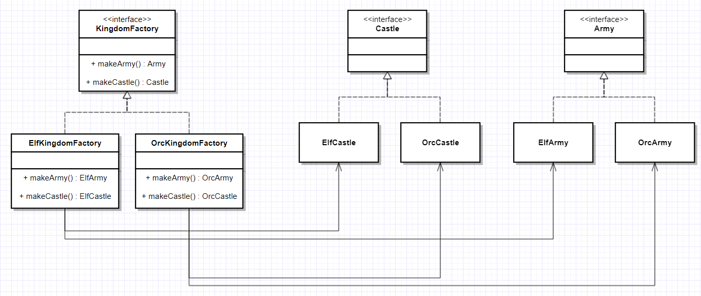

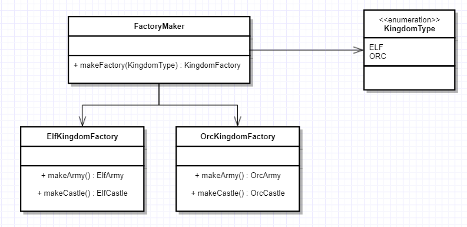

[abstract-factory/etc/presentation.html](abstract-factory/etc/presentation.html)

## acyclic-visitor
[acyclic-visitor/README.md](acyclic-visitor/README.md)

## adapter
[adapter/README.md](adapter/README.md)

## aggregator-microservices
[aggregator-microservices/README.md](aggregator-microservices/README.md)

## ambassador
[ambassador/README.md](ambassador/README.md)

## api-gateway
[api-gateway/README.md](api-gateway/README.md)

## async-method-invocation
[async-method-invocation/README.md](async-method-invocation/README.md)

## balking
[balking/README.md](balking/README.md)

## bridge
[bridge/README.md](bridge/README.md)

## builder
[builder/README.md](builder/README.md)

## business-delegate
[business-delegate/README.md](business-delegate/README.md)

## caching
[caching/README.md](caching/README.md)

## callback
[callback/README.md](callback/README.md)

## chain
[chain/README.md](chain/README.md)

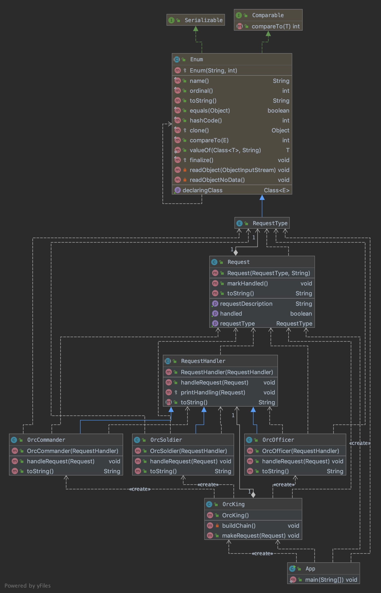

## collection-pipeline
[collection-pipeline/README.md](collection-pipeline/README.md)

## command
[command/README.md](command/README.md)

[command/etc/presentation.html](command/etc/presentation.html)

## composite
[composite/README.md](composite/README.md)

## converter
[converter/README.md](converter/README.md)

## cqrs
[cqrs/README.md](cqrs/README.md)

## dao
[dao/README.md](dao/README.md)

## data-bus
[data-bus/README.md](data-bus/README.md)

## data-mapper
[data-mapper/README.md](data-mapper/README.md)

## data-transfer-object
[data-transfer-object/README.md](data-transfer-object/README.md)

## decorator
[decorator/README.md](decorator/README.md)

## delegation
[delegation/README.md](delegation/README.md)

## dependency-injection
[dependency-injection/README.md](dependency-injection/README.md)

## dirty-flag
[dirty-flag/README.md](dirty-flag/README.md)

## double-checked-locking
[double-checked-locking/README.md](double-checked-locking/README.md)

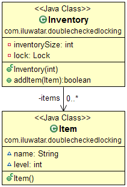

## double-dispatch
[double-dispatch/README.md](double-dispatch/README.md)

## eip-aggregator
[eip-aggregator/README.md](eip-aggregator/README.md)

## eip-message-channel
[eip-message-channel/README.md](eip-message-channel/README.md)

## eip-publish-subscribe
[eip-publish-subscribe/README.md](eip-publish-subscribe/README.md)

## eip-splitter
[eip-splitter/README.md](eip-splitter/README.md)

## eip-wire-tap
[eip-wire-tap/README.md](eip-wire-tap/README.md)

## event-aggregator
[event-aggregator/README.md](event-aggregator/README.md)

## event-asynchronous
[event-asynchronous/README.md](event-asynchronous/README.md)

## event-driven-architecture
[event-driven-architecture/README.md](event-driven-architecture/README.md)

## event-queue
[event-queue/README.md](event-queue/README.md)

## event-sourcing
[event-sourcing/README.md](event-sourcing/README.md)

## execute-around
[execute-around/README.md](execute-around/README.md)

## extension-objects
[extension-objects/README.md](extension-objects/README.md)

## facade
[facade/README.md](facade/README.md)

## factory-kit
[factory-kit/README.md](factory-kit/README.md)

## factory-method
[factory-method/README.md](factory-method/README.md)

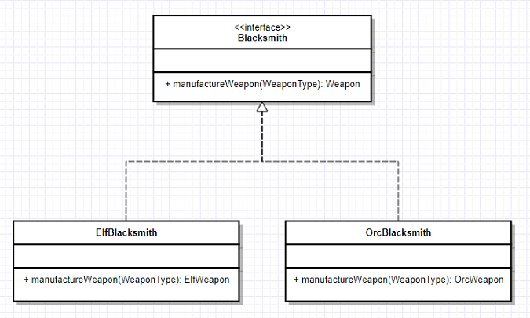

[factory-method/etc/presentation.html](factory-method/etc/presentation.html)

## feature-toggle
[feature-toggle/README.md](feature-toggle/README.md)

## fluentinterface
[fluentinterface/README.md](fluentinterface/README.md)

## flux
[flux/README.md](flux/README.md)

## flyweight
[flyweight/README.md](flyweight/README.md)

## front-controller
[front-controller/README.md](front-controller/README.md)

## guarded-suspension
[guarded-suspension/README.md](guarded-suspension/README.md)

## half-sync-half-async
[half-sync-half-async/README.md](half-sync-half-async/README.md)

## hexagonal
[hexagonal/README.md](hexagonal/README.md)

[hexagonal/etc/presentation.html](hexagonal/etc/presentation.html)

## intercepting-filter
[intercepting-filter/README.md](intercepting-filter/README.md)

## interpreter
[interpreter/README.md](interpreter/README.md)

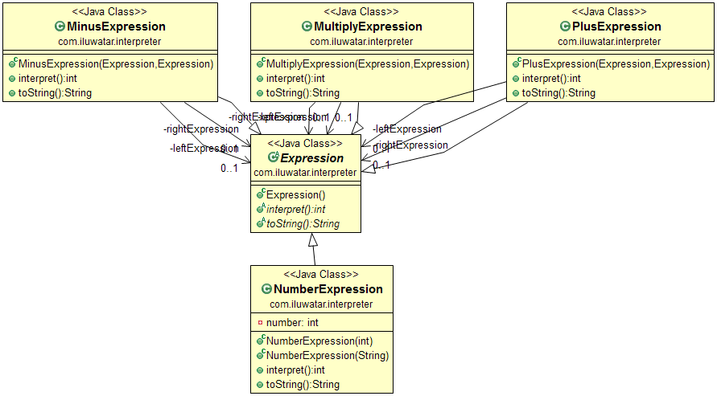

## iterator
[iterator/README.md](iterator/README.md)

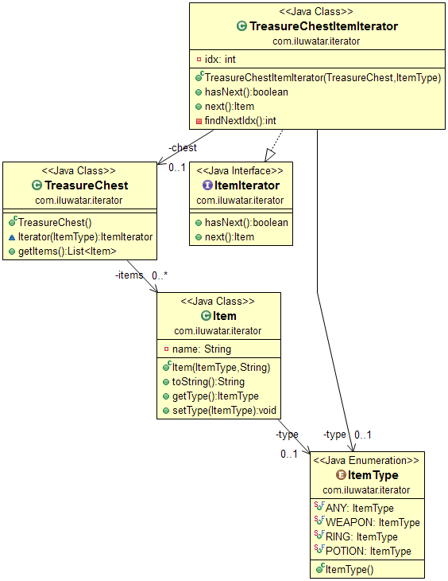

## layers
[layers/README.md](layers/README.md)

## lazy-loading
[lazy-loading/README.md](lazy-loading/README.md)

## marker
[marker/README.md](marker/README.md)

## master-worker-pattern
[master-worker-pattern/README.md](master-worker-pattern/README.md)

## mediator
[mediator/README.md](mediator/README.md)

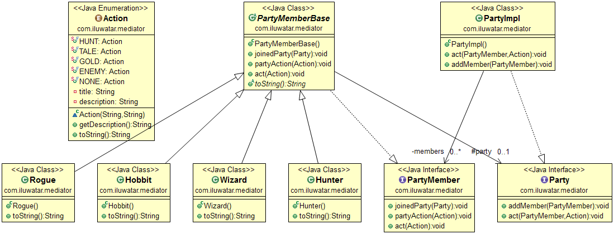

## memento
[memento/README.md](memento/README.md)

## model-view-controller
[model-view-controller/README.md](model-view-controller/README.md)

## model-view-presenter
[model-view-presenter/README.md](model-view-presenter/README.md)

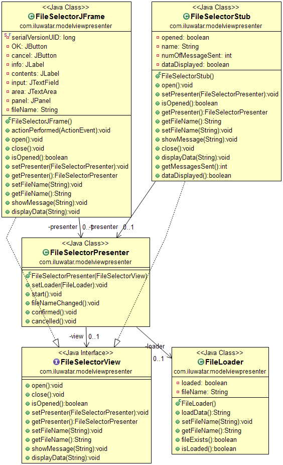

## module
[module/README.md](module/README.md)

## monad
[monad/README.md](monad/README.md)

## monostate
[monostate/README.md](monostate/README.md)

## multiton
[multiton/README.md](multiton/README.md)

## mute-idiom
[mute-idiom/README.md](mute-idiom/README.md)

## mutex
[mutex/README.md](mutex/README.md)

## naked-objects
[naked-objects/README.md](naked-objects/README.md)

## null-object
[null-object/README.md](null-object/README.md)

## object-mother
[object-mother/README.md](object-mother/README.md)

## object-pool
[object-pool/README.md](object-pool/README.md)

## observer
[observer/README.md](observer/README.md)

## page-object
[page-object/README.md](page-object/README.md)

## partial-response
[partial-response/README.md](partial-response/README.md)

## poison-pill
[poison-pill/README.md](poison-pill/README.md)

## private-class-data
[private-class-data/README.md](private-class-data/README.md)

## producer-consumer
[producer-consumer/README.md](producer-consumer/README.md)

## promise
[promise/README.md](promise/README.md)

## property
[property/README.md](property/README.md)

## prototype
[prototype/README.md](prototype/README.md)

## proxy
[proxy/README.md](proxy/README.md)

[proxy/etc/presentation.html](proxy/etc/presentation.html)

## queue-load-leveling
[queue-load-leveling/README.md](queue-load-leveling/README.md)

## reactor
[reactor/README.md](reactor/README.md)

## reader-writer-lock
[reader-writer-lock/README.md](reader-writer-lock/README.md)

## repository
[repository/README.md](repository/README.md)

## resource-acquisition-is-initialization
[resource-acquisition-is-initialization/README.md](resource-acquisition-is-initialization/README.md)

## retry
[retry/README.md](retry/README.md)

## semaphore
[semaphore/README.md](semaphore/README.md)

## servant
[servant/README.md](servant/README.md)

## serverless
[serverless/README.md](serverless/README.md)

## service-layer
[service-layer/README.md](service-layer/README.md)

## service-locator
[service-locator/README.md](service-locator/README.md)

## singleton
[singleton/README.md](singleton/README.md)

## spatial-partition
[spatial-partition/README.md](spatial-partition/README.md)

## specification
[specification/README.md](specification/README.md)

## state
[state/README.md](state/README.md)

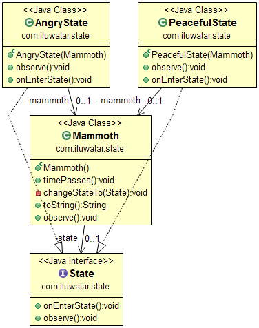

## step-builder
[step-builder/README.md](step-builder/README.md)

## strategy
[strategy/README.md](strategy/README.md)

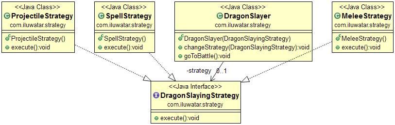

## template-method
[template-method/README.md](template-method/README.md)

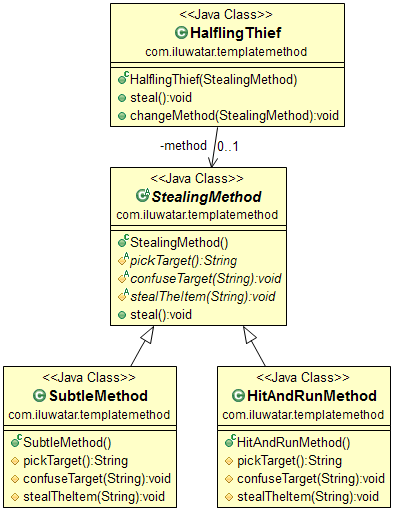

## thread-pool
[thread-pool/README.md](thread-pool/README.md)

## throttling
[throttling/README.md](throttling/README.md)

## tls
[tls/README.md](tls/README.md)

## tolerant-reader
[tolerant-reader/README.md](tolerant-reader/README.md)

## trampoline
[trampoline/README.md](trampoline/README.md)

## twin
[twin/README.md](twin/README.md)

## unit-of-work
[unit-of-work/README.md](unit-of-work/README.md)

## value-object
[value-object/README.md](value-object/README.md)

## visitor
[visitor/README.md](visitor/README.md)

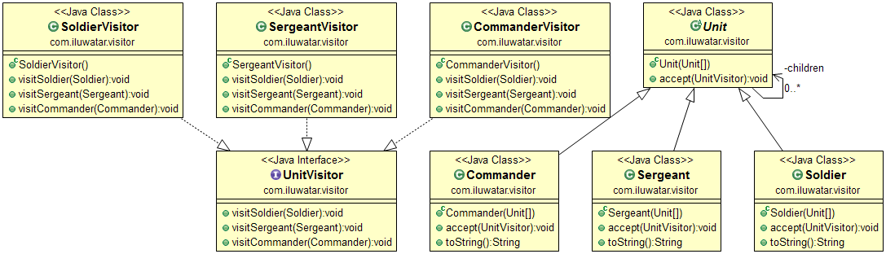

