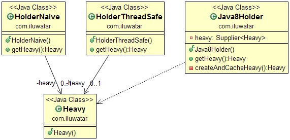

## Intent
Lazy loading is a design pattern commonly used to defer
initialization of an object until the point at which it is needed. It can
contribute to efficiency in the program's operation if properly and
appropriately used.

## Class diagram

## Applicability
Use the Lazy Loading idiom when

* eager loading is expensive or the object to be loaded might not be needed at all

## Real world examples

* JPA annotations @OneToOne, @OneToMany, @ManyToOne, @ManyToMany and fetch = FetchType.LAZY

## Credits

* [J2EE Design Patterns](https://www.amazon.com/gp/product/0596004273/ref=as_li_tl?ie=UTF8&camp=1789&creative=9325&creativeASIN=0596004273&linkCode=as2&tag=javadesignpat-20&linkId=48d37c67fb3d845b802fa9b619ad8f31)
* [Patterns of Enterprise Application Architecture](https://www.amazon.com/gp/product/0321127420/ref=as_li_tl?ie=UTF8&camp=1789&creative=9325&creativeASIN=0321127420&linkCode=as2&tag=javadesignpat-20&linkId=d9f7d37b032ca6e96253562d075fcc4a)
