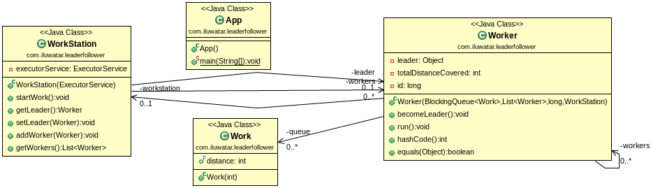

**Intent:** Leader Follower is a concurrency pattern where multiple threads can efficiently demultiplex
 events and dispatch to event handlers.

**Applicability:** Use the Leader Follower pattern when

* multiple threads can receive events , process reponses and demutiplex connection using a shared HandleSet. 
