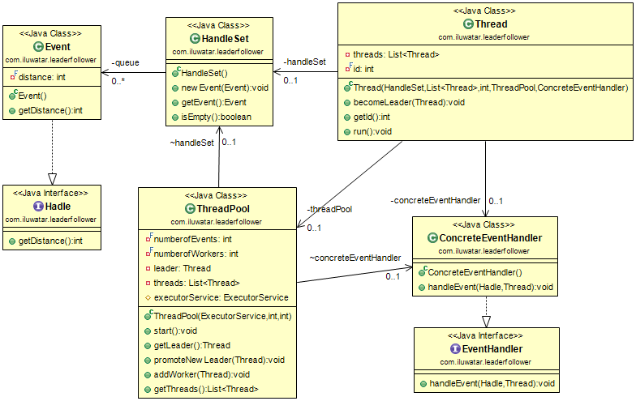

## Intent
The Leader/Follower pattern simplifies the programming
of concurrency models where multiple threads can receive requests, process
responses, and demultiplex connections using a shared handle set.

## Applicability
Use the Leader/Followers pattern when:

* you have a large number of short-lived tasks s that arrive simultaneously.

