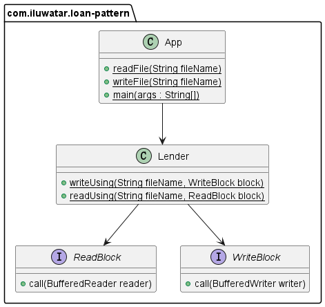

## Also known as

Lender lendee pattern

## Intent

Implement separation between the code that holds resource from that of accessing it such that the accessing code does
not need to manage the resources.

## Explanation

Real-world example

> We want to write the numbers 0 to 9 to a specified file. After successful writing, we read the numbers 0 to 9 from the file.

In plain words

> The lender helps users manage resources. Users only need to define the use of resources.

**Programmatic Example**

Let's first look at the Lender class which helps users manage resources.

```java
public class Lender {

    public static void writeUsing(String fileName, WriteBlock block) throws IOException {
        // helps users create a file and a BufferedWriter instance.
        File file = new File(fileName);
        if (!file.exists()) {
            file.createNewFile();
        }
        FileWriter fw = new FileWriter(file.getAbsoluteFile(), true);
        BufferedWriter bufferedWriter = new BufferedWriter(fw);
        try {
            // execute user-defined logic.
            block.call(bufferedWriter);
        } finally {
            // helps users close the resource.
            bufferedWriter.close();
        }
    }

    public static void readUsing(String fileName, ReadBlock block) throws IOException {
        // helps users create a BufferedReader instance.
        File file = new File(fileName);
        FileReader fr = new FileReader(file.getAbsoluteFile());
        BufferedReader bufferedReader = new BufferedReader(fr);
        try {
            // execute user-defined logic
            block.call(bufferedReader);
        } finally {
            // helps users close the resource.
            bufferedReader.close();
        }
    }
}
```

Next, we present two interfaces `ReadBlock` defining the logic of reading and operating the data from a file
and `WriteBlock`defining the logic of writing data to a file.

```java
public interface ReadBlock {
    void call(BufferedReader reader) throws IOException;
}

public interface WriteBlock {
    void call(BufferedWriter writer) throws IOException;
}
```

Now we are ready to show the full example in action.

```java
public class App {
    public static void main(String[] args) throws IOException {
        // export data to the given file
        writeFile("loan-pattern/src/main/resources/data.txt");
        // get data from the given file
        readFile("loan-pattern/src/main/resources/data.txt");
    }

    public static void writeFile(String fileName) throws IOException {
        Lender.writeUsing(fileName,
                new WriteBlock() {
                    public void call(BufferedWriter out) throws IOException {
                        // define what data should be written to the file
                        for (int i = 0; i < 10; i++) {
                            out.append(i + "");
                            out.newLine();
                        }
                    }
                });
    }

    public static void readFile(String fileName) throws IOException {
        Lender.readUsing(fileName,
                new ReadBlock() {
                    @Override
                    public void call(BufferedReader reader) throws IOException {
                        while (reader.ready()) {
                            // the way how to read the data
                            String s = reader.readLine();
                            // the way how to operate the data
                            System.out.println(s);
                        }
                    }
                });
    }
}
```

## Class diagram



## Applicability

Use the Loan Pattern when you need to operate resources

## Credits

* [ScalaKnol: Understanding Loan Pattern](https://blog.knoldus.com/scalaknol-understanding-loan-pattern/)
* [Loan pattern in Java(a.k.a lender lendee pattern)](https://www.javacodegeeks.com/2013/01/loan-pattern-in-java-a-k-a-lender-lendee-pattern.html)
