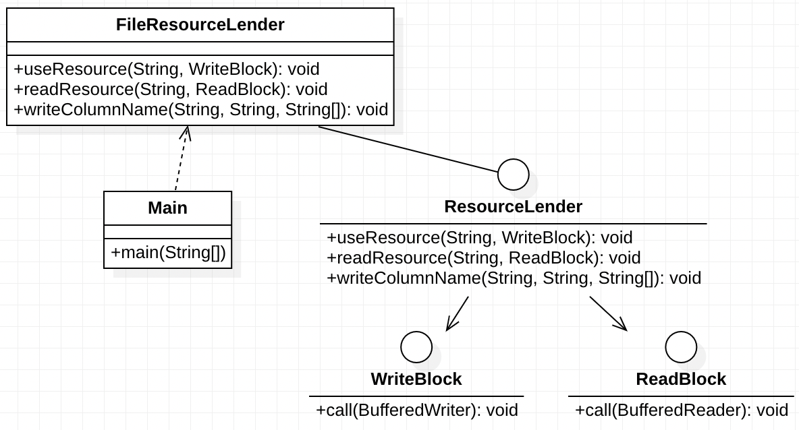

## Intent
Loan pattern is commonly used in financial system design. It helps ensure that loan objects are created and managed correctly, allowing for accurate calculation of interest, repayments, and other crucial financial metrics, without leading to data inconsistencies or inaccuracies.

## Class diagram

## Applicability
Use the Loan pattern when:

you are designing a system that handles various types of loans, such as personal loans, mortgages, auto loans, etc.
there's a need to accurately track and manage loan lifecycle events like disbursement, repayments, and foreclosure.
Do not use the Loan pattern when:

the financial domain of your system is simple and doesn't need a dedicated structure for managing loans.
the system has other primary focuses and loans are just a small aspect that can be managed without a dedicated pattern.

## Real world examples

## Credits

* [Loan pattern](https://www.javacodegeeks.com/2013/01/loan-pattern-in-java-a-k-a-lender-lendee-pattern.html)
