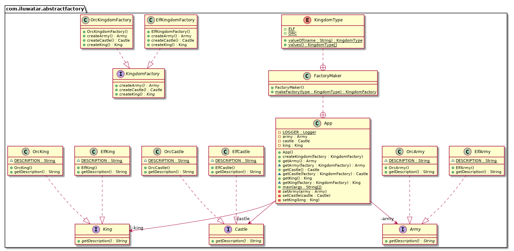

## يُعرف أيضًا باسم

Kit

## الهدف

توفير واجهة لإنشاء عائلات من الكائنات المرتبطة المعتمدة دون تحديد فئتها المحددة.

## التوضيح

مثال من العالم الحقيقي

> لإنشاء مملكة نحتاج إلى كائنات بموضوع مشترك. المملكة الإلفية تحتاج إلى ملك إلفي، وقلعة إلفية، وجيش إلفي، بينما المملكة الأوركية تحتاج إلى ملك أوركي، وقلعة أوركية، وجيش أوركي. هناك اعتماد بين كائنات المملكة.

بصيغة أخرى

> مصنع للمصانع؛ مصنع يجمع بين مصانع فردية ولكنها مرتبطة/معتمدة دون تحديد فئتها المحددة.

حسب ويكيبيديا

> يوفر نمط المصنع المجرد طريقة لتغليف مجموعة من المصانع الفردية التي لها موضوع مشترك دون تحديد فئاتها المحددة.

**مثال برمجي**

ترجمة المثال السابق حول الممالك. أولاً لدينا بعض الواجهات والتنفيذات لكائنات `Castle`.


```java
public interface Castle {
  String getDescription();
}

public interface King {
  String getDescription();
}

public interface Army {
  String getDescription();
}

// Elven implementations ->
public class ElfCastle implements Castle {
  static final String DESCRIPTION = "This is the elven castle!";
  @Override
  public String getDescription() {
    return DESCRIPTION;
  }
}
public class ElfKing implements King {
  static final String DESCRIPTION = "This is the elven king!";
  @Override
  public String getDescription() {
    return DESCRIPTION;
  }
}
public class ElfArmy implements Army {
  static final String DESCRIPTION = "This is the elven Army!";
  @Override
  public String getDescription() {
    return DESCRIPTION;
  }
}

// التنفيذات Orcish بطريقة مشابهة
-> ...

```

ثم لدينا التجريد والتنفيذ لمصنع المملكة `KingdomFactory`.


```java
public interface KingdomFactory {
  Castle createCastle();
  King createKing();
  Army createArmy();
}

public class ElfKingdomFactory implements KingdomFactory {

  @Override
  public Castle createCastle() {
    return new ElfCastle();
  }

  @Override
  public King createKing() {
    return new ElfKing();
  }

  @Override
  public Army createArmy() {
    return new ElfArmy();
  }
}

public class OrcKingdomFactory implements KingdomFactory {

  @Override
  public Castle createCastle() {
    return new OrcCastle();
  }

  @Override
  public King createKing() {
    return new OrcKing();
  }
  
  @Override
  public Army createArmy() {
    return new OrcArmy();
  }
}
```

الآن لدينا المصنع المجرد الذي يسمح لنا بإنشاء عائلات من الكائنات المرتبطة. على سبيل المثال، مصنع المملكة الإلفية `ElfKingdomFactory` يقوم بإنشاء القلعة `castle`، الملك `king`، والجيش `army`، إلخ.


```java
var factory = new ElfKingdomFactory();
var castle = factory.createCastle();
var king = factory.createKing();
var army = factory.createArmy();

castle.getDescription();
king.getDescription();
army.getDescription();
```

ناتج البرنامج:


```java
This is the elven castle!
This is the elven king!
This is the elven Army!
```

الآن يمكننا تصميم مصنع لمصانع الممالك الخاصة بنا. في هذا المثال، قمنا بإنشاء `FactoryMaker`، المسؤول عن إعادة نسخة من `ElfKingdomFactory` أو `OrcKingdomFactory`.  
يمكن للعميل استخدام `FactoryMaker` لإنشاء مصنع محدد، والذي بدوره سينتج كائنات محددة مختلفة (مشتقة من `Army` و `King` و `Castle`).  
في هذا المثال نستخدم أيضًا `enum` لتمرير نوع مصنع المملكة الذي سيطلبه العميل.


```java
public static class FactoryMaker {

    public enum KingdomType {
        ELF, ORC
    }

    public static KingdomFactory makeFactory(KingdomType type) {
        return switch (type) {
            case ELF -> new ElfKingdomFactory();
            case ORC -> new OrcKingdomFactory();
            default -> throw new IllegalArgumentException("KingdomType not supported.");
        };
    }
}

    public static void main(String[] args) {
        var app = new App();

        LOGGER.info("Elf Kingdom");
        app.createKingdom(FactoryMaker.makeFactory(KingdomType.ELF));
        LOGGER.info(app.getArmy().getDescription());
        LOGGER.info(app.getCastle().getDescription());
        LOGGER.info(app.getKing().getDescription());

        LOGGER.info("Orc Kingdom");
        app.createKingdom(FactoryMaker.makeFactory(KingdomType.ORC));
        --similar use of the orc factory
    }
```

## مخطط الفئات




## التطبيق

استخدم نمط المصنع المجرد عندما:

* يجب أن يكون النظام غير متحيز حول كيفية إنشاء وتركيب وتمثيل كائناته.
* يجب تكوين النظام مع إحدى عائلات المنتجات المتعددة.
* تم تصميم عائلة الكائنات المرتبطة لتستخدم معًا وتحتاج إلى فرض هذا الافتراض.
* ترغب في توفير مكتبة من المنتجات ولا تريد الكشف عن تنفيذاتها، بل واجهاتها فقط.
* العمر الافتراضي للاعتماد هو مفهومًا أقصر من عمر العميل.
* تحتاج إلى قيمة في وقت التشغيل لبناء الاعتماد.
* تريد تحديد أي منتج من العائلة يتم استدعاؤه في وقت التشغيل.
* تحتاج إلى توفير واحد أو أكثر من المعلمات المعروفة فقط في وقت التشغيل قبل أن تتمكن من حل الاعتماد.
* تحتاج إلى الاتساق بين المنتجات.
* لا تريد تغيير الكود الموجود عند إضافة منتجات أو عائلات جديدة من المنتجات إلى البرنامج.

أمثلة على حالات الاستخدام

* اختيار استدعاء التنفيذ الصحيح لـ FileSystemAcmeService أو DatabaseAcmeService أو NetworkAcmeService في وقت التشغيل.
* كتابة الاختبارات الوحدوية تصبح أسهل بكثير.
* أدوات واجهة المستخدم (UI) لأنظمة تشغيل مختلفة (SO).

## العواقب

* إخفاء حقن الاعتمادات في جافا داخل كائنات الخدمة قد يؤدي إلى أخطاء في وقت التشغيل كان يمكن تجنبها في وقت الترجمة.
* بينما يكون النمط جيدًا في إنشاء كائنات محددة مسبقًا، قد يكون من الصعب إضافة الجديدة.
* الكود يصبح أكثر تعقيدًا مما ينبغي لأنه يتم إضافة العديد من الواجهات والفئات الجديدة جنبًا إلى جنب مع النمط.

## الدروس التعليمية

* [Abstract Factory Pattern Tutorial](https://www.journaldev.com/1418/abstract-factory-design-pattern-in-java) 

## الاستخدامات المعروفة

* [javax.xml.parsers.DocumentBuilderFactory](http://docs.oracle.com/javase/8/docs/api/javax/xml/parsers/DocumentBuilderFactory.html)
* [javax.xml.transform.TransformerFactory](http://docs.oracle.com/javase/8/docs/api/javax/xml/transform/TransformerFactory.html#newInstance--)
* [javax.xml.xpath.XPathFactory](http://docs.oracle.com/javase/8/docs/api/javax/xml/xpath/XPathFactory.html#newInstance--)

## الأنماط المتعلقة

* [Factory Method](https://java-design-patterns.com/patterns/factory-method/)
* [Factory Kit](https://java-design-patterns.com/patterns/factory-kit/)

## الحقوق

* [Design Patterns: Elements of Reusable Object-Oriented Software](https://www.amazon.com/gp/product/0201633612/ref=as_li_tl?ie=UTF8&camp=1789&creative=9325&creativeASIN=0201633612&linkCode=as2&tag=javadesignpat-20&linkId=675d49790ce11db99d90bde47f1aeb59)
* [Head First Design Patterns: A Brain-Friendly Guide](https://www.amazon.com/gp/product/0596007124/ref=as_li_tl?ie=UTF8&camp=1789&creative=9325&creativeASIN=0596007124&linkCode=as2&tag=javadesignpat-20&linkId=6b8b6eea86021af6c8e3cd3fc382cb5b)
