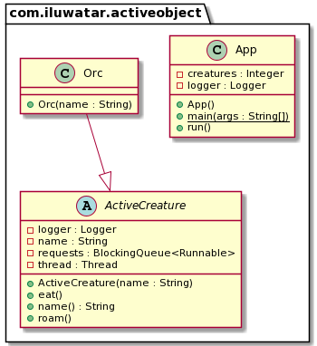

## الهدف
يفصل نمط التصميم الكائن النشط بين تنفيذ الطريقة واستدعائها للكائنات التي تعمل في خيط تحكم خاص بها. الهدف هو إدخال التزامن باستخدام استدعاءات الطرق غير المتزامنة وجدولة لإدارة الطلبات.

## التوضيح

ستحتوي الفئة التي تنفذ نمط التصميم الكائن النشط على آلية مزامنة ذاتية دون استخدام الطرق المتزامنة (synchronized).

مثال من العالم الحقيقي

> الأورك معروفون بوحشيتهم وفلسفتهم في عدم العمل الجماعي. بناءً على هذا السلوك، يمكن القول إن لديهم خيط تحكم خاص بهم.

يمكننا استخدام نمط الكائن النشط لتنفيذ مخلوق لديه خيط تحكم خاص به ويعرض واجهة برمجة التطبيقات (API) الخاصة به، ولكن ليس التنفيذ نفسه.

**مثال برمجي**


```java
public abstract class ActiveCreature{
  private final Logger logger = LoggerFactory.getLogger(ActiveCreature.class.getName());

  private BlockingQueue<Runnable> requests;
  
  private String name;
  
  private Thread thread;

  public ActiveCreature(String name) {
    this.name = name;
    this.requests = new LinkedBlockingQueue<Runnable>();
    thread = new Thread(new Runnable() {
        @Override
        public void run() {
          while (true) {
            try {
              requests.take().run();
            } catch (InterruptedException e) { 
              logger.error(e.getMessage());
            }
          }
        }
      }
    );
    thread.start();
  }
  
  public void eat() throws InterruptedException {
    requests.put(new Runnable() {
        @Override
        public void run() { 
          logger.info("{} is eating!",name());
          logger.info("{} has finished eating!",name());
        }
      }
    );
  }

  public void roam() throws InterruptedException {
    requests.put(new Runnable() {
        @Override
        public void run() { 
          logger.info("{} has started to roam the wastelands.",name());
        }
      }
    );
  }
  
  public String name() {
    return this.name;
  }
}
```
يمكننا أن نرى أن أي فئة تمتد من ActiveCreature سيكون لديها خيط تحكم خاص بها لاستدعاء وتنفيذ الطرق.

على سبيل المثال، الفئة Orc:

```java
public class Orc extends ActiveCreature {

  public Orc(String name) {
    super(name);
  }

}
```
الآن يمكننا إنشاء مخلوقات متعددة مثل الأورك، نطلب منهم الأكل والتجول، وسيفعلون ذلك في خيط التحكم الخاص بهم:

```java
  public static void main(String[] args) {  
    var app = new App();
    app.run();
  }
  
  @Override
  public void run() {
    ActiveCreature creature;
    try {
      for (int i = 0;i < creatures;i++) {
        creature = new Orc(Orc.class.getSimpleName().toString() + i);
        creature.eat();
        creature.roam();
      }
      Thread.sleep(1000);
    } catch (InterruptedException e) {
      logger.error(e.getMessage());
    }
    Runtime.getRuntime().exit(1);
  }
```

## مخطط الفئات  



## الدروس التعليمية

* [Android and Java Concurrency: The Active Object Pattern](https://www.youtube.com/watch?v=Cd8t2u5Qmvc)