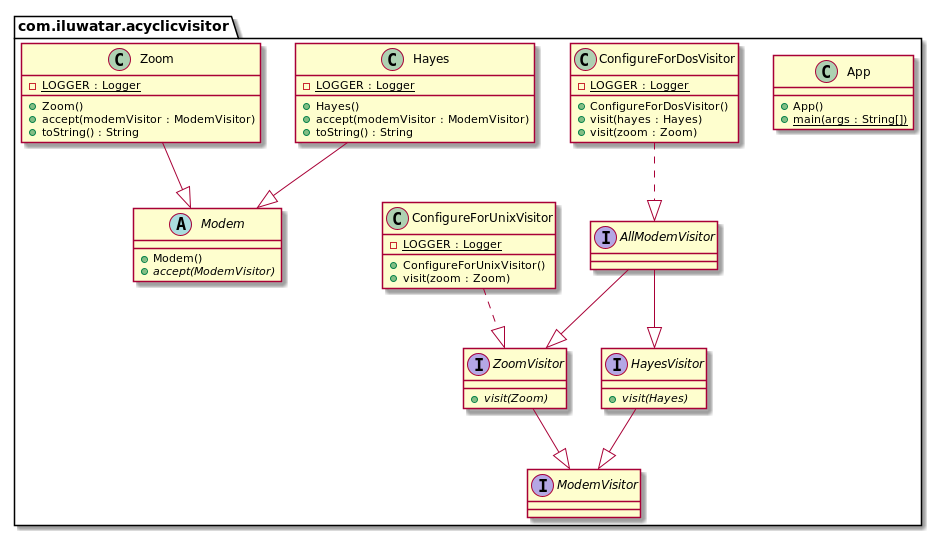

## الهدف

السماح بإضافة وظائف جديدة إلى تسلسلات الفئات الموجودة دون التأثير عليها، ودون إنشاء الدوائر المعتمدة المزعجة التي هي جزء من نمط GoF (Gang of Four) للزائر (Visitor).

## التوضيح

مثال من العالم الحقيقي

> لدينا تسلسل فئات مودم. يجب أن تتم زيارة المودمات في هذه التسلسلات بواسطة خوارزمية خارجية بناءً على بعض الفلاتر (هل المودم متوافق مع Unix أو DOS؟).

بصيغة أخرى

> يتيح نمط Acyclic Visitor إضافة وظائف إلى تسلسلات الفئات الموجودة دون تعديلها.

[WikiWikiWeb](https://wiki.c2.com/?AcyclicVisitor) يقول

> يسمح نمط Acyclic Visitor بإضافة وظائف جديدة إلى تسلسلات الفئات الموجودة دون التأثير عليها، ودون إنشاء الدوائر المعتمدة التي هي جزء من نمط الزائر (Visitor Pattern) في GangOfFour.

**مثال برمجي**

هنا لدينا تسلسل `Modem`.


```java
public abstract class Modem {
  public abstract void accept(ModemVisitor modemVisitor);
}

public class Zoom extends Modem {
  ...
  @Override
  public void accept(ModemVisitor modemVisitor) {
    if (modemVisitor instanceof ZoomVisitor) {
      ((ZoomVisitor) modemVisitor).visit(this);
    } else {
      LOGGER.info("Only ZoomVisitor is allowed to visit Zoom modem");
    }
  }
}

public class Hayes extends Modem {
  ...
  @Override
  public void accept(ModemVisitor modemVisitor) {
    if (modemVisitor instanceof HayesVisitor) {
      ((HayesVisitor) modemVisitor).visit(this);
    } else {
      LOGGER.info("Only HayesVisitor is allowed to visit Hayes modem");
    }
  }
}
```

بعد ذلك، لدينا تسلسل `ModemVisitor`.


```java
public interface ModemVisitor {
}

public interface HayesVisitor extends ModemVisitor {
  void visit(Hayes hayes);
}

public interface ZoomVisitor extends ModemVisitor {
  void visit(Zoom zoom);
}

public interface AllModemVisitor extends ZoomVisitor, HayesVisitor {
}

public class ConfigureForDosVisitor implements AllModemVisitor {
  ...
  @Override
  public void visit(Hayes hayes) {
    LOGGER.info(hayes + " used with Dos configurator.");
  }
  @Override
  public void visit(Zoom zoom) {
    LOGGER.info(zoom + " used with Dos configurator.");
  }
}

public class ConfigureForUnixVisitor implements ZoomVisitor {
  ...
  @Override
  public void visit(Zoom zoom) {
    LOGGER.info(zoom + " used with Unix configurator.");
  }
}
```

وأخيرًا، هنا "الزوار" في العمل.


```java
    var conUnix = new ConfigureForUnixVisitor();
    var conDos = new ConfigureForDosVisitor();
    var zoom = new Zoom();
    var hayes = new Hayes();
    hayes.accept(conDos);
    zoom.accept(conDos);
    hayes.accept(conUnix);
    zoom.accept(conUnix);   
```

ناتج البرنامج:


```
    // Hayes modem used with Dos configurator.
    // Zoom modem used with Dos configurator.
    // Only HayesVisitor is allowed to visit Hayes modem
    // Zoom modem used with Unix configurator.
```


## مخطط الفئات



## التطبيق

يمكن استخدام هذا النمط في الحالات التالية:

* عندما تحتاج إلى إضافة وظيفة جديدة إلى تسلسل فئات دون التأثير عليها أو تعديلها.
* عندما توجد وظائف تعمل على التسلسل ولكنها لا تنتمي إلى التسلسل بحد ذاته. على سبيل المثال، الفئات `ConfigureForDOS` و `ConfigureForUnix` و `ConfigureForX`.
* عندما تحتاج إلى تنفيذ عمليات مختلفة تمامًا على كائن اعتمادًا على نوعه.
* عندما يكون من المتوقع توسيع التسلسل الزائر بشكل متكرر باستخدام مشتقات من فئة العنصر.
* عندما يكون عملية إعادة التجميع، الربط، الاختبار أو توزيع المشتقات من فئة العنصر مرهقة جدًا.

## الدروس التعليمية

* [Acyclic Visitor Pattern Example](https://codecrafter.blogspot.com/2012/12/the-acyclic-visitor-pattern.html)

## العواقب

الجوانب الجيدة:

* لا توجد دوائر اعتماد بين التسلسلات.
* لا حاجة لإعادة تجميع جميع الزوار إذا تم إضافة زائر جديد.
* لا يسبب أخطاء في الترجمة في الزوار الموجودين إذا كانت التسلسل تحتوي على عضو جديد.

الجوانب السيئة:


* ينتهك [مبدأ الاستبدال في ليسكوف](https://java-design-patterns.com/principles/#liskov-substitution-principle) من خلال إظهار أنه يمكن قبول جميع الزوار مع الاهتمام بزائر واحد فقط.
* يجب إنشاء تسلسل زوار موازٍ لجميع الأعضاء في التسلسل الذي يمكن زيارته.

## الأنماط المتعلقة

* [Visitor Pattern](https://java-design-patterns.com/patterns/visitor/)


## الحقوق


* [Acyclic Visitor by Robert C. Martin](http://condor.depaul.edu/dmumaugh/OOT/Design-Principles/acv.pdf)
* [Acyclic Visitor in WikiWikiWeb](https://wiki.c2.com/?AcyclicVisitor)
