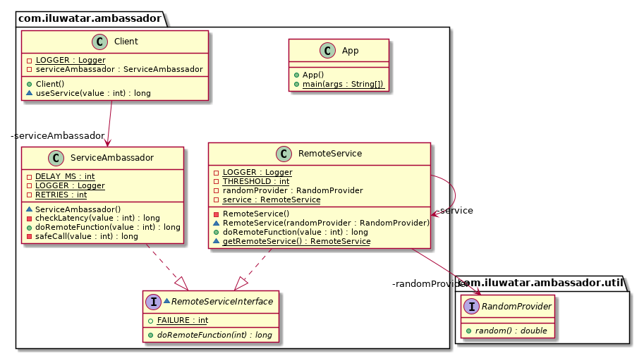

## الهدف

توفير مثيل من الخدمة المساعدة للعميل وتفويض الوظائف المشتركة لها من مصدر مشترك.

## الشرح

مثال واقعي

> خدمة بعيدة تحتوي على العديد من العملاء الذين يصلون إلى وظيفة تقدمها هذه الخدمة. الخدمة هي تطبيق قديم ومن
> المستحيل تحديثها. عدد كبير من الطلبات من قبل المستخدمين تسبب مشاكل في الاتصال. يجب تنفيذ قواعد جديدة
> بشأن تكرار الطلبات جنبًا إلى جنب مع فحوصات التأخير والسجلات من جانب العميل.

بكلمات أخرى

> باستخدام نمط Ambassador، يمكننا تنفيذ تقليل تكرار الطلبات من العملاء جنبًا إلى جنب مع فحوصات التأخير
> والسجلات.

وفقًا لوثائق مايكروسوفت

> يمكن اعتبار خدمة Ambassador وكأنها وكيل خارج العملية يتواجد جنبًا إلى جنب مع العميل.
>
> يمكن أن يكون هذا النمط مفيدًا لتفريغ المهام المشتركة في الاتصال من العميل مثل المراقبة، السجلات، التوجيه،
> الأمان (مثل TLS) وأنماط المقاومة (*) بطريقة مستقلة عن اللغة. غالبًا ما يُستخدم مع التطبيقات القديمة،
> أو التطبيقات الأخرى التي يصعب تعديلها، بهدف توسيع قدراتها في الشبكات. يمكنه أيضًا
> تمكين فريق متخصص لتنفيذ هذه الميزات.

**مثال على الكود**

مع المقدمة السابقة في الاعتبار، سنقوم بمحاكاة وظيفتها في المثال التالي. لدينا واجهة يتم تنفيذها
من قبل الخدمة البعيدة وكذلك خدمة Ambassador:

```java
interface RemoteServiceInterface {
    long doRemoteFunction(int value) throws Exception;
}
```

## خدمة بعيدة ممثلة كـ Singleton (مثيل واحد).

```java
@Slf4j
public class RemoteService implements RemoteServiceInterface {
    private static RemoteService service = null;

    static synchronized RemoteService getRemoteService() {
        if (service == null) {
            service = new RemoteService();
        }
        return service;
    }

    private RemoteService() {}

    @Override
    public long doRemoteFunction(int value) {
        long waitTime = (long) Math.floor(Math.random() * 1000);

        try {
            sleep(waitTime);
        } catch (InterruptedException e) {
            LOGGER.error("Thread sleep interrupted", e);
        }

        return waitTime >= 200 ? value * 10 : -1;
    }
}
```

## خدمة السفير مع إضافة وظائف إضافية مثل السجلات والتحقق من الكمون

```java
@Slf4j
public class ServiceAmbassador implements RemoteServiceInterface {
  private static final int RETRIES = 3;
  private static final int DELAY_MS = 3000;

  ServiceAmbassador() {
  }

  @Override
  public long doRemoteFunction(int value) {
    return safeCall(value);
  }

  private long checkLatency(int value) {
    var startTime = System.currentTimeMillis();
    var result = RemoteService.getRemoteService().doRemoteFunction(value);
    var timeTaken = System.currentTimeMillis() - startTime;

    LOGGER.info("Time taken (ms): " + timeTaken);
    return result;
  }

  private long safeCall(int value) {
    var retries = 0;
    var result = (long) FAILURE;

    for (int i = 0; i < RETRIES; i++) {
      if (retries >= RETRIES) {
        return FAILURE;
      }

      if ((result = checkLatency(value)) == FAILURE) {
        LOGGER.info("Failed to reach remote: (" + (i + 1) + ")");
        retries++;
        try {
          sleep(DELAY_MS);
        } catch (InterruptedException e) {
          LOGGER.error("Thread sleep state interrupted", e);
        }
      } else {
        break;
      }
    }
    return result;
  }
}
```

العميل لديه خدمة سفير محلية تستخدم للتفاعل مع الخدمة البعيدة:


```java
@Slf4j
public class Client {
  private final ServiceAmbassador serviceAmbassador = new ServiceAmbassador();

  long useService(int value) {
    var result = serviceAmbassador.doRemoteFunction(value);
    LOGGER.info("Service result: " + result);
    return result;
  }
}
```

بعد ذلك، لدينا عميلان يستخدمان الخدمة:


```java
public class App {
  public static void main(String[] args) {
    var host1 = new Client();
    var host2 = new Client();
    host1.useService(12);
    host2.useService(73);
  }
}
```

هذه هي النتيجة التي سنحصل عليها بعد تنفيذ المثال:


```java
Time taken (ms): 111
Service result: 120
Time taken (ms): 931
Failed to reach remote: (1)
Time taken (ms): 665
Failed to reach remote: (2)
Time taken (ms): 538
Failed to reach remote: (3)
Service result: -1
```

## مخطط الفئات



## التطبيقات

يتم تطبيق نمط Ambassador عندما نعمل مع خدمة بعيدة قديمة لا يمكن تعديلها أو أنه سيكون من الصعب للغاية تعديلها. يمكن تنفيذ خصائص الاتصال في العميل دون الحاجة إلى إجراء تغييرات على الخدمة البعيدة.

* يوفر Ambassador واجهة محلية لخدمة بعيدة.
* يوفر Ambassador سجلات، انقطاع الدائرة، إعادة المحاولات، والأمان في العميل.

## حالات الاستخدام النموذجية

* التحكم في الوصول إلى كائن آخر
* تنفيذ السجلات أو السجلات
* تنفيذ انقطاع الدائرة
* تفويض مهام الخدمات البعيدة
* تسهيل الاتصال بالشبكة

## الاستخدامات المعروفة

* [بوابة API المدمجة مع Kubernetes للخدمات الصغيرة](https://github.com/datawire/ambassador)

## الأنماط ذات الصلة

* [الوكيل (Proxy)](https://java-design-patterns.com/patterns/proxy/)

## الشكر

* [نمط Ambassador (وثائق Microsoft باللغة الإنجليزية)](https://docs.microsoft.com/en-us/azure/architecture/patterns/ambassador)
* [تصميم الأنظمة الموزعة: الأنماط والمفاهيم للخدمات القابلة للتوسع وموثوقة](https://www.amazon.com/s?k=designing+distributed+systems&sprefix=designing+distri%2Caps%2C156&linkCode=ll2&tag=javadesignpat-20&linkId=a12581e625462f9038557b01794e5341&language=en_US&ref_=as_li_ss_tl)

## ملاحظات المترجم
(*) تشير النسخة الأصلية بالإنجليزية من وثائق Microsoft إلى مصطلح المرونة
وفي الترجمة الإسبانية يتم ترجمته إلى المقاومة، على الرغم من ربطه بالقسم الخاص بنمط الموثوقية. انظر:
* [نسخة الوثائق الخاصة بنمط Ambassador من Microsoft باللغة الإسبانية.](https://learn.microsoft.com/es-es/azure/architecture/patterns/ambassador)
