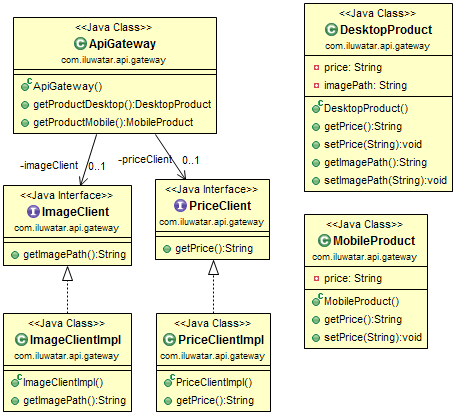

## الهدف

إضافة استدعاءات إلى الخدمات الصغيرة في نفس المكان، بوابة API (API Gateway). يقوم المستخدم 
بإجراء استدعاء بسيط إلى بوابة API، وتقوم بوابة API بدورها باستدعاء كل خدمة صغيرة ذات صلة.

## الشرح

مع نمط الخدمات الصغيرة، قد يحتاج العميل إلى بيانات من عدة خدمات صغيرة. إذا كان 
العميل سيستدعي كل خدمة صغيرة بشكل مباشر، فقد يؤدي ذلك إلى أوقات تحميل طويلة، حيث 
يجب على العميل إجراء طلب شبكة لكل خدمة صغيرة يتم استدعاؤها. بالإضافة إلى ذلك، وجود 
استدعاء العميل لكل خدمة صغيرة يربط العميل مباشرة بتلك الخدمة الصغيرة - إذا حدث تغيير داخلي 
في الخدمات الصغيرة (على سبيل المثال، إذا تم دمج خدمتين صغيرتين في وقت ما في المستقبل) أو إذا تغير الموقع (الخادم والمنفذ) لأحد الخدمات الصغيرة، فإن كل 
عميل يستخدم تلك الخدمات الصغيرة يجب تحديثه.

الهدف من نمط بوابة API هو تخفيف بعض هذه المشاكل. في نمط بوابة API، يتم وضع كيان إضافي 
(بوابة API) بين العميل والخدمات الصغيرة. 
مهمة بوابة API هي إضافة استدعاءات إلى الخدمات الصغيرة. بدلاً من أن يقوم العميل 
بإجراء استدعاء لكل خدمة صغيرة على حدة، يقوم العميل باستدعاء بوابة API مرة واحدة فقط. ثم تقوم بوابة 
API باستدعاء كل واحدة من الخدمات الصغيرة التي يحتاجها العميل.

مثال واقعي

> نحن نطبق نظام خدمات صغيرة وبوابة API لموقع تجارة إلكترونية. في هذا 
> النظام تقوم بوابة API بإجراء استدعاءات إلى خدمات Image و Price. (الصورة والسعر)

بمعنى آخر

> في نظام يتم تنفيذه باستخدام بنية خدمات صغيرة، تعتبر بوابة API هي النقطة 
> الوحيدة للوصول التي تجمع استدعاءات الخدمات الصغيرة الفردية.

تقول ويكيبيديا

> بوابة API هي خادم يعمل كواجهة أمامية لـ API، يستقبل طلبات API، ويطبق 
> حدودًا وسياسات الأمان، ويرسل الطلبات إلى الخدمة الخلفية ثم يعيد 
> الاستجابة إلى الطالب. غالبًا ما تشمل بوابة API محركًا للتحويل لتنظيم 
> وتعديل الطلبات والاستجابات أثناء سير العملية. يمكن أن توفر بوابة 
> API أيضًا وظائف مثل جمع تحليلات البيانات والتخزين المؤقت. قد 
> توفر بوابة API وظائف لدعم المصادقة، والتفويض، والأمان، 
> والتدقيق، والامتثال.

**كود المثال**

يوضح هذا التنفيذ كيف قد يبدو نمط بوابة API لموقع تجارة إلكترونية. تقوم 
`ApiGateway` بإجراء استدعاءات إلى خدمات Image و Price باستخدام 
`ImageClientImpl` و `PriceClientImpl` على التوالي. العملاء الذين يشاهدون الموقع 
على جهاز مكتبي يمكنهم مشاهدة معلومات الأسعار وصورة المنتج، لذلك تقوم `ApiGateway` 
بإجراء استدعاء إلى الخدمات الصغيرة وجمع البيانات في نموذج `DesktopProduct`. 
ومع ذلك، فإن مستخدمي الأجهزة المحمولة يرون فقط معلومات الأسعار، ولا يشاهدون صورة المنتج. 
بالنسبة لمستخدمي الأجهزة المحمولة، تقوم `ApiGateway` فقط 
بالحصول على معلومات الأسعار، والتي تستخدم لإكمال `MobileProduct`.

إليك تنفيذ خدمة الصورة (Image).


```java
public interface ImageClient {
  String getImagePath();
}

public class ImageClientImpl implements ImageClient {
  @Override
  public String getImagePath() {
    var httpClient = HttpClient.newHttpClient();
    var httpGet = HttpRequest.newBuilder()
        .GET()
        .uri(URI.create("http://localhost:50005/image-path"))
        .build();

    try {
      var httpResponse = httpClient.send(httpGet, BodyHandlers.ofString());
      return httpResponse.body();
    } catch (IOException | InterruptedException e) {
      e.printStackTrace();
    }

    return null;
  }
}
```

إليك تنفيذ خدمة المصغرة للسعر (Price).

```java
public interface PriceClient {
  String getPrice();
}

public class PriceClientImpl implements PriceClient {

  @Override
  public String getPrice() {
    var httpClient = HttpClient.newHttpClient();
    var httpGet = HttpRequest.newBuilder()
        .GET()
        .uri(URI.create("http://localhost:50006/price"))
        .build();

    try {
      var httpResponse = httpClient.send(httpGet, BodyHandlers.ofString());
      return httpResponse.body();
    } catch (IOException | InterruptedException e) {
      e.printStackTrace();
    }

    return null;
  }
}
```

هنا يمكننا أن نرى كيف تقوم بوابة الـ API بتوجيه الطلبات إلى الخدمات المصغرة.

```java
public class ApiGateway {

  @Resource
  private ImageClient imageClient;

  @Resource
  private PriceClient priceClient;

  @RequestMapping(path = "/desktop", method = RequestMethod.GET)
  public DesktopProduct getProductDesktop() {
    var desktopProduct = new DesktopProduct();
    desktopProduct.setImagePath(imageClient.getImagePath());
    desktopProduct.setPrice(priceClient.getPrice());
    return desktopProduct;
  }

  @RequestMapping(path = "/mobile", method = RequestMethod.GET)
  public MobileProduct getProductMobile() {
    var mobileProduct = new MobileProduct();
    mobileProduct.setPrice(priceClient.getPrice());
    return mobileProduct;
  }
}
```

## مخطط الفئة



## التطبيقات

استخدم نمط API Gateway عندما

* تكون تستخدم بنية ميكروسيرفيسز وتحتاج إلى نقطة تجميع واحدة لاستدعاءات الميكروسيرفيسز.

## الدروس التعليمية

* [Exploring the New Spring Cloud Gateway](https://www.baeldung.com/spring-cloud-gateway)
* [Spring Cloud - Gateway](https://www.tutorialspoint.com/spring_cloud/spring_cloud_gateway.htm)
* [Getting Started With Spring Cloud Gateway](https://dzone.com/articles/getting-started-with-spring-cloud-gateway)

## الشكر

* [microservices.io - API Gateway](http://microservices.io/patterns/apigateway.html)
* [NGINX - Building Microservices: Using an API Gateway](https://www.nginx.com/blog/building-microservices-using-an-api-gateway/)
* [Microservices Patterns: With examples in Java](https://www.amazon.com/gp/product/1617294543/ref=as_li_qf_asin_il_tl?ie=UTF8&tag=javadesignpat-20&creative=9325&linkCode=as2&creativeASIN=1617294543&linkId=ac7b6a57f866ac006a309d9086e8cfbd)
* [Building Microservices: Designing Fine-Grained Systems](https://www.amazon.com/gp/product/1491950358/ref=as_li_qf_asin_il_tl?ie=UTF8&tag=javadesignpat-20&creative=9325&linkCode=as2&creativeASIN=1491950358&linkId=4c95ca9831e05e3f0dadb08841d77bf1)
