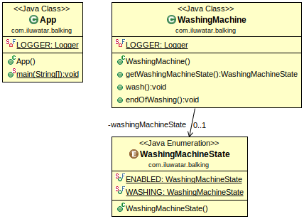

## الغرض

يتم استخدام نمط _Balking_ لمنع كائن من تنفيذ كود معين إذا كان في حالة غير مكتملة أو غير مناسبة.

## الشرح

مثال من الحياة الواقعية

> في غسالة الملابس هناك زر بدء لتشغيل غسل الملابس. عندما تكون الغسالة غير نشطة، يعمل الزر كما هو متوقع، ولكن إذا كانت الغسالة تغسل بالفعل، فإن الزر لا يفعل شيئًا.

بمعنى آخر

> باستخدام نمط _Balking_، يتم تنفيذ كود معين فقط إذا كان الكائن في حالة معينة.

تقول ويكيبيديا

> نمط _Balking_ هو نمط تصميم برمجي ينفذ إجراء على كائن فقط عندما يكون الكائن في حالة معينة. على سبيل المثال، إذا كان الكائن يقرأ ملفات ZIP واستدعى أسلوب _get_ على الكائن عندما لا يكون الملف ZIP مفتوحًا، فإن الكائن "يرفض" (_balk_) الطلب.

**مثال برمجي**

في هذا المثال من التنفيذ، `WashingMachine` هو كائن له حالتان يمكن أن يكونا: _ENABLED_ و _WASHING_ (مفعل و يغسل على التوالي). إذا كانت الغسالة في حالة _ENABLED_، فإن الحالة تتغير إلى _WASHING_ باستخدام طريقة آمنة ضد الخيوط (thread-safe). من ناحية أخرى، إذا كانت الغسالة بالفعل تغسل وأي خيط آخر ينفذ `wash()`، فلن يتم تغيير الحالة وتنتهي تنفيذ الطريقة دون القيام بأي شيء.

إليك الأجزاء ذات الصلة من فئة `WashingMachine`.


```java
@Slf4j
public class WashingMachine {

    private final DelayProvider delayProvider;
    private WashingMachineState washingMachineState;

    public WashingMachine(DelayProvider delayProvider) {
        this.delayProvider = delayProvider;
        this.washingMachineState = WashingMachineState.ENABLED;
    }

    public WashingMachineState getWashingMachineState() {
        return washingMachineState;
    }
    
    public void wash() {
        synchronized (this) {
            var machineState = getWashingMachineState();
            LOGGER.info("{}: Actual machine state: {}", Thread.currentThread().getName(), machineState);
            if (this.washingMachineState == WashingMachineState.WASHING) {
                LOGGER.error("Cannot wash if the machine has been already washing!");
                return;
            }
            this.washingMachineState = WashingMachineState.WASHING;
        }
        LOGGER.info("{}: Doing the washing", Thread.currentThread().getName());
        this.delayProvider.executeAfterDelay(50, TimeUnit.MILLISECONDS, this::endOfWashing);
    }
    
    public synchronized void endOfWashing() {
        washingMachineState = WashingMachineState.ENABLED;
        LOGGER.info("{}: Washing completed.", Thread.currentThread().getId());
    }
}
```

هنا الواجهة البسيطة `DelayProvider` المستخدمة من قبل `WashingMachine`.


```java
public interface DelayProvider {
    void executeAfterDelay(long interval, TimeUnit timeUnit, Runnable task);
}
```

الآن نقدم التطبيق باستخدام `WashingMachine`.


```java
public static void main(String... args) {
    final var washingMachine = new WashingMachine();
    var executorService = Executors.newFixedThreadPool(3);
    for (int i = 0; i < 3; i++) {
        executorService.execute(washingMachine::wash);
    }
    executorService.shutdown();
    try {
        executorService.awaitTermination(10, TimeUnit.SECONDS);    
    } catch (InterruptedException ie) {
        LOGGER.error("ERROR: Waiting on executor service shutdown!");
        Thread.currentThread().interrupt();
    }
}
```

إليك مخرجات التطبيق في وحدة التحكم.


```
14:02:52.268 [pool-1-thread-2] INFO com.iluwatar.balking.WashingMachine - pool-1-thread-2: Actual machine state: ENABLED
14:02:52.272 [pool-1-thread-2] INFO com.iluwatar.balking.WashingMachine - pool-1-thread-2: Doing the washing
14:02:52.272 [pool-1-thread-3] INFO com.iluwatar.balking.WashingMachine - pool-1-thread-3: Actual machine state: WASHING
14:02:52.273 [pool-1-thread-3] ERROR com.iluwatar.balking.WashingMachine - Cannot wash if the machine has been already washing!
14:02:52.273 [pool-1-thread-1] INFO com.iluwatar.balking.WashingMachine - pool-1-thread-1: Actual machine state: WASHING
14:02:52.273 [pool-1-thread-1] ERROR com.iluwatar.balking.WashingMachine - Cannot wash if the machine has been already washing!
14:02:52.324 [pool-1-thread-2] INFO com.iluwatar.balking.WashingMachine - 14: Washing completed.
```

## مخطط الفئات




## القابلية للتطبيق

استخدم نمط _Balking_ عندما

* يجب على كائن تنفيذ كود معين فقط عندما يكون في حالة معينة.
* الكائنات في حالة معرضة للتوقف مؤقتًا، ولكن لفترة زمنية غير محددة.

## الأنماط ذات الصلة


* [Guarded Suspension Pattern](https://java-design-patterns.com/patterns/guarded-suspension/)
* [Double Checked Locking Pattern](https://java-design-patterns.com/patterns/double-checked-locking/)

## المراجع


* [Patterns in Java: A Catalog of Reusable Design Patterns Illustrated with UML, 2nd Edition, Volume 1](https://www.amazon.com/gp/product/0471227293/ref=as_li_qf_asin_il_tl?ie=UTF8&tag=javadesignpat-20&creative=9325&linkCode=as2&creativeASIN=0471227293&linkId=0e39a59ffaab93fb476036fecb637b99)
