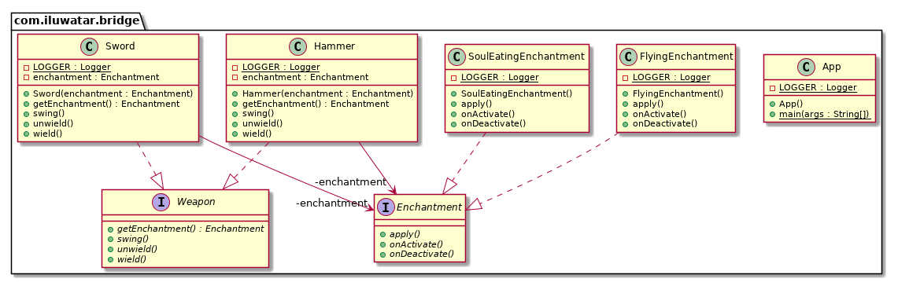

## أيضًا معروف باسم

Handle/Body

## الهدف

فصل التجريد عن تنفيذه بحيث يمكن لكل منهما التغيير بشكل مستقل.

## الشرح

مثال من الحياة الواقعية

> تخيل أن لديك سلاحًا مع تعاويذ مختلفة، ومن المفترض أن تسمح بخلط أسلحة مختلفة مع تعاويذ مختلفة. ماذا ستفعل؟ هل ستقوم بإنشاء نسخ متعددة من كل سلاح لكل تعويذة من التعاويذ أو ببساطة تقوم بإنشاء تعويذة منفصلة وتحددها للسلاح حسب الحاجة؟ نمط Bridge يتيح لك القيام بالأمر الثاني.

ببساطة

> يتعلق نمط Bridge بتفضيل التركيب على الوراثة. يتم دفع تفاصيل التنفيذ من هرم إلى كائن آخر مع هرم منفصل.

تقول ويكيبيديا

> نمط Bridge هو نمط تصميم يستخدم في هندسة البرمجيات يهدف إلى "فصل التجريد عن تنفيذه بحيث يمكن لكل منهما التغيير بشكل مستقل."

**مثال برمجي**

نقلًا لمثال السلاح المذكور أعلاه. هنا لدينا واجهة السلاح `Weapon`:


```java
public interface Weapon {
  void wield();
  void swing();
  void unwield();
  Enchantment getEnchantment();
}

public class Sword implements Weapon {

  private final Enchantment enchantment;

  public Sword(Enchantment enchantment) {
    this.enchantment = enchantment;
  }

  @Override
  public void wield() {
    LOGGER.info("The sword is wielded.");
    enchantment.onActivate();
  }

  @Override
  public void swing() {
    LOGGER.info("The sword is swinged.");
    enchantment.apply();
  }

  @Override
  public void unwield() {
    LOGGER.info("The sword is unwielded.");
    enchantment.onDeactivate();
  }

  @Override
  public Enchantment getEnchantment() {
    return enchantment;
  }
}

public class Hammer implements Weapon {

  private final Enchantment enchantment;

  public Hammer(Enchantment enchantment) {
    this.enchantment = enchantment;
  }

  @Override
  public void wield() {
    LOGGER.info("The hammer is wielded.");
    enchantment.onActivate();
  }

  @Override
  public void swing() {
    LOGGER.info("The hammer is swinged.");
    enchantment.apply();
  }

  @Override
  public void unwield() {
    LOGGER.info("The hammer is unwielded.");
    enchantment.onDeactivate();
  }

  @Override
  public Enchantment getEnchantment() {
    return enchantment;
  }
}
```

إليك واجهة التعاويذ `Enchantment` المنفصلة:


```java
public interface Enchantment {
  void onActivate();
  void apply();
  void onDeactivate();
}

public class FlyingEnchantment implements Enchantment {

  @Override
  public void onActivate() {
    LOGGER.info("The item begins to glow faintly.");
  }

  @Override
  public void apply() {
    LOGGER.info("The item flies and strikes the enemies finally returning to owner's hand.");
  }

  @Override
  public void onDeactivate() {
    LOGGER.info("The item's glow fades.");
  }
}

public class SoulEatingEnchantment implements Enchantment {

  @Override
  public void onActivate() {
    LOGGER.info("The item spreads bloodlust.");
  }

  @Override
  public void apply() {
    LOGGER.info("The item eats the soul of enemies.");
  }

  @Override
  public void onDeactivate() {
    LOGGER.info("Bloodlust slowly disappears.");
  }
}
```

إليك كلا الواجهتين في العمل:


```java
LOGGER.info("The knight receives an enchanted sword.");
var enchantedSword = new Sword(new SoulEatingEnchantment());
enchantedSword.wield();
enchantedSword.swing();
enchantedSword.unwield();

LOGGER.info("The valkyrie receives an enchanted hammer.");
var hammer = new Hammer(new FlyingEnchantment());
hammer.wield();
hammer.swing();
hammer.unwield();
```

إليك مخرجات التطبيق في وحدة التحكم.


```
The knight receives an enchanted sword.
The sword is wielded.
The item spreads bloodlust.
The sword is swung.
The item eats the soul of enemies.
The sword is unwielded.
Bloodlust slowly disappears.
The valkyrie receives an enchanted hammer.
The hammer is wielded.
The item begins to glow faintly.
The hammer is swung.
The item flies and strikes the enemies finally returning to owner's hand.
The hammer is unwielded.
The item's glow fades.
```

## مخطط الفئات




## القابلية للتطبيق

استخدم نمط Bridge عندما

* ترغب في تجنب الربط الدائم بين التجريد وتنفيذه. قد يكون هذا هو الحال، على سبيل المثال، عندما يجب اختيار أو تغيير التنفيذ في وقت التشغيل.
* يجب أن تكون كل من التجريدات وتنفيذاتها قابلة للتوسيع عبر الوراثة. في هذه الحالة، يتيح لك نمط Bridge دمج التجريدات والتنفيذات المختلفة وتوسيعها بشكل مستقل.
* يجب ألا تؤثر التغييرات في تنفيذ التجريد على العملاء؛ أي أنه لا يجب أن يحتاج الكود الخاص بهم إلى إعادة تجميع.
* لديك تكاثر في الفئات. تشير مثل هذه الهرميات إلى الحاجة إلى تقسيم كائن إلى جزئين. يستخدم Rumbaugh مصطلح "التعميمات المتداخلة" للإشارة إلى مثل هذه الهرميات من الفئات.
* ترغب في مشاركة تنفيذ بين عدة كائنات (ربما باستخدام عد مرجعي)، ويجب إخفاء هذه الحقيقة عن العميل. مثال بسيط هو فئة String لـ Coplien، حيث يمكن لعدة كائنات مشاركة نفس تمثيل السلسلة.

## الدروس التعليمية

* [Bridge Pattern Tutorial](https://www.journaldev.com/1491/bridge-design-pattern-java)

## الاعتمادات

* [Design Patterns: Elements of Reusable Object-Oriented Software](https://www.amazon.com/gp/product/0201633612/ref=as_li_tl?ie=UTF8&camp=1789&creative=9325&creativeASIN=0201633612&linkCode=as2&tag=javadesignpat-20&linkId=675d49790ce11db99d90bde47f1aeb59)
* [Head First Design Patterns: A Brain-Friendly Guide](https://www.amazon.com/gp/product/0596007124/ref=as_li_tl?ie=UTF8&camp=1789&creative=9325&creativeASIN=0596007124&linkCode=as2&tag=javadesignpat-20&linkId=6b8b6eea86021af6c8e3cd3fc382cb5b)
