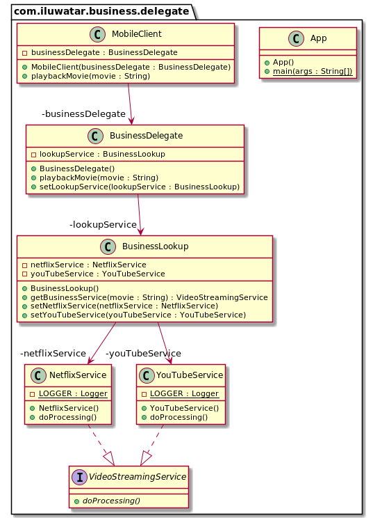

## الغرض

نمط **Business Delegate** يضيف طبقة من التجريد بين مستويات العرض والأعمال. باستخدام هذا النمط، نحقق ارتباطًا مرنًا بين المستويات ونعزل المعرفة حول كيفية تحديد المواقع والاتصال والتفاعل مع الكائنات التجارية التي تشكل التطبيق.

## أيضًا معروف باسم

مُمثل الخدمة

## الشرح

مثال من العالم الحقيقي

> تطبيق للهواتف المحمولة يعد ببث أي فيلم موجود إلى جهازك. يقوم التطبيق بالتقاط سلسلة البحث من المستخدم ويمررها إلى **Business Delegate**. يقوم **Business Delegate** باختيار خدمة البث الأكثر ملاءمة ويبدأ في تشغيل الفيديو.

بكلمات أبسط

> يضيف **Business Delegate** طبقة من التجريد بين مستويات العرض والأعمال.

تقول ويكيبيديا

> **Business Delegate** هو نمط تصميم في Java EE. هذا النمط يهدف إلى تقليل الترابط بين خدمات الأعمال ومستوى العرض المتصل، وإخفاء تفاصيل التنفيذ الخاصة بالخدمات (بما في ذلك البحث والوصول إلى بنية EJB). يعمل **Business Delegate** كـ **مهايئ** لاستدعاء كائنات الأعمال من طبقة العرض.

**مثال برمجي**

أولاً، لدينا تجريد لخدمات البث عبر الفيديو `VideoStreamingService` مع زوج من التطبيقات `NetflixService` و `YouTubeService`.


```java
public interface VideoStreamingService {
    void doProcessing();
}

@Slf4j
public class NetflixService implements VideoStreamingService {
    @Override
    public void doProcessing() {
        LOGGER.info("NetflixService is now processing");
    }
}

@Slf4j
public class YouTubeService implements VideoStreamingService {
    @Override
    public void doProcessing() {
        LOGGER.info("YouTubeService is now processing");
    }
}
```

التالي، لدينا خدمة البحث `BusinessLookup` التي تقرر أي خدمة بث الفيديو يجب استخدامها.


```java

@Setter
public class BusinessLookup {

    private NetflixService netflixService;
    private YouTubeService youTubeService;

    public VideoStreamingService getBusinessService(String movie) {
        if (movie.toLowerCase(Locale.ROOT).contains("die hard")) {
            return netflixService;
        } else {
            return youTubeService;
        }
    }
}
```

يستخدم **Delegado de Negocio** `BusinessDelegate` بحث الأعمال لتوجيه طلبات تشغيل الأفلام إلى خدمة بث الفيديو المناسبة.


```java

@Setter
public class BusinessDelegate {

    private BusinessLookup lookupService;

    public void playbackMovie(String movie) {
        VideoStreamingService videoStreamingService = lookupService.getBusinessService(movie);
        videoStreamingService.doProcessing();
    }
}
```

العميل المحمول `MobileClient` يستخدم **Business Delegate** لاستدعاء مستوى الأعمال.


```java
public class MobileClient {

    private final BusinessDelegate businessDelegate;

    public MobileClient(BusinessDelegate businessDelegate) {
        this.businessDelegate = businessDelegate;
    }

    public void playbackMovie(String movie) {
        businessDelegate.playbackMovie(movie);
    }
}
```

أخيرًا، يمكننا عرض المثال الكامل أثناء التنفيذ.


```java
  public static void main(String[]args){

        // preparar los objetos
        var businessDelegate=new BusinessDelegate();
        var businessLookup=new BusinessLookup();
        businessLookup.setNetflixService(new NetflixService());
        businessLookup.setYouTubeService(new YouTubeService());
        businessDelegate.setLookupService(businessLookup);

        // crear el cliente y utilizar el Business Delegate
        var client=new MobileClient(businessDelegate);
        client.playbackMovie("Die Hard 2");
        client.playbackMovie("Maradona: The Greatest Ever");
        }
```

إليك مخرجات وحدة التحكم.


```
21:15:33.790 [main] INFO com.iluwatar.business.delegate.NetflixService - NetflixService is now processing
21:15:33.794 [main] INFO com.iluwatar.business.delegate.YouTubeService - YouTubeService is now processing
```

## مخطط الفئات



## الأنماط ذات الصلة

* [نمط تحديد الموقع للخدمات](https://java-design-patterns.com/patterns/service-locator/)

## القابلية للتطبيق

استخدم نمط Business Delegate عندما

* ترغب في تقليل الترابط بين مستويات العرض والأعمال.
* ترغب في تنسيق المكالمات إلى خدمات أعمال متعددة.
* ترغب في تجميع عمليات البحث والمكالمات إلى الخدمات.
* من الضروري تجريد وتغليف الاتصال بين طبقة العميل وخدمات الأعمال.

## دروس

* [نمط Business Delegate في TutorialsPoint](https://www.tutorialspoint.com/design_pattern/business_delegate_pattern.htm)

## الاستخدامات المعروفة

* التطبيقات المؤسسية التي تستخدم Java EE (Java Platform, Enterprise Edition)
* التطبيقات التي تتطلب الوصول عن بُعد إلى خدمات الأعمال

## العواقب

الفوائد:

* فك الترابط بين مستويات العرض والأعمال: يسمح بمواصلة تطور مستوى العميل والخدمات المؤسسية بشكل مستقل.
* شفافية الموقع: لا يتأثر العملاء بتغييرات الموقع أو التهيئة لخدمات الأعمال.
* إعادة الاستخدام وقابلية التوسع: يمكن إعادة استخدام كائنات Business Delegate بواسطة عملاء متعددين، ويدعم النمط التوازن في الحمل وقابلية التوسع.

العيوب:

* التعقيد: يضيف طبقات وتجريدات إضافية قد تزيد من التعقيد.
* تحميل الأداء: قد يؤدي الإشارة الإضافية إلى خفض طفيف في الأداء.

## الأنماط ذات الصلة

* [محدد خدمات](https://java-design-patterns.com/patterns/service-locator/): يستخدم Delegado de Negocio (
  Business Delegate) محدد خدمات (Service Locator) للعثور على خدمات الأعمال.
* [واجهة الجلسة](https://java-design-patterns.com/patterns/session-facade/): يمكن لـ Delegado de Negocio (Business
  Delegate) استخدام واجهة الجلسة (Session Facade) لتوفير واجهة موحدة لمجموعة من خدمات الأعمال.
* [كائن مركب](https://java-design-patterns.com/patterns/composite-entity/): يمكن لـ Delegado de Negocio (Business Delegate)
  استخدام الكائن المركب (Composite Entity) لإدارة حالة خدمات الأعمال.

## الشكر

* [J2EE Design Patterns](https://www.amazon.com/gp/product/0596004273/ref=as_li_tl?ie=UTF8&camp=1789&creative=9325&creativeASIN=0596004273&linkCode=as2&tag=javadesignpat-20&linkId=48d37c67fb3d845b802fa9b619ad8f31)
* [Core J2EE Patterns: Best Practices and Design Strategies](https://www.amazon.com/gp/product/0130648841/ref=as_li_qf_asin_il_tl?ie=UTF8&tag=javadesignpat-20&creative=9325&linkCode=as2&creativeASIN=0130648841&linkId=a0100de2b28c71ede8db1757fb2b5947)
