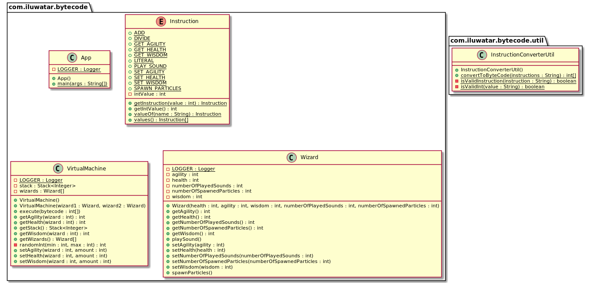

## الغرض

يسمح بترميز السلوك كتعليمات لجهاز افتراضي.

## الشرح

مثال من العالم الواقعي

> فريق يعمل على لعبة جديدة حيث يتقاتل السحرة مع بعضهم البعض. يحتاج سلوك السحرة إلى تعديل دقيق وتجربة مئات المرات من خلال اختبارات اللعبة. ليس من المثالي أن يطلب من المبرمج إجراء تغييرات في كل مرة يريد فيها مصمم اللعبة تعديل السلوك، لذلك يتم تنفيذ سلوك الساحر كجهاز افتراضي يعتمد على البيانات.

بكلمات بسيطة

> نمط Bytecode يسمح بسلوك موجه بالبيانات بدلاً من الكود.

[Gameprogrammingpatterns.com](https://gameprogrammingpatterns.com/bytecode.html) يوضح الوثائق:

> مجموعة من التعليمات تحدد العمليات منخفضة المستوى التي يمكن تنفيذها. يتم ترميز سلسلة من التعليمات كدورة من البايتات. يقوم الجهاز الافتراضي بتنفيذ هذه التعليمات واحدة تلو الأخرى، باستخدام مكدس للقيم الوسيطة. يسمح الجمع بين التعليمات بتعريف سلوكيات معقدة وعالية المستوى.

**مثال برمجي**

أحد الكائنات الأكثر أهمية في اللعبة هو فئة ماغو `Wizard`.


```java

@AllArgsConstructor
@Setter
@Getter
@Slf4j
public class Wizard {

    private int health;
    private int agility;
    private int wisdom;
    private int numberOfPlayedSounds;
    private int numberOfSpawnedParticles;

    public void playSound() {
        LOGGER.info("Playing sound");
        numberOfPlayedSounds++;
    }

    public void spawnParticles() {
        LOGGER.info("Spawning particles");
        numberOfSpawnedParticles++;
    }
}
```

بعد ذلك، نعرض التعليمات المتاحة لجهازنا الافتراضي. لكل تعليمات دلالتها الخاصة حول كيفية التعامل مع بيانات المكدس. على سبيل المثال، تقوم التعليمة ADD بأخذ العنصرين العلويين من المكدس، وتجمعهما، ثم تضع النتيجة في المكدس.


```java

@AllArgsConstructor
@Getter
public enum Instruction {

    LITERAL(1),         // e.g. "LITERAL 0", push 0 to stack
    SET_HEALTH(2),      // e.g. "SET_HEALTH", pop health and wizard number, call set health
    SET_WISDOM(3),      // e.g. "SET_WISDOM", pop wisdom and wizard number, call set wisdom
    SET_AGILITY(4),     // e.g. "SET_AGILITY", pop agility and wizard number, call set agility
    PLAY_SOUND(5),      // e.g. "PLAY_SOUND", pop value as wizard number, call play sound
    SPAWN_PARTICLES(6), // e.g. "SPAWN_PARTICLES", pop value as wizard number, call spawn particles
    GET_HEALTH(7),      // e.g. "GET_HEALTH", pop value as wizard number, push wizard's health
    GET_AGILITY(8),     // e.g. "GET_AGILITY", pop value as wizard number, push wizard's agility
    GET_WISDOM(9),      // e.g. "GET_WISDOM", pop value as wizard number, push wizard's wisdom
    ADD(10),            // e.g. "ADD", pop 2 values, push their sum
    DIVIDE(11);         // e.g. "DIVIDE", pop 2 values, push their division
    // ...
}
```

في قلب مثالنا توجد فئة `VirtualMachine`. تأخذ التعليمات كمدخلات وتنفذها لتوفير سلوك كائن اللعبة.


```java

@Getter
@Slf4j
public class VirtualMachine {

    private final Stack<Integer> stack = new Stack<>();

    private final Wizard[] wizards = new Wizard[2];

    public VirtualMachine() {
        wizards[0] = new Wizard(randomInt(3, 32), randomInt(3, 32), randomInt(3, 32),
                0, 0);
        wizards[1] = new Wizard(randomInt(3, 32), randomInt(3, 32), randomInt(3, 32),
                0, 0);
    }

    public VirtualMachine(Wizard wizard1, Wizard wizard2) {
        wizards[0] = wizard1;
        wizards[1] = wizard2;
    }

    public void execute(int[] bytecode) {
        for (var i = 0; i < bytecode.length; i++) {
            Instruction instruction = Instruction.getInstruction(bytecode[i]);
            switch (instruction) {
                case LITERAL:
                    // Read the next byte from the bytecode.
                    int value = bytecode[++i];
                    // Push the next value to stack
                    stack.push(value);
                    break;
                case SET_AGILITY:
                    var amount = stack.pop();
                    var wizard = stack.pop();
                    setAgility(wizard, amount);
                    break;
                case SET_WISDOM:
                    amount = stack.pop();
                    wizard = stack.pop();
                    setWisdom(wizard, amount);
                    break;
                case SET_HEALTH:
                    amount = stack.pop();
                    wizard = stack.pop();
                    setHealth(wizard, amount);
                    break;
                case GET_HEALTH:
                    wizard = stack.pop();
                    stack.push(getHealth(wizard));
                    break;
                case GET_AGILITY:
                    wizard = stack.pop();
                    stack.push(getAgility(wizard));
                    break;
                case GET_WISDOM:
                    wizard = stack.pop();
                    stack.push(getWisdom(wizard));
                    break;
                case ADD:
                    var a = stack.pop();
                    var b = stack.pop();
                    stack.push(a + b);
                    break;
                case DIVIDE:
                    a = stack.pop();
                    b = stack.pop();
                    stack.push(b / a);
                    break;
                case PLAY_SOUND:
                    wizard = stack.pop();
                    getWizards()[wizard].playSound();
                    break;
                case SPAWN_PARTICLES:
                    wizard = stack.pop();
                    getWizards()[wizard].spawnParticles();
                    break;
                default:
                    throw new IllegalArgumentException("Invalid instruction value");
            }
            LOGGER.info("Executed " + instruction.name() + ", Stack contains " + getStack());
        }
    }

    public void setHealth(int wizard, int amount) {
        wizards[wizard].setHealth(amount);
    }
    // other setters ->
    // ...
}
```

الآن يمكننا عرض المثال الكامل باستخدام الآلة الافتراضية.

```java
  public static void main(String[]args){

        var vm=new VirtualMachine(
        new Wizard(45,7,11,0,0),
        new Wizard(36,18,8,0,0));

        vm.execute(InstructionConverterUtil.convertToByteCode("LITERAL 0"));
        vm.execute(InstructionConverterUtil.convertToByteCode("LITERAL 0"));
        vm.execute(InstructionConverterUtil.convertToByteCode("GET_HEALTH"));
        vm.execute(InstructionConverterUtil.convertToByteCode("LITERAL 0"));
        vm.execute(InstructionConverterUtil.convertToByteCode("GET_AGILITY"));
        vm.execute(InstructionConverterUtil.convertToByteCode("LITERAL 0"));
        vm.execute(InstructionConverterUtil.convertToByteCode("GET_WISDOM"));
        vm.execute(InstructionConverterUtil.convertToByteCode("ADD"));
        vm.execute(InstructionConverterUtil.convertToByteCode("LITERAL 2"));
        vm.execute(InstructionConverterUtil.convertToByteCode("DIVIDE"));
        vm.execute(InstructionConverterUtil.convertToByteCode("ADD"));
        vm.execute(InstructionConverterUtil.convertToByteCode("SET_HEALTH"));
        }
```

إليك مخرجات وحدة التحكم.


```
16:20:10.193 [main] INFO com.iluwatar.bytecode.VirtualMachine - Executed LITERAL, Stack contains [0]
16:20:10.196 [main] INFO com.iluwatar.bytecode.VirtualMachine - Executed LITERAL, Stack contains [0, 0]
16:20:10.197 [main] INFO com.iluwatar.bytecode.VirtualMachine - Executed GET_HEALTH, Stack contains [0, 45]
16:20:10.197 [main] INFO com.iluwatar.bytecode.VirtualMachine - Executed LITERAL, Stack contains [0, 45, 0]
16:20:10.197 [main] INFO com.iluwatar.bytecode.VirtualMachine - Executed GET_AGILITY, Stack contains [0, 45, 7]
16:20:10.197 [main] INFO com.iluwatar.bytecode.VirtualMachine - Executed LITERAL, Stack contains [0, 45, 7, 0]
16:20:10.197 [main] INFO com.iluwatar.bytecode.VirtualMachine - Executed GET_WISDOM, Stack contains [0, 45, 7, 11]
16:20:10.197 [main] INFO com.iluwatar.bytecode.VirtualMachine - Executed ADD, Stack contains [0, 45, 18]
16:20:10.197 [main] INFO com.iluwatar.bytecode.VirtualMachine - Executed LITERAL, Stack contains [0, 45, 18, 2]
16:20:10.198 [main] INFO com.iluwatar.bytecode.VirtualMachine - Executed DIVIDE, Stack contains [0, 45, 9]
16:20:10.198 [main] INFO com.iluwatar.bytecode.VirtualMachine - Executed ADD, Stack contains [0, 54]
16:20:10.198 [main] INFO com.iluwatar.bytecode.VirtualMachine - Executed SET_HEALTH, Stack contains []
```

## مخطط الفئات




## القابلية للتطبيق


## القابلية للتطبيق

استخدم نمط Bytecode عندما تحتاج إلى تعريف العديد من السلوكيات ولغة تنفيذ لعبتك ليست مناسبة لأن:

* إنها منخفضة المستوى جدًا، مما يجعل البرمجة مملة أو عرضة للأخطاء.
* التكرار فيها يستغرق وقتًا طويلًا بسبب بطء وقت الترجمة أو مشاكل أخرى في الأدوات.
* إنها تحتوي على ثقة مفرطة. إذا كنت ترغب في التأكد من أن السلوك المحدد لا يمكن أن يتسبب في كسر اللعبة، يجب أن تفصله عن باقي قاعدة الكود.

## الاستخدامات المعروفة

* تستخدم Java Virtual Machine (JVM) bytecode لتمكين برامج Java من العمل على أي جهاز يحتوي على JVM.
* تقوم Python بترجمة سكربتاتها إلى bytecode، الذي يتم تفسيره بعد ذلك بواسطة آلة افتراضية Python.
* يستخدم .NET Framework نوعًا من bytecode يسمى Microsoft Intermediate Language (MSIL).

## العواقب

### المزايا:

* القابلية للنقل: يمكن تنفيذ البرامج على أي منصة تحتوي على آلة افتراضية متوافقة.
* الأمان: يمكن للآلة الافتراضية تطبيق ضوابط أمان على كود البايت.
* الأداء: يمكن للمترجمات JIT تحسين كود البايت في وقت التشغيل، مما يحسن الأداء المحتمل مقارنة بالكود المفسر.

### العيوب:

* الحمل الزائد: تنفيذ bytecode يتضمن عادةً مزيدًا من الحمل الزائد مقارنةً بتنفيذ الكود الأصلي، مما قد يؤثر على الأداء.
* التعقيد: تنفيذ وصيانة آلة افتراضية يضيف تعقيدًا للنظام.

## الأنماط المرتبطة

* [مترجم](https://java-design-patterns.com/patterns/interpreter/) يستخدم غالبًا داخل تنفيذ آلات افتراضية لتفسير تعليمات bytecode.
* [أمر](https://java-design-patterns.com/patterns/command/): يمكن اعتبار تعليمات bytecode أوامر يتم تنفيذها بواسطة الآلة الافتراضية.
* [طريقة المصنع](https://java-design-patterns.com/patterns/factory-method/): قد تستخدم الآلات الافتراضية طرق المصنع لإنشاء العمليات أو التعليمات المحددة في bytecode.

## الشكر

* [أنماط برمجة الألعاب](http://gameprogrammingpatterns.com/bytecode.html)
* [برمجة لغات البرمجة](https://amzn.to/49Tusnn)
