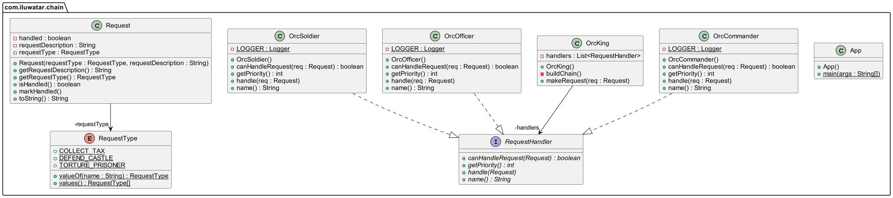

## أيضًا معروف بـ

* سلسلة الأوامر
* سلسلة الكائنات
* سلسلة المسؤولية

## الغرض

يمنع ربط مُرسل الطلب بمستقبله من خلال إعطاء أكثر من كائن الفرصة لإدارة الطلب. يربط الكائنات المستقبلية معًا ويمرر الطلب عبر السلسلة حتى يتمكن أحد الكائنات من معالجته.

## الشرح

مثال من الحياة الواقعية

> الملك الأورك يعطي أوامر بصوت عالٍ لجيشه. أقرب شخص للرد هو القائد، ثم الضابط، ثم الجندي. القائد، الضابط، والجندي يشكلون سلسلة من المسؤولية.

بكلمات بسيطة

> يساعد في بناء سلسلة من الكائنات. يدخل الطلب من طرف ويتنقل عبر كائنات متعددة حتى يجد مديرًا مناسبًا.

تقول ويكيبيديا

> في التصميم الموجه للكائنات، نمط سلسلة المسؤولية هو نمط تصميم يتكون من مصدر لأوامر الكائنات وسلسلة من كائنات المعالجة. يحتوي كل كائن معالجة على منطق يحدد أنواع أوامر الكائنات التي يمكنه التعامل معها؛ يتم تمرير البقية إلى كائن المعالجة التالي في السلسلة.

**مثال برمجي**

ترجمة لمثالنا مع الأورك أعلاه. أولًا، لدينا الكلاس `Request`:


```java
import lombok.Getter;

@Getter
public class Request {

    private final RequestType requestType;
    private final String requestDescription;
    private boolean handled;

    public Request(final RequestType requestType, final String requestDescription) {
        this.requestType = Objects.requireNonNull(requestType);
        this.requestDescription = Objects.requireNonNull(requestDescription);
    }

    public void markHandled() {
        this.handled = true;
    }

    @Override
    public String toString() {
        return getRequestDescription();
    }
}

public enum RequestType {
    DEFEND_CASTLE, TORTURE_PRISONER, COLLECT_TAX
}
```

أدناه، نعرض تسلسل هرم مدير الطلبات.


```java
public interface RequestHandler {

    boolean canHandleRequest(Request req);

    int getPriority();

    void handle(Request req);

    String name();
}

@Slf4j
public class OrcCommander implements RequestHandler {
    @Override
    public boolean canHandleRequest(Request req) {
        return req.getRequestType() == RequestType.DEFEND_CASTLE;
    }

    @Override
    public int getPriority() {
        return 2;
    }

    @Override
    public void handle(Request req) {
        req.markHandled();
        LOGGER.info("{} handling request \"{}\"", name(), req);
    }

    @Override
    public String name() {
        return "Orc commander";
    }
}

// يتم تعريف OrcOfficer و OrcSoldier بطريقة مشابهة لـ OrcCommander


```

الملك أورك يعطي الأوامر ويشكل السلسلة.


```java
public class OrcKing {

    private List<RequestHandler> handlers;

    public OrcKing() {
        buildChain();
    }

    private void buildChain() {
        handlers = Arrays.asList(new OrcCommander(), new OrcOfficer(), new OrcSoldier());
    }

    public void makeRequest(Request req) {
        handlers
                .stream()
                .sorted(Comparator.comparing(RequestHandler::getPriority))
                .filter(handler -> handler.canHandleRequest(req))
                .findFirst()
                .ifPresent(handler -> handler.handle(req));
    }
}
```

سلسلة المسؤولية في العمل.


```java
var king=new OrcKing();
        king.makeRequest(new Request(RequestType.DEFEND_CASTLE,"defend castle"));
        king.makeRequest(new Request(RequestType.TORTURE_PRISONER,"torture prisoner"));
        king.makeRequest(new Request(RequestType.COLLECT_TAX,"collect tax"));
```

إخراج وحدة التحكم.


```
Orc commander handling request "defend castle"
Orc officer handling request "torture prisoner"
Orc soldier handling request "collect tax"
```

## مخطط الفئات



## التطبيقية

استخدم سلسلة المسؤولية عندما

* يمكن لعدة كائنات معالجة الطلب، ولا يتم التعرف على المعالج مسبقًا. يجب تحديد المعالج تلقائيًا.
* ترغب في إرسال طلب إلى أحد الكائنات دون تحديد المستقبل بشكل صريح.
* يجب تحديد مجموعة الكائنات التي يمكنها معالجة الطلب ديناميكيًا.

## الاستخدامات المعروفة

* التفاعل مع الأحداث في إطارات واجهات المستخدم الرسومية حيث يمكن معالجة الحدث في عدة مستويات من تسلسل مكونات واجهة المستخدم.
* إطارات عمل الوسطاء حيث يمر الطلب عبر سلسلة من كائنات المعالجة.
* أنظمة السجلات حيث يمكن أن تمر الرسائل عبر سلسلة من المسجلين، مع إمكانية معالجتها بطرق مختلفة.
* [java.util.logging.Logger#log()](http://docs.oracle.com/javase/8/docs/api/java/util/logging/Logger.html#log%28java.util.logging.Level,%20java.lang.String%29)
* [Apache Commons Chain](https://commons.apache.org/proper/commons-chain/index.html)
* [javax.servlet.Filter#doFilter()](http://docs.oracle.com/javaee/7/api/javax/servlet/Filter.html#doFilter-javax.servlet.ServletRequest-javax.servlet.ServletResponse-javax.servlet.FilterChain-)

## العواقب

المزايا:

* تقليل الترابط. لا يحتاج مُرسل الطلب إلى معرفة المعالج المحدد الذي سيعالج الطلب.
* مرونة أكبر في تخصيص المسؤوليات للكائنات. يمكن إضافة أو تغيير المسؤوليات لإدارة الطلب عن طريق تغيير أعضاء وترتيب السلسلة.
* يتيح تعيين معالج افتراضي إذا لم يكن هناك معالج محدد يمكنه معالجة الطلب.

العيوب:

* قد يكون من الصعب تصحيح الأخطاء وفهم التدفق، خاصة إذا كانت السلسلة طويلة ومعقدة.
* قد يبقى الطلب دون معالجة إذا كانت السلسلة لا تحتوي على معالج "التقاط الكل".
* قد تنشأ مشكلات في الأداء بسبب إمكانية مرور الطلب عبر عدة معالجات قبل العثور على المعالج المناسب، أو عدم العثور عليه على الإطلاق.

## الأنماط ذات الصلة

* [الأمر](https://java-design-patterns.com/patterns/command/): يمكن استخدامه لتغليف طلب ككائن، يمكن تمريره عبر السلسلة.
* [التركيب](https://java-design-patterns.com/patterns/composite/): غالبًا ما يتم تطبيق نمط سلسلة المسؤولية مع نمط التركيب.
* [الزخرفة](https://java-design-patterns.com/patterns/decorator/): يمكن ربط الزخارف بشكل مشابه للمسؤوليات في نمط سلسلة المسؤولية.

## الاعتمادات

* [Design Patterns: Elements of Reusable Object-Oriented Software](https://www.amazon.com/gp/product/0201633612/ref=as_li_tl?ie=UTF8&camp=1789&creative=9325&creativeASIN=0201633612&linkCode=as2&tag=javadesignpat-20&linkId=675d49790ce11db99d90bde47f1aeb59)
* [Head First Design Patterns: A Brain-Friendly Guide](https://www.amazon.com/gp/product/0596007124/ref=as_li_tl?ie=UTF8&camp=1789&creative=9325&creativeASIN=0596007124&linkCode=as2&tag=javadesignpat-20&linkId=6b8b6eea86021af6c8e3cd3fc382cb5b)
* [Pattern-Oriented Software Architecture, Volume 1: A System of Patterns](https://amzn.to/3PAJUg5)
* [Refactoring to Patterns](https://amzn.to/3VOO4F5)
* [Pattern languages of program design 3](https://amzn.to/4a4NxTH)
