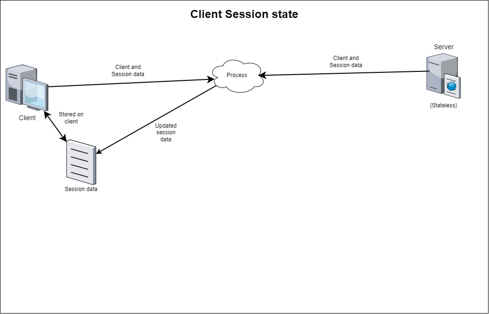

## أيضًا معروف باسم

* جلسة المستخدم

## الهدف

يهدف نمط التصميم "جلسة العميل" إلى الحفاظ على حالة وبيانات المستخدم عبر طلبات متعددة ضمن تطبيق ويب، مما يضمن تجربة مستخدم مستمرة وشخصية.

## الشرح

مثال واقعي

> ترغب في إنشاء تطبيق لإدارة البيانات يسمح للمستخدمين بإرسال طلبات إلى الخادم لتعديل وإجراء تغييرات على البيانات المخزنة على أجهزتهم. هذه الطلبات صغيرة والبيانات فردية لكل مستخدم، مما يلغي الحاجة إلى تنفيذ قاعدة بيانات واسعة النطاق. باستخدام نمط جلسة العميل، يمكن إدارة عدة طلبات في نفس الوقت، مع تحقيق توازن في تحميل العملاء عبر خوادم مختلفة بسهولة لأن الخوادم تظل بدون حالة. كما يتم القضاء على الحاجة إلى تخزين معرفات الجلسة على الخادم لأن العملاء يقدمون كل المعلومات التي يحتاجها الخادم لمعالجة طلباتهم.

بإيجاز

> بدلاً من تخزين معلومات عن العميل الحالي والمعلومات التي يتم الوصول إليها على الخادم، يتم الاحتفاظ بها فقط على جانب العميل. يجب على العميل إرسال بيانات الجلسة مع كل طلب إلى الخادم ويجب عليه إرسال حالة محدثة مرة أخرى إلى العميل، التي يتم تخزينها على جهاز العميل. لا يتعين على الخادم تخزين معلومات العميل. ([مرجع](https://dzone.com/articles/practical-php-patterns/practical-php-patterns-client))

**مثال برمجي**

إليك كود مثال لوصف نمط جلسة العميل. في الكود التالي، نقوم أولاً بإنشاء مثيل للخادم. سيتم استخدام هذا المثيل بعد ذلك للحصول على كائنات الجلسة لعميلين. كما ترى في الكود التالي، يمكن استخدام كائن الجلسة لتخزين أي معلومات ذات صلة يحتاجها الخادم لمعالجة طلب العميل. سيتم تمرير هذه الكائنات مع كل طلب إلى الخادم. سيتضمن الطلب كائن الجلسة الذي يخزن التفاصيل ذات الصلة بالعميل مع البيانات المطلوبة لمعالجة الطلب. تساعد معلومات الجلسة في كل طلب الخادم في التعرف على العميل ومعالجة الطلب بناءً على ذلك.


```java
public class App {

    public static void main(String[] args) {
        var server = new Server("localhost", 8080);
        var session1 = server.getSession("Session1");
        var session2 = server.getSession("Session2");
        var request1 = new Request("Data1", session1);
        var request2 = new Request("Data2", session2);
        server.process(request1);
        server.process(request2);
    }
}

@Data
@AllArgsConstructor
public class Session {

    /**
     * Session id.
     */
    private String id;

    /**
     * Client name.
     */
    private String clientName;

}

@Data
@AllArgsConstructor
public class Request {

    private String data;

    private Session session;

}
```

## مخطط الهيكلية



## قابلية التطبيق

استخدم نمط حالة الجلسة عندما:

* التطبيقات الويب التي تتطلب مصادقة وتفويض المستخدم.
* التطبيقات التي تحتاج إلى تتبع أنشطة وتفضيلات المستخدم عبر طلبات أو زيارات متعددة.
* الأنظمة التي يحتاج فيها موارد الخادم إلى التحسين عن طريق تحميل إدارة الحالة إلى جانب العميل.

## الاستخدامات المعروفة

* مواقع التجارة الإلكترونية لتتبع محتويات سلة التسوق عبر الجلسات.
* المنصات عبر الإنترنت التي تقدم محتوى مخصص بناءً على تفضيلات وسجل المستخدم.
* تطبيقات الويب التي تتطلب تسجيل دخول المستخدم للوصول إلى المحتوى المخصص أو الآمن.

## العواقب

الفوائد:

* تحسين أداء الخادم من خلال تقليل الحاجة لتخزين حالة المستخدم على الخادم.
* تحسين تجربة المستخدم من خلال المحتوى المخصص والتنقل السلس عبر أجزاء التطبيق المختلفة.
* مرونة في إدارة الجلسات من خلال عدة آليات تخزين على جانب العميل (مثل الكوكيز، Web Storage API).

العيوب:

* مخاطر محتملة للأمان إذا تم تخزين معلومات حساسة في جلسات العميل دون التشفير والتحقق المناسب.
* الاعتماد على قدرات وضبط العميل، مثل سياسات الكوكيز التي قد تختلف حسب المتصفح وإعدادات المستخدم.
* زيادة التعقيد في منطق إدارة الجلسات، خاصة في إدارة انتهاء الصلاحية، التجديد ومزامنة الجلسات عبر الأجهزة أو النوافذ المتعددة.

## الأنماط ذات الصلة

* جلسة الخادم: غالباً ما يُستخدم جنباً إلى جنب مع نمط جلسة العميل لتوفير توازن بين كفاءة جانب العميل والتحكم في جانب الخادم.
* [سينجلتون](https://java-design-patterns.com/patterns/singleton/): ضمان وجود مثيل واحد فقط من جلسة المستخدم في التطبيق بأكمله.
* [حالة](https://java-design-patterns.com/patterns/state/): إدارة تحولات الحالة في الجلسة مثل الحالات المصادق عليها، الضيف أو المنتهية.

## الفضل

* [DZone - Practical PHP patterns](https://dzone.com/articles/practical-php-patterns/practical-php-patterns-client)
* [نمط حالة جلسة العميل - Ram N Java](https://www.youtube.com/watch?v=ycOSj9g41pc)
* [Java الاحترافي لتطبيقات الويب](https://amzn.to/4aazY59)
* [تأمين تطبيقات الويب باستخدام Spring Security](https://amzn.to/3PCCEA1)
