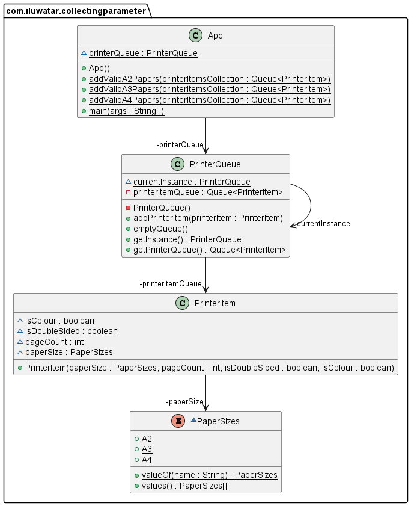

## أيضًا يُعرف بـ

* جامع
* مُجمّع

## الهدف

يهدف إلى تبسيط الطرق التي تجمع المعلومات من خلال تمرير كائن جمع واحد عبر عدة استدعاءات للطرق، مما يسمح لها بإضافة النتائج إلى هذه المجموعة بدلاً من أن يقوم كل طريقة بإنشاء مجموعة خاصة بها.

## الشرح

### مثال من العالم الحقيقي

داخل مبنى تجاري كبير، توجد طابعات مُشتركة تعد مجموعة من جميع وظائف الطباعة المعلقة حاليًا. تحتوي الطوابق المختلفة على طرز مختلفة من الطابعات، ولكل منها سياسة طباعة مختلفة. يجب علينا بناء برنامج يمكنه إضافة مهام الطباعة المناسبة بشكل مستمر إلى مجموعة تسمى *معامل الجمع*.

### ببساطة

بدلاً من وجود دالة ضخمة تحتوي على العديد من السياسات لجمع المعلومات في متغير، يمكننا إنشاء العديد من الدوال الصغيرة التي تأخذ كل معلم، وتضيف معلومات جديدة. يمكننا تمرير المعامل إلى كل من هذه الدوال الصغيرة وفي النهاية، سيكون لدينا ما أردناه في الأصل. في هذه المرة، يكون الكود أنظف وأسهل في الفهم. نظرًا لأن الدالة الكبيرة قد تم تقسيمها، فإن الكود أيضًا أسهل في التعديل حيث يتم تحديد التغييرات في الدوال الصغيرة.

### تقول ويكيبيديا

في اصطلاح المعاملات الجامعية، يتم تمرير مجموعة (قائمة، خريطة، إلخ) بشكل متكرر كمعامل إلى دالة تضيف العناصر إلى المجموعة.

### مثال برمجي

بتشفير مثالنا السابق، يمكننا استخدام مجموعة `النتيجة` كمعامل جامع. يتم تنفيذ القيود التالية:

- إذا كان ورق A4 ملونًا، يجب أن يكون أيضًا من جهة واحدة. يتم قبول جميع الأوراق غير الملونة الأخرى.
- لا يجب أن يكون ورق A3 ملونًا ويجب أن يكون من جهة واحدة.
- يجب أن يكون ورق A2 من صفحة واحدة، من جهة واحدة وغير ملون.


```java
package com.iluwatar.collectingparameter;

import java.util.LinkedList;
import java.util.Queue;

public class App {
    static PrinterQueue printerQueue = PrinterQueue.getInstance();

    /**
     * Program entry point.
     *
     * @param args command line args
     */
    public static void main(String[] args) {
    /*
      Initialising the printer queue with jobs
    */
        printerQueue.addPrinterItem(new PrinterItem(PaperSizes.A4, 5, false, false));
        printerQueue.addPrinterItem(new PrinterItem(PaperSizes.A3, 2, false, false));
        printerQueue.addPrinterItem(new PrinterItem(PaperSizes.A2, 5, false, false));

    /*
      This variable is the collecting parameter.
    */
        var result = new LinkedList<PrinterItem>();

        /*
         * Using numerous sub-methods to collaboratively add information to the result collecting parameter
         */
        addA4Papers(result);
        addA3Papers(result);
        addA2Papers(result);
    }
}
```

نستخدم الطرق `addA4Paper` و `addA3Paper` و `addA2Paper` لملء معامل الجمع `النتيجة` بالوظائف المناسبة للطباعة وفقًا للسياسة الموصوفة سابقًا. يتم ترميز السياسات الثلاث كما يلي:


```java
public class App {
    static PrinterQueue printerQueue = PrinterQueue.getInstance();

    /**
     * Adds A4 document jobs to the collecting parameter according to some policy that can be whatever the client
     * (the print center) wants.
     *
     * @param printerItemsCollection the collecting parameter
     */
    public static void addA4Papers(Queue<PrinterItem> printerItemsCollection) {
    /*
      Iterate through the printer queue, and add A4 papers according to the correct policy to the collecting parameter,
      which is 'printerItemsCollection' in this case.
     */
        for (PrinterItem nextItem : printerQueue.getPrinterQueue()) {
            if (nextItem.paperSize.equals(PaperSizes.A4)) {
                var isColouredAndSingleSided =
                        nextItem.isColour && !nextItem.isDoubleSided;
                if (isColouredAndSingleSided) {
                    printerItemsCollection.add(nextItem);
                } else if (!nextItem.isColour) {
                    printerItemsCollection.add(nextItem);
                }
            }
        }
    }

    /**
     * Adds A3 document jobs to the collecting parameter according to some policy that can be whatever the client
     * (the print center) wants. The code is similar to the 'addA4Papers' method. The code can be changed to accommodate
     * the wants of the client.
     *
     * @param printerItemsCollection the collecting parameter
     */
    public static void addA3Papers(Queue<PrinterItem> printerItemsCollection) {
        for (PrinterItem nextItem : printerQueue.getPrinterQueue()) {
            if (nextItem.paperSize.equals(PaperSizes.A3)) {

                // Encoding the policy into a Boolean: the A3 paper cannot be coloured and double-sided at the same time
                var isNotColouredAndSingleSided =
                        !nextItem.isColour && !nextItem.isDoubleSided;
                if (isNotColouredAndSingleSided) {
                    printerItemsCollection.add(nextItem);
                }
            }
        }
    }

    /**
     * Adds A2 document jobs to the collecting parameter according to some policy that can be whatever the client
     * (the print center) wants. The code is similar to the 'addA4Papers' method. The code can be changed to accommodate
     * the wants of the client.
     *
     * @param printerItemsCollection the collecting parameter
     */
    public static void addA2Papers(Queue<PrinterItem> printerItemsCollection) {
        for (PrinterItem nextItem : printerQueue.getPrinterQueue()) {
            if (nextItem.paperSize.equals(PaperSizes.A2)) {

                // Encoding the policy into a Boolean: the A2 paper must be single page, single-sided, and non-coloured.
                var isNotColouredSingleSidedAndOnePage =
                        nextItem.pageCount == 1 &&
                                !nextItem.isDoubleSided
                                && !nextItem.isColour;
                if (isNotColouredSingleSidedAndOnePage) {
                    printerItemsCollection.add(nextItem);
                }
            }
        }
    }
}
```

كل طريقة تأخذ كمعامل معلمة جمع. بعد ذلك، تضيف العناصر، المأخوذة من متغير عالمي، إلى هذه المعلمة إذا كانت كل عنصر يفي بمعيار معين. يمكن أن تحتوي هذه الطرق على السياسة التي يرغب فيها العميل.

في هذا المثال البرمجي، يتم إضافة ثلاث مهام طباعة إلى الطابور. فقط أول مهمتين للطباعة يجب إضافتهما إلى معلمة الجمع وفقًا للسياسة. العناصر في متغير `النتيجة` بعد التنفيذ هي:

| حجم الورق | عدد الصفحات | مزدوج الوجه | ملون |
|-----------|-------------|-------------|------|
| A4        | 5           | false       | false |
| A3        | 2           | false       | false |

وهذا هو ما توقعناه.

## مخطط الفئات



## قابلية التطبيق

استخدم نمط التصميم جمع المعاملات عندما:

- عندما تنتج عدة طرق مجموعة من النتائج وتريد إضافة هذه النتائج بطريقة موحدة.
- في السيناريوهات حيث يمكن أن يحسن تقليل عدد المجموعات التي يتم إنشاؤها بواسطة الطرق من كفاءة الذاكرة والأداء.
- عند إعادة هيكلة الطرق الكبيرة التي تقوم بعدة مهام، بما في ذلك جمع النتائج من عمليات متعددة.

## الدروس التعليمية

الدروس التعليمية لهذه الطريقة موجودة في:

- [Refactoring To Patterns](http://www.tarrani.net/RefactoringToPatterns.pdf) بواسطة Joshua Kerivsky
- [Smalltalk Best Practice Patterns](https://ptgmedia.pearsoncmg.com/images/9780134769042/samplepages/013476904X.pdf) بواسطة Kent Beck

## الاستخدامات المعروفة

يوضح Joshua Kerivsky مثالًا واقعيًا في كتابه 'Refactoring to Patterns'. يقدم مثالًا لاستخدام نمط التصميم "جمع المعاملات" لإنشاء طريقة `toString()` لشجرة XML. بدون استخدام هذا النمط، سيحتاج ذلك إلى وظيفة ضخمة تحتوي على شروط ودمج النصوص مما سيزيد من صعوبة قراءة الشيفرة. يمكن تقسيم مثل هذه الطريقة إلى طرق أصغر، حيث يضيف كل منها مجموعة خاصة من المعلومات إلى معلمة الجمع. انظر إلى هذا في [Refactoring To Patterns](http://www.tarrani.net/RefactoringToPatterns.pdf).

أمثلة أخرى هي:

- إضافة رسائل الخطأ أو فشل التحقق في عملية تحقق معقدة.
- جمع العناصر أو المعلومات أثناء التنقل في هيكل بيانات معقد.
- إعادة هيكلة الوظائف المعقدة للتقارير حيث يتم إنشاء أجزاء متعددة من التقرير باستخدام طرق مختلفة.

## العواقب

المزايا:

- يقلل من تكرار الشيفرة من خلال تجميع معالجة المجموعات في مكان واحد.
- يحسن الوضوح وقابلية الصيانة من خلال توضيح مكان وكيفية جمع النتائج.
- يحسن الأداء عن طريق تقليل إنشاء وإدارة كائنات جمع متعددة.

العيوب:

- يزيد من الترابط بين المنادي والطرق المنادى عليها، حيث يجب أن يتفقوا على المجموعة المستخدمة.
- قد يقدم آثار جانبية في الطرق إذا لم تتم إدارتها بعناية، حيث لم تعد الطرق مستقلة في إدارة النتائج.

## الأنماط ذات الصلة

- [Composite](https://java-design-patterns.com/patterns/composite/): يمكن استخدامه مع جمع المعاملات عند العمل مع الهياكل الهرمية، مما يسمح بجمع النتائج عبر هيكل مركب.
- [Visitor](https://java-design-patterns.com/patterns/visitor/): يستخدم غالبًا معًا، حيث يتولى Visitor المرور وإجراء العمليات في هيكل، بينما يقوم جمع المعاملات بتراكم النتائج.
- [Command](https://java-design-patterns.com/patterns/command/): يمكن للأوامر استخدام معلمة الجمع لإضافة نتائج عدة عمليات يتم تنفيذها بواسطة كائنات الأمر.

## الشكر

- [Refactoring To Patterns](http://www.tarrani.net/RefactoringToPatterns.pdf) بواسطة Joshua Kerivsky
- [Smalltalk Best Practice Patterns](https://ptgmedia.pearsoncmg.com/images/9780134769042/samplepages/013476904X.pdf) بواسطة Kent Beck
- [Wiki](https://wiki.c2.com/?CollectingParameter)
- [Refactoring: Improving the Design of Existing Code](https://amzn.to/3TVEgaB)
- [Clean Code: A Handbook of Agile Software Craftsmanship](https://amzn.to/4aApLP0)
