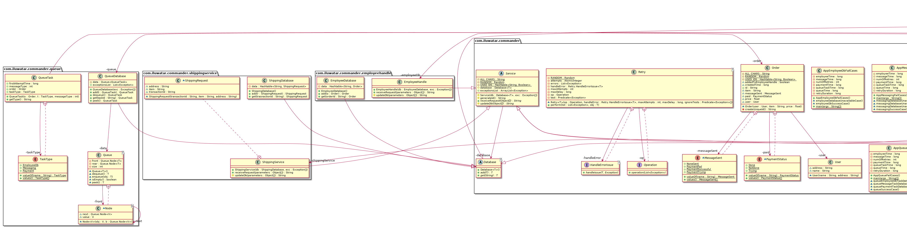

## أيضا يُعرف باسم

* منسق المعاملات الموزعة
* منسق المعاملات

## الهدف

الهدف من نمط "المنسق" في سياق المعاملات الموزعة هو إدارة وتنسيق المعاملات المعقدة عبر العديد من المكونات أو الخدمات الموزعة، مما يضمن التناسق والنزاهة للمعاملة العالمية. يقوم بتغليف أوامر المعاملات ومنطق التنسيق، مما يسهل تنفيذ بروتوكولات المعاملات الموزعة مثل الالتزام ذو المرحلتين أو ساغا.

## الشرح

مثال حقيقي

> تخيل أنك تنظم مهرجان موسيقي دولي كبير، حيث من المقرر أن تؤدي عدة فرق من جميع أنحاء العالم. وصول كل فرقة، واختبار الصوت، والأداء، كل منها يعد معاملة فردية في نظام موزع. يتصرف منظم المهرجان كـ "منسق"، منسقًا هذه المعاملات لضمان أنه إذا تأخر طيران إحدى الفرق (مثل فشل المعاملة)، فهناك خطة احتياطية مثل إعادة جدولة أو تبادل الفترات الزمنية مع فرقة أخرى (إجراءات تعويضية)، للحفاظ على سير البرنامج العام. تعكس هذه الإعدادات نمط المنسق في المعاملات الموزعة، حيث يجب تنسيق العديد من المكونات لتحقيق نتيجة مرضية رغم الفشل الفردي.

بكلمات بسيطة

> يقوم نمط "المنسق" بتحويل الطلب إلى كائن مستقل، مما يسمح بمعلمة الأوامر، ووضع الإجراءات في طابور، وتنفيذ عمليات التراجع.

**مثال برمجي**

إدارة المعاملات عبر خدمات مختلفة في نظام موزع، مثل منصة للتجارة الإلكترونية تحتوي على خدمات منفصلة للدفع والشحن، تتطلب تنسيقًا دقيقًا لتجنب المشكلات. عندما يقدم المستخدم طلبًا ولكن خدمة واحدة (مثل الدفع) غير متوفرة بينما الخدمة الأخرى (مثل الشحن) جاهزة، نحتاج إلى حل قوي للتعامل مع هذا التفاوت.

إحدى الاستراتيجيات لحل هذه المشكلة هي استخدام مكون منسق لتنظيم العملية. في البداية، تتم معالجة الطلب من قبل الخدمة المتاحة (الشحن في هذه الحالة). ثم يحاول المنسق مزامنة الطلب مع الخدمة غير المتوفرة في ذلك الوقت (الدفع) من خلال تخزين تفاصيل الطلب في قاعدة بيانات أو وضعه في طابور للمعالجة في المستقبل. يجب أن يأخذ هذا النظام في الحسبان الفشل المحتمل عند إضافة الطلبات إلى الطابور.

يحاول المنسق بشكل متكرر معالجة الطلبات في الطابور لضمان أن تعكس جميع الخدمات أخيرًا نفس بيانات المعاملة. يتضمن هذا العملية ضمان التكرارية، مما يعني أنه حتى إذا تم إجراء نفس طلب مزامنة الطلبات عدة مرات، فسيتم تنفيذه مرة واحدة فقط، مما يمنع المعاملات المكررة. الهدف هو تحقيق التناسق النهائي بين الخدمات، حيث تتزامن جميع الأنظمة بمرور الوقت على الرغم من الفشل أو التأخير الأولي.

في الكود المقدم، يُستخدم نمط المنسق لإدارة المعاملات الموزعة عبر العديد من الخدمات (خدمة الدفع، خدمة الشحن، خدمة الرسائل، إدارة الموظفين). كل خدمة تحتوي على قاعدة بيانات خاصة بها ويمكن أن تُطلق استثناءات لمحاكاة الفشل.

فئة المنسق هي الجزء المركزي من هذا النمط. تأخذ الفئة المنسق مثيلات لجميع الخدمات وقواعد بياناتها، جنبًا إلى جنب مع بعض معلمات التكوين. تُستخدم دالة placeOrder في فئة المنسق لتنفيذ الطلب، مما يتطلب التفاعل مع جميع الخدمات.


```java
public class Commander {
    // ... constructor and other methods ...

    public void placeOrder(Order order) {
        // ... implementation ...
    }
}
```

تمثل الفئات "المستخدم" و "الطلب" مستخدمًا وطلبًا على التوالي. يتم إجراء الطلب بواسطة المستخدم.


```java
public class User {
    // ... constructor and other methods ...
}

public class Order {
    // ... constructor and other methods ...
}
```

كل خدمة (على سبيل المثال، خدمة الدفع، خدمة الشحن، خدمة الرسائل، إدارة الموظفين) لديها قاعدة بيانات خاصة بها ويمكن أن تُطلق استثناءات لمحاكاة الأعطال. على سبيل المثال، قد تقوم خدمة الدفع بإطلاق استثناء DatabaseUnavailableException إذا كانت قاعدة بياناتها غير متاحة.


```java
public class PaymentService {
    // ... constructor and other methods ...
}
```

تمثل الفئات DatabaseUnavailableException و ItemUnavailableException و ShippingNotPossibleException أنواعًا مختلفة من الاستثناءات التي قد تحدث.


```java
public class DatabaseUnavailableException extends Exception {
    // ... constructor and other methods ...
}

public class ItemUnavailableException extends Exception {
    // ... constructor and other methods ...
}

public class ShippingNotPossibleException extends Exception {
    // ... constructor and other methods ...
}
```

في الطريقة الرئيسية لكل فئة (AppQueueFailCases و AppShippingFailCases)، يتم محاكاة سيناريوهات مختلفة عن طريق إنشاء مثيلات من فئة Commander مع تكوينات مختلفة واستدعاء طريقة placeOrder.

## مخطط الفئات



## قابلية التطبيق

استخدم نمط Commander للمعاملات الموزعة عندما:

* تحتاج إلى ضمان اتساق البيانات بين الخدمات الموزعة في حالة حدوث فشل جزئي في النظام.
* تشمل المعاملات عدة خدمات ميكروسيرفيس أو مكونات موزعة تتطلب commit أو rollback منسق.
* تقوم بتنفيذ معاملات طويلة الأجل تتطلب إجراءات تعويضية للإلغاء.

## الاستخدامات المعروفة

* بروتوكولات Two-Phase Commit (2PC): التنسيق بين commit أو rollback عبر قواعد البيانات أو الخدمات الموزعة.
* تنفيذات نمط Saga: إدارة عمليات الأعمال طويلة الأجل التي تشمل العديد من الميكروسيرفيس، مع وجود إجراء تعويضي لكل خطوة للإلغاء.
* المعاملات الموزعة في بنية الميكروسيرفيس: تنسيق العمليات المعقدة بين الميكروسيرفيس مع الحفاظ على تكامل البيانات واتساقها.

## العواقب

الفوائد:

* يوفر آلية واضحة لإدارة المعاملات الموزعة المعقدة، مما يحسن موثوقية النظام.
* يسمح بتنفيذ المعاملات التعويضية، وهي ضرورية للحفاظ على التناسق في المعاملات طويلة الأجل.
* يسهل دمج الأنظمة المتجانسة في سياق المعاملات.

العيوب:

* يزيد من التعقيد، خاصة في حالات الفشل، بسبب الحاجة إلى آليات التراجع المنسقة.
* قد يؤثر على الأداء بسبب الحمل الزائد للتنسيق وفحوصات التناسق.
* قد تؤدي التنفيذات المعتمدة على Saga إلى زيادة التعقيد في فهم سير العملية التجارية العامة.

## الأنماط المرتبطة

[Nمط Saga](https://java-design-patterns.com/patterns/saga/): غالبًا ما يتم مناقشته مع نمط Commander للمعاملات الموزعة، مع التركيز على المعاملات طويلة الأجل مع إجراءات تعويضية.

## الشكر

* [المعاملات الموزعة: جبال الجليد في الميكروسيرفيس](https://www.grahamlea.com/2016/08/distributed-transactions-microservices-icebergs/)
* [أنماط الميكروسيرفيس: مع أمثلة في جافا](https://amzn.to/4axjnYW)
* [تصميم التطبيقات المعتمدة على البيانات: الأفكار الكبيرة وراء الأنظمة القابلة للاعتماد، القابلة للتوسع، والقابلة للصيانة](https://amzn.to/4axHwOV)
* [أنماط تكامل المؤسسات: تصميم وبناء ونشر حلول الرسائل](https://amzn.to/4aATcRe)
