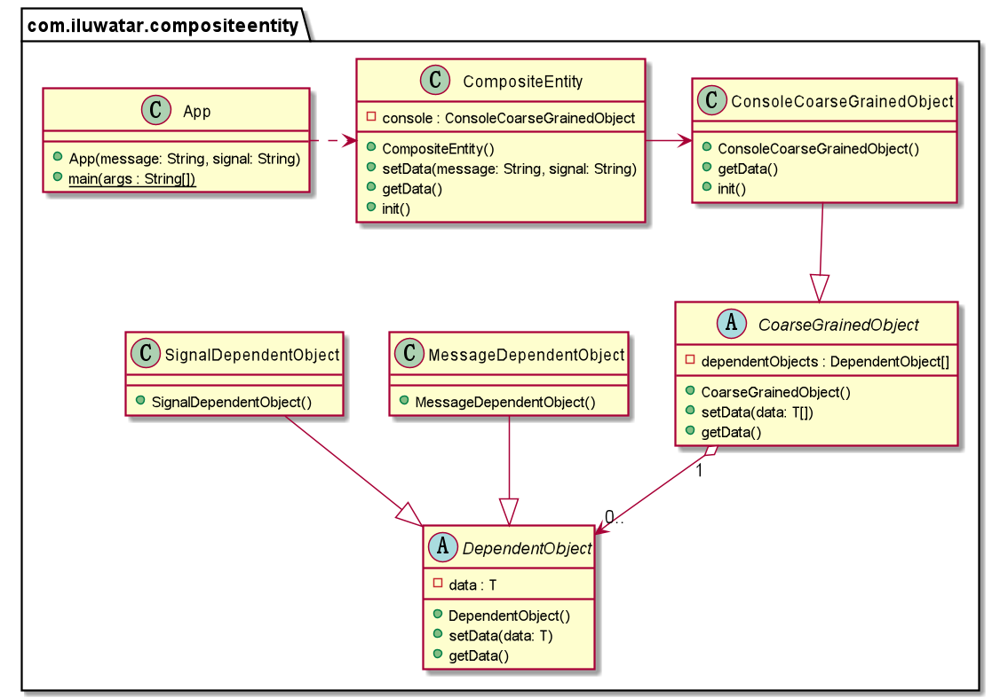

## أيضا يُعرف بـ

* الكيان ذو الحبيبات الخشنة

## الهدف

هدف نمط التصميم **الكيان المركب** هو إدارة مجموعة من الكائنات المستمرة المترابطة كما لو كانت كيانًا واحدًا. يتم استخدامه عادة في سياق **Enterprise JavaBeans (EJB)** وأطر العمل التجارية المماثلة لتمثيل الهياكل البيانية للبيانات ضمن نماذج الأعمال، مما يتيح للعملاء التعامل معها كوحدة واحدة.

## الشرح

مثال واقعي

> في وحدة التحكم، قد يكون هناك العديد من الواجهات التي تحتاج إلى إدارة ومراقبة. باستخدام نمط الكيان المركب، يمكن دمج الكائنات المعتمدة مثل الرسائل والإشارات والسيطرة عليها باستخدام كائن واحد.

بكلمات بسيطة

> نمط الكيان المركب يسمح بتمثيل وإدارة مجموعة من الكائنات المرتبطة من خلال كائن موحد.

**مثال برمجي**

نحتاج إلى حل عام للمشكلة. لذلك، سنقدم نمطًا عامًا للكيان المركب.


```java
public abstract class DependentObject<T> {

    T data;

    public void setData(T message) {
        this.data = message;
    }

    public T getData() {
        return data;
    }
}

public abstract class CoarseGrainedObject<T> {

    DependentObject<T>[] dependentObjects;

    public void setData(T... data) {
        IntStream.range(0, data.length).forEach(i -> dependentObjects[i].setData(data[i]));
    }

    public T[] getData() {
        return (T[]) Arrays.stream(dependentObjects).map(DependentObject::getData).toArray();
    }
}

```

الكائن المركب المتخصص `consola` يرث من هذه الفئة الأساسية بالطريقة التالية.


```java
public class MessageDependentObject extends DependentObject<String> {

}

public class SignalDependentObject extends DependentObject<String> {

}

public class ConsoleCoarseGrainedObject extends CoarseGrainedObject<String> {

    @Override
    public String[] getData() {
        super.getData();
        return new String[] {
                dependentObjects[0].getData(), dependentObjects[1].getData()
        };
    }

    public void init() {
        dependentObjects = new DependentObject[] {
                new MessageDependentObject(), new SignalDependentObject()};
    }
}

public class CompositeEntity {

    private final ConsoleCoarseGrainedObject console = new ConsoleCoarseGrainedObject();

    public void setData(String message, String signal) {
        console.setData(message, signal);
    }

    public String[] getData() {
        return console.getData();
    }
}
```

إدارة الآن تخصيص كائنات الرسالة والإشارة مع الكائن المركب `consola`.


```java
var console=new CompositeEntity();
        console.init();
        console.setData("No Danger","Green Light");
        Arrays.stream(console.getData()).forEach(LOGGER::info);
        console.setData("Danger","Red Light");
        Arrays.stream(console.getData()).forEach(LOGGER::info);
```

## مخطط الفئات



## القابلية للتطبيق

* مفيد في التطبيقات التجارية حيث تكون الكائنات التجارية معقدة وتنطوي على عدة كائنات مترابطة.
* مثالي للسيناريوهات التي يحتاج فيها العملاء للعمل مع واجهة موحدة لمجموعة من الكائنات بدلاً من الكائنات الفردية.
* قابل للتطبيق في الأنظمة التي تتطلب عرضًا مبسطًا لنموذج بيانات معقد للعملاء أو الخدمات الخارجية.

## الاستخدامات المعروفة

* التطبيقات التجارية ذات النماذج التجارية المعقدة، وخاصة تلك التي تستخدم EJB أو أطر عمل تجارية مشابهة.
* الأنظمة التي تتطلب تجريدًا فوق مخططات قواعد بيانات معقدة لتبسيط التفاعلات مع العملاء.
* التطبيقات التي تحتاج إلى تعزيز التناسق أو المعاملات عبر عدة كائنات في كائن تجاري واحد.

## العواقب

الفوائد:

* يبسط تفاعلات العميل مع النماذج الكائنية المعقدة من خلال توفير واجهة موحدة.
* يعزز إعادة الاستخدام والصيانة في طبقة الأعمال عن طريق فصل كود العميل عن المكونات الداخلية المعقدة للكائنات التجارية.
* يسهل إدارة المعاملات وتطبيق التناسق في مجموعة من الكائنات المترابطة.

السلبيات:

* قد يقدم مستوى من الاستدلال الذي قد يؤثر على الأداء.
* قد يؤدي إلى واجهات ذات حبوب خشنة جدًا قد لا تكون مرنة لجميع احتياجات العملاء.
* يتطلب تصميمًا دقيقًا لتجنب الكائنات المركبة المتضخمة التي يصعب إدارتها.

## الأنماط ذات الصلة

* [الزخرفة](https://java-design-patterns.com/patterns/decorator/): لإضافة سلوك ديناميكي للكائنات الفردية داخل الكائن المركب دون التأثير على الهيكل.
* [الواجهة](https://java-design-patterns.com/patterns/facade/): يوفر واجهة مبسطة لنظام فرعي معقد، بشكل مشابه لكيفية تبسيط الكائن المركب الوصول إلى مجموعة من الكائنات.
* [الوزن الخفيف](https://java-design-patterns.com/patterns/flyweight/): مفيد لإدارة الكائنات المشتركة داخل الكائن المركب لتقليل بصمة الذاكرة.

## الاعتمادات

* [نمط الكائن المركب في ويكيبيديا](https://en.wikipedia.org/wiki/Composite_entity_pattern)
* [أفضل الممارسات واستراتيجيات التصميم في الأنماط الأساسية لـ J2EE](https://amzn.to/4cAbDap)
* [أنماط المؤسسة و MDA: بناء البرمجيات الأفضل باستخدام أنماط الأركيتايب و UML](https://amzn.to/49mslqS)
* [أنماط بنية التطبيقات المؤسسية](https://amzn.to/3xjKdpe)
