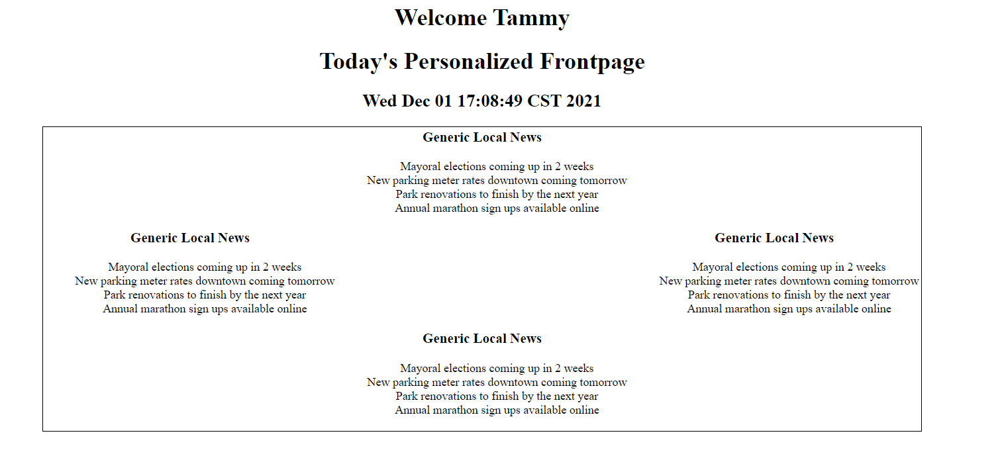
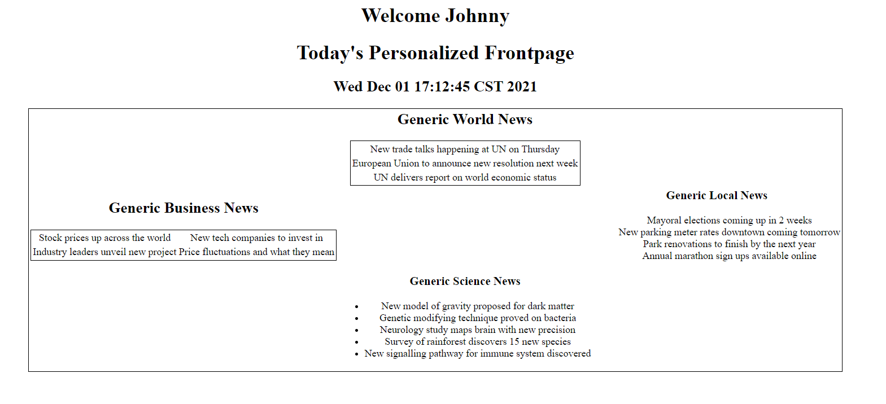
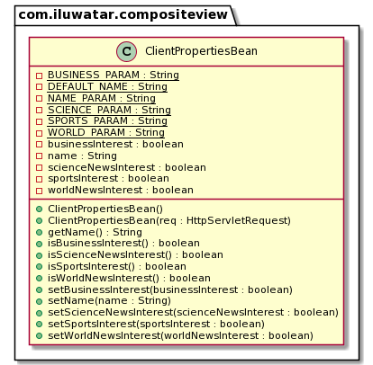

## الغرض

الهدف الرئيسي من نمط التصميم "عرض مركب" هو تكوين الكائنات في هياكل شجرية لتمثيل الهيراركية جزء-كامل. هذا يتيح للعملاء التعامل مع الكائنات الفردية وتركيبات الكائنات بشكل موحد، مما يبسط إدارة الهياكل المعقدة.

## التفسير

مثال من العالم الحقيقي

> موقع إخباري يريد عرض التاريخ الحالي والأخبار لعدة مستخدمين بناءً على تفضيلات كل مستخدم. سيستبدل الموقع في مكونات تغذية الأخبار المختلفة حسب اهتمامات المستخدم، مع الأخبار المحلية كافتراضي.

بإيجاز

> نمط العرض المركب يتكون من عرض رئيسي مكون من عروض فرعية أصغر. يعتمد تصميم هذا العرض المركب على قالب. ثم يقرر مدير العرض أي العروض الفرعية يجب تضمينها في هذا القالب.

تقول ويكيبيديا

> العروض المركبة التي تتكون من العديد من العروض الفرعية الذرية. يمكن تضمين كل مكون من القالب ديناميكيًا في المجموعة ويمكن إدارة تصميم الصفحة بشكل مستقل عن المحتوى. يتيح هذا الحل إنشاء عرض مركب استنادًا إلى تضمين واستبدال أجزاء قابلة لإعادة الاستخدام من القوالب الديناميكية والثابتة. يعزز التصميم المعياري من خلال تشجيع إعادة استخدام أجزاء الذرة من العرض.

**مثال برمجي**

نظرًا لأن هذا نمط تطوير ويب، فإن الخادم مطلوب لعرضه. يستخدم هذا المثال Tomcat 10.0.13 لتشغيل السيرفلت، ولن يعمل هذا المثال البرمجي إلا مع Tomcat 10+.

أولاً، يوجد `AppServlet` الذي هو `HttpServlet` يعمل في Tomcat 10+.


```java
public class AppServlet extends HttpServlet {
    private String msgPartOne = "<h1>This Server Doesn't Support";
    private String msgPartTwo = "Requests</h1>\n"
            + "<h2>Use a GET request with boolean values for the following parameters<h2>\n"
            + "<h3>'name'</h3>\n<h3>'bus'</h3>\n<h3>'sports'</h3>\n<h3>'sci'</h3>\n<h3>'world'</h3>";

    private String destination = "newsDisplay.jsp";

    public AppServlet() {

    }

    @Override
    public void doGet(HttpServletRequest req, HttpServletResponse resp)
            throws ServletException, IOException {
        RequestDispatcher requestDispatcher = req.getRequestDispatcher(destination);
        ClientPropertiesBean reqParams = new ClientPropertiesBean(req);
        req.setAttribute("properties", reqParams);
        requestDispatcher.forward(req, resp);
    }

    @Override
    public void doPost(HttpServletRequest req, HttpServletResponse resp)
            throws ServletException, IOException {
        resp.setContentType("text/html");
        PrintWriter out = resp.getWriter();
        out.println(msgPartOne + " Post " + msgPartTwo);

    }

    @Override
    public void doDelete(HttpServletRequest req, HttpServletResponse resp)
            throws ServletException, IOException {
        resp.setContentType("text/html");
        PrintWriter out = resp.getWriter();
        out.println(msgPartOne + " Delete " + msgPartTwo);

    }

    @Override
    public void doPut(HttpServletRequest req, HttpServletResponse resp)
            throws ServletException, IOException {
        resp.setContentType("text/html");
        PrintWriter out = resp.getWriter();
        out.println(msgPartOne + " Put " + msgPartTwo);

    }
}

```

هذا السيرفلت لا يشكل جزءًا من النمط، ويقوم ببساطة بإعادة توجيه طلبات GET إلى JSP الصحيح. الطلبات PUT و POST و DELETE غير مدعومة وستعرض ببساطة رسالة خطأ.

إدارة العرض في هذا المثال تتم من خلال فئة javabean: `ClientPropertiesBean`، التي تخزن تفضيلات المستخدم.


```java
public class ClientPropertiesBean implements Serializable {

    private static final String WORLD_PARAM = "world";
    private static final String SCIENCE_PARAM = "sci";
    private static final String SPORTS_PARAM = "sport";
    private static final String BUSINESS_PARAM = "bus";
    private static final String NAME_PARAM = "name";

    private static final String DEFAULT_NAME = "DEFAULT_NAME";
    private boolean worldNewsInterest;
    private boolean sportsInterest;
    private boolean businessInterest;
    private boolean scienceNewsInterest;
    private String name;

    public ClientPropertiesBean() {
        worldNewsInterest = true;
        sportsInterest = true;
        businessInterest = true;
        scienceNewsInterest = true;
        name = DEFAULT_NAME;

    }

    public ClientPropertiesBean(HttpServletRequest req) {
        worldNewsInterest = Boolean.parseBoolean(req.getParameter(WORLD_PARAM));
        sportsInterest = Boolean.parseBoolean(req.getParameter(SPORTS_PARAM));
        businessInterest = Boolean.parseBoolean(req.getParameter(BUSINESS_PARAM));
        scienceNewsInterest = Boolean.parseBoolean(req.getParameter(SCIENCE_PARAM));
        String tempName = req.getParameter(NAME_PARAM);
        if (tempName == null || tempName == "") {
            tempName = DEFAULT_NAME;
        }
        name = tempName;
    }
    // getters and setters generated by Lombok 
}
```

هذا السيرفلت لا يشكل جزءًا من النمط، ويقوم ببساطة بإعادة توجيه طلبات GET إلى JSP الصحيح. الطلبات PUT و POST و DELETE غير مدعومة وستعرض ببساطة رسالة خطأ.

إدارة العرض في هذا المثال تتم من خلال فئة javabean: `ClientPropertiesBean`، التي تخزن تفضيلات المستخدم.


```html

<html>
<head>
    <style>
        h1 {
            text-align: center;
        }

        h2 {
            text-align: center;
        }

        h3 {
            text-align: center;
        }

        .centerTable {
            margin-left: auto;
            margin-right: auto;
        }

        table {
            border: 1px solid black;
        }

        tr {
            text-align: center;
        }

        td {
            text-align: center;
        }
    </style>
</head>
<body>
<%ClientPropertiesBean propertiesBean = (ClientPropertiesBean) request.getAttribute("properties");%>
<h1>Welcome <%= propertiesBean.getName()%></h1>
<jsp:include page="header.jsp"></jsp:include>
<table class="centerTable">

    <tr>
        <td></td>
        <% if(propertiesBean.isWorldNewsInterest()) { %>
        <td><%@include file="worldNews.jsp"%></td>
        <% } else { %>
        <td><%@include file="localNews.jsp"%></td>
        <% } %>
        <td></td>
    </tr>
    <tr>
        <% if(propertiesBean.isBusinessInterest()) { %>
        <td><%@include file="businessNews.jsp"%></td>
        <% } else { %>
        <td><%@include file="localNews.jsp"%></td>
        <% } %>
        <td></td>
        <% if(propertiesBean.isSportsInterest()) { %>
        <td><%@include file="sportsNews.jsp"%></td>
        <% } else { %>
        <td><%@include file="localNews.jsp"%></td>
        <% } %>
    </tr>
    <tr>
        <td></td>
        <% if(propertiesBean.isScienceNewsInterest()) { %>
        <td><%@include file="scienceNews.jsp"%></td>
        <% } else { %>
        <td><%@include file="localNews.jsp"%></td>
        <% } %>
        <td></td>
    </tr>
</table>
</body>
</html>
```

هذه الصفحة JSP هي القالب. تقوم بإعلان جدول يحتوي على ثلاث صفوف، مع مكون في الصف الأول، واثنين من المكونات في الصف الثاني، ومكون واحد في الصف الثالث.

تعتبر السكربتات في الملف جزءًا من استراتيجية إدارة العرض التي تتضمن مختلف العناصر الفرعية الذرية بناءً على تفضيلات المستخدم في الجافابين.

فيما يلي مثالان على العناصر الفرعية الذرية المُحاكاة المستخدمة في التكوين: `businessNews.jsp`.


```html

<html>
<head>
    <style>
        h2 {
            text-align: center;
        }

        table {
            border: 1px solid black;
        }

        tr {
            text-align: center;
        }

        td {
            text-align: center;
        }
    </style>
</head>
<body>
<h2>
    Generic Business News
</h2>
<table style="margin-right: auto; margin-left: auto">
    <tr>
        <td>Stock prices up across the world</td>
        <td>New tech companies to invest in</td>
    </tr>
    <tr>
        <td>Industry leaders unveil new project</td>
        <td>Price fluctuations and what they mean</td>
    </tr>
</table>
</body>
</html>
```

`localNews.jsp`

```html

<html>
<body>
<div style="text-align: center">
    <h3>
        Generic Local News
    </h3>
    <ul style="list-style-type: none">
        <li>
            Mayoral elections coming up in 2 weeks
        </li>
        <li>
            New parking meter rates downtown coming tomorrow
        </li>
        <li>
            Park renovations to finish by the next year
        </li>
        <li>
            Annual marathon sign ups available online
        </li>
    </ul>
</div>
</body>
</html>
```

النتائج هي كما يلي:

1) وضع المستخدم اسمه كـ `Tammy` في معلمات الطلب ولم يضع أي تفضيلات: 
2) وضع المستخدم اسمه كـ `Johnny` في معلمات الطلب ولديه تفضيل للأخبار عن العالم، الأعمال والعلوم: 

يتم تضمين العناصر الفرعية المختلفة مثل `worldNews.jsp`، `businessNews.jsp`، وغيرها بشكل مشروط بناءً على معلمات الطلب.

**كيفية الاستخدام**

لاختبار هذا المثال، تأكد من أن لديك Tomcat 10+ مثبتًا. قم بتكوين IDE الخاص بك لإنشاء ملف WAR من الوحدة ونشر هذا الملف على الخادم.

IntelliJ:

في `تشغيل` و `تحرير التكوينات` تأكد من أن خادم Tomcat هو أحد تكوينات التنفيذ. اذهب إلى تبويب النشر وتأكد من أنه يتم بناء artifact يسمى `composite-view:war exploded`. إذا لم يكن موجودًا، أضف واحدًا.

تأكد من أن artifact يتم بناؤه من محتويات مجلد `web` ونتائج تجميع الوحدة. وجه مخرجات artifact إلى مكان مناسب. نفذ التكوين وشاهد الصفحة المستهدفة، واتبع التعليمات في تلك الصفحة للمتابعة.

## مخطط الفئات



يُظهر مخطط الفئات هنا الجافابين الذي يُعتبر مدير العرض. العروض هي ملفات JSP داخل مجلد الويب.

## القابلية للتطبيق:

استخدم نمط التصميم Composite View عندما:

## تريد تمثيل الهياكل الجزئية للأشياء.

* تتوقع أن الهياكل المركبة قد تتضمن مكونات جديدة في المستقبل.
* ترغب في أن يتمكن العملاء من تجاهل الفرق بين تكوينات الكائنات والكائنات الفردية. سيتعامل العملاء مع جميع الكائنات في الهيكل المركب بشكل موحد.

## الاستخدامات المعروفة

* واجهات المستخدم الرسومية (GUI) التي يمكن أن تحتوي فيها الأدوات على أدوات أخرى (على سبيل المثال، نافذة تحتوي على لوحات وأزرار وحقول نصية).
* هياكل الوثائق، مثل تمثيل الجداول التي تحتوي على صفوف، تحتوي هذه الصفوف بدورها على خلايا، والتي يمكن معالجتها جميعًا كعناصر في تسلسل هرمي موحد.

## العواقب

الفوائد:

* مرونة كبيرة في إضافة مكونات جديدة: بما أن المكونات المركبة والعقد الورقية يتم التعامل معها بشكل موحد، يكون من الأسهل إضافة أنواع جديدة من المكونات.
* تبسيط الشيفرة البرمجية للعملاء: يمكن للعملاء التعامل مع الهياكل المركبة والعناصر الفردية بشكل موحد، مما يقلل من تعقيد الشيفرة البرمجية للعملاء.

العيوب:

* التعميم المفرط: قد يصبح تصميم النظام أكثر تعقيدًا إذا جعلت كل شيء مركبًا، خاصة إذا كانت تطبيقك لا يتطلب ذلك.
* صعوبة تطبيق القيود: قد يكون من الأصعب تقييد مكونات المركب لتكون من أنواع معينة فقط.

## الأنماط ذات الصلة

* [المزخرف](https://java-design-patterns.com/patterns/decorator/): بينما يستخدم مزخرف لإضافة مسؤوليات إلى الكائنات، يتم تصميم Composite لبناء هياكل كائنات.
* [الوزن الخفيف](https://java-design-patterns.com/patterns/flyweight/): يمكن دمج Composite غالبًا مع Flyweight لتنفيذ العقد الورقية المشتركة في هيكل مركب، مما يقلل من بصمة الذاكرة.
* [سلسلة المسؤولية](https://java-design-patterns.com/patterns/chain-of-responsibility/): يمكن استخدامها مع Composite للسماح للمكونات بتمرير الطلبات عبر التسلسل الهرمي.
* [المركب](https://java-design-patterns.com/patterns/composite/)
* [مساعد العرض](https://www.oracle.com/java/technologies/viewhelper.html)

## الاعتمادات

* [Core J2EE Patterns - Composite View](https://www.oracle.com/java/technologies/composite-view.html)
* [Composite View Design Pattern – Core J2EE Patterns](https://www.dineshonjava.com/composite-view-design-pattern/)
* [Patterns of Enterprise Application Architecture](https://amzn.to/49jpQG3)
* [Head First Design Patterns: Building Extensible and Maintainable Object-Oriented Software](https://amzn.to/3xfntGJ)
