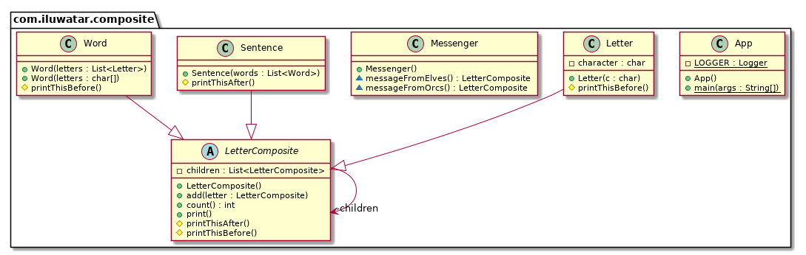

## أيضًا يُعرف بـ

* شجرة الكائنات
* الهيكل المركب

## الهدف

تركيب الكائنات في هياكل شجرية لتمثيل التسلسل الهرمي "جزء-كامل". يسمح نمط المركب للعملاء بمعاملة الكائنات الفردية وتركيبات الكائنات بطريقة موحدة.

## الشرح

مثال واقعي

> تتكون كل جملة من كلمات، وكل كلمة تتكون بدورها من أحرف. كل واحد من هذه الكائنات قابل للطباعة ويمكن أن يكون له شيء مطبوع قبله أو بعده، مثلًا الجملة دائمًا تنتهي بنقطة، والكلمة دائمًا تملك مسافة قبلها.

بكلمات بسيطة

> يسمح نمط المركب للعملاء بمعاملة الكائنات الفردية بطريقة موحدة.

تقول ويكيبيديا

> في هندسة البرمجيات، نمط المركب هو نمط تصميم تقسيمي. يصف هذا النمط أنه يجب معاملة مجموعة من الكائنات بنفس الطريقة التي يتم بها معاملة كائن واحد. الهدف من المركب هو "تركيب" الكائنات في هياكل شجرية لتمثيل التسلسل الهرمي "جزء-كامل". يسمح تنفيذ نمط التركيب للعملاء بمعاملة الكائنات الفردية وتركيبات الكائنات بطريقة موحدة.

**مثال برمجي**

باستخدام مثالنا السابق، هنا لدينا الفئة الأساسية `LetterComposite` وأنواع مختلفة من الكائنات القابلة للطباعة مثل `Letter`, `Word`, و `Sentence`.


```java
public abstract class LetterComposite {

    private final List<LetterComposite> children = new ArrayList<>();

    public void add(LetterComposite letter) {
        children.add(letter);
    }

    public int count() {
        return children.size();
    }

    protected void printThisBefore() {
    }

    protected void printThisAfter() {
    }

    public void print() {
        printThisBefore();
        children.forEach(LetterComposite::print);
        printThisAfter();
    }
}

public class Letter extends LetterComposite {

    private final char character;

    public Letter(char c) {
        this.character = c;
    }

    @Override
    protected void printThisBefore() {
        System.out.print(character);
    }
}

public class Word extends LetterComposite {

    public Word(List<Letter> letters) {
        letters.forEach(this::add);
    }

    public Word(char... letters) {
        for (char letter : letters) {
            this.add(new Letter(letter));
        }
    }

    @Override
    protected void printThisBefore() {
        System.out.print(" ");
    }
}

public class Sentence extends LetterComposite {

    public Sentence(List<Word> words) {
        words.forEach(this::add);
    }

    @Override
    protected void printThisAfter() {
        System.out.print(".");
    }
}
```

## لدينا الآن مرسل لنقل الرسائل:

```java
public class Messenger {

    LetterComposite messageFromOrcs() {

        var words = List.of(
                new Word('W', 'h', 'e', 'r', 'e'),
                new Word('t', 'h', 'e', 'r', 'e'),
                new Word('i', 's'),
                new Word('a'),
                new Word('w', 'h', 'i', 'p'),
                new Word('t', 'h', 'e', 'r', 'e'),
                new Word('i', 's'),
                new Word('a'),
                new Word('w', 'a', 'y')
        );

        return new Sentence(words);

    }

    LetterComposite messageFromElves() {

        var words = List.of(
                new Word('M', 'u', 'c', 'h'),
                new Word('w', 'i', 'n', 'd'),
                new Word('p', 'o', 'u', 'r', 's'),
                new Word('f', 'r', 'o', 'm'),
                new Word('y', 'o', 'u', 'r'),
                new Word('m', 'o', 'u', 't', 'h')
        );

        return new Sentence(words);

    }

}
```

## وبالتالي يمكن استخدامه كالتالي:

```java
var messenger=new Messenger();

        LOGGER.info("Message from the orcs: ");
        messenger.messageFromOrcs().print();

        LOGGER.info("Message from the elves: ");
        messenger.messageFromElves().print();
```

## مخرجات وحدة التحكم:


```
Message from the orcs: 
 Where there is a whip there is a way.
Message from the elves: 
 Much wind pours from your mouth.
```

## Diagrama de clases



## Applicabilidad

استخدم نمط **Composite** عندما:

* ترغب في تمثيل الهياكل الجزئية للأشياء.
* ترغب في أن يتجاهل العملاء الفرق بين تراكيب الأشياء والأشياء الفردية. سيعالج العملاء جميع الكائنات في الهيكل المركب بشكل موحد.

## الاستخدامات المعروفة

* واجهات المستخدم الرسومية حيث يمكن للمكونات أن تحتوي على مكونات أخرى (مثل الألواح التي تحتوي على أزرار، تسميات، وألواح أخرى).
* تمثيلات أنظمة الملفات حيث يمكن للأدلة أن تحتوي على ملفات وأدلة أخرى.
* الهياكل التنظيمية حيث يمكن للقسم أن يحتوي على أقسام فرعية وموظفين.
* [java.awt.Container](http://docs.oracle.com/javase/8/docs/api/java/awt/Container.html)
  و [java.awt.Component](http://docs.oracle.com/javase/8/docs/api/java/awt/Component.html)
* شجرة المكونات [Apache Wicket](https://github.com/apache/wicket)،
  انظر [Component](https://github.com/apache/wicket/blob/91e154702ab1ff3481ef6cbb04c6044814b7e130/wicket-core/src/main/java/org/apache/wicket/Component.java)
  و [MarkupContainer](https://github.com/apache/wicket/blob/b60ec64d0b50a611a9549809c9ab216f0ffa3ae3/wicket-core/src/main/java/org/apache/wicket/MarkupContainer.java)

## العواقب

### الفوائد:

* يبسط الكود الخاص بالعميل، حيث يمكنه التعامل مع الهياكل المركبة والأشياء الفردية بشكل موحد.
* يسهل إضافة أنواع جديدة من المكونات، حيث لا يتعين تعديل الكود الموجود.

### العيوب:

* قد يجعل التصميم عامًا جدًا. قد يكون من الصعب تقييد مكونات المركب.
* قد يصعب تحديد أنواع المكونات في المركب.

## الأنماط المتعلقة

* [Flyweight](https://java-design-patterns.com/patterns/flyweight/): يمكن لـ Composite استخدام Flyweight لمشاركة
  مثيلات المكونات بين عدة مركبات.
* [Iterador](https://java-design-patterns.com/patterns/iterator/): يمكن استخدامه لتصفح الهياكل المركبة.
* [Visitante](https://java-design-patterns.com/patterns/visitor/): يمكن تطبيق عملية على الهيكل المركب.

## الائتمانات

* [Design Patterns: Elements of Reusable Object-Oriented Software](https://www.amazon.com/gp/product/0201633612/ref=as_li_tl?ie=UTF8&camp=1789&creative=9325&creativeASIN=0201633612&linkCode=as2&tag=javadesignpat-20&linkId=675d49790ce11db99d90bde47f1aeb59)
* [Head First Design Patterns: A Brain-Friendly Guide](https://www.amazon.com/gp/product/0596007124/ref=as_li_tl?ie=UTF8&camp=1789&creative=9325&creativeASIN=0596007124&linkCode=as2&tag=javadesignpat-20&linkId=6b8b6eea86021af6c8e3cd3fc382cb5b)
* [Refactoring to Patterns](https://www.amazon.com/gp/product/0321213351/ref=as_li_tl?ie=UTF8&camp=1789&creative=9325&creativeASIN=0321213351&linkCode=as2&tag=javadesignpat-20&linkId=2a76fcb387234bc71b1c61150b3cc3a7)
* [Pattern-Oriented Software Architecture, Volume 1: A System of Patterns](https://amzn.to/3xoLAmi)
* [Patterns of Enterprise Application Architecture](https://amzn.to/3vBKXWb)
