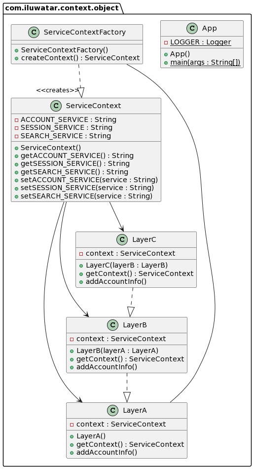

## الاسم / التصنيف

كائن السياق

## يعرف أيضًا باسم

السياق، تجميع السياق

## الغرض

فصل البيانات عن الفئات الخاصة بالبروتوكول وتخزين بيانات السياق في كائن مستقل عن التكنولوجيا الخاصة بالبروتوكول الأساسي.

## الشرح

مثال من العالم الواقعي

> يحتوي هذا التطبيق على طبقات مختلفة موسومة مثل A وB وC، كل واحدة منها تستخرج معلومات محددة من سياق مشابه لاستخدامها لاحقًا في البرنامج. تمرير كل قطعة من المعلومات بشكل فردي سيكون غير فعال، لذا هناك حاجة إلى طريقة لتخزين وتمرير المعلومات بشكل فعال.
> بكلمات بسيطة

> أنشئ كائنًا وخزن البيانات هناك، ثم مرر هذا الكائن حيثما كان مطلوبًا.

[Core J2EE Patterns](http://corej2eepatterns.com/ContextObject.htm) يقول

> استخدم كائن السياق (Context Object) لتغليف الحالة بطريقة مستقلة عن البروتوكول ليتم مشاركتها عبر تطبيقك.

**مثال برمجي**

نحدد البيانات التي يحتوي عليها كائن السياق (Context Object) للخدمة `ServiceContext`.


```Java
public class ServiceContext {

    String ACCOUNT_SERVICE, SESSION_SERVICE, SEARCH_SERVICE;

    public void setACCOUNT_SERVICE(String ACCOUNT_SERVICE) {
        this.ACCOUNT_SERVICE = ACCOUNT_SERVICE;
    }

    public void setSESSION_SERVICE(String SESSION_SERVICE) {
        this.SESSION_SERVICE = SESSION_SERVICE;
    }

    public void setSEARCH_SERVICE(String SEARCH_SERVICE) {
        this.SEARCH_SERVICE = SEARCH_SERVICE;
    }

    public String getACCOUNT_SERVICE() {
        return ACCOUNT_SERVICE;
    }

    public String getSESSION_SERVICE() {
        return SESSION_SERVICE;
    }

    public String getSEARCH_SERVICE() {
        return SEARCH_SERVICE;
    }
    
    public String toString() { return ACCOUNT_SERVICE + " " + SESSION_SERVICE + " " + SEARCH_SERVICE;}
}
```

يتم إنشاء واجهة `ServiceContextFactory` تُستخدم في أجزاء من التطبيق لإنشاء كائنات السياق.


```Java
public class ServiceContextFactory {

    public static ServiceContext createContext() {
        return new ServiceContext();
    }
}
```

إنشاء كائن السياق في الطبقة الأولى `LayerA` والطبقة المجاورة `LayerB` حتى يتم استدعاء السياق في الطبقة الحالية `LayerC`، التي تقوم بترتيب الكائن.


```Java
public class LayerA {

    private static ServiceContext context;

    public LayerA() {
        context = ServiceContextFactory.createContext();
    }

    public static ServiceContext getContext() {
        return context;
    }

    public void addAccountInfo(String accountService) {
        context.setACCOUNT_SERVICE(accountService);
    }
}

public class LayerB {

    private static ServiceContext context;

    public LayerB(LayerA layerA) {
        this.context = layerA.getContext();
    }

    public static ServiceContext getContext() {
        return context;
    }

    public void addSessionInfo(String sessionService) {
        context.setSESSION_SERVICE(sessionService);
    }
}

public class LayerC {

    public static ServiceContext context;

    public LayerC(LayerB layerB) {
        this.context = layerB.getContext();
    }

    public static ServiceContext getContext() {
        return context;
    }

    public void addSearchInfo(String searchService) {
        context.setSEARCH_SERVICE(searchService);
    }
}
```

إليك كائن السياق والطبقات قيد التنفيذ.


```Java
var layerA = new LayerA();
layerA.addAccountInfo(SERVICE);
LOGGER.info("Context = {}",layerA.getContext());
var layerB = new LayerB(layerA);
layerB.addSessionInfo(SERVICE);
LOGGER.info("Context = {}",layerB.getContext());
var layerC = new LayerC(layerB);
layerC.addSearchInfo(SERVICE);
LOGGER.info("Context = {}",layerC.getContext());
```

إخراج البرنامج:


```Java
Context = SERVICE null null
Context = SERVICE SERVICE null
Context = SERVICE SERVICE SERVICE
```

## رسم توضيحي للفئات



## القابلية للتطبيق

استخدم نمط كائن السياق (Context Object) لـ:

* مشاركة المعلومات بين الطبقات المختلفة للنظام.
* فصل البيانات عن السياقات المحددة للبروتوكولات.
* عرض واجهات البرمجة ذات الصلة فقط ضمن السياق.

## الاستخدامات المعروفة

* [Spring: ApplicationContext](https://docs.spring.io/spring-framework/docs/current/javadoc-api/org/springframework/context/ApplicationContext.html)
* [Oracle: SecurityContext](https://docs.oracle.com/javaee/7/api/javax/ws/rs/core/SecurityContext.html)
* [Oracle: ServletContext](https://docs.oracle.com/javaee/6/api/javax/servlet/ServletContext.html)

## الفضل

* [Core J2EE Design Patterns](https://amzn.to/3IhcY9w)
* [موقع Core J2EE Design Patterns - كائن السياق](http://corej2eepatterns.com/ContextObject.htm)
* [Allan Kelly - نمط تجميع السياق](https://accu.org/journals/overload/12/63/kelly_246/)
* [Arvid S. Krishna وآخرون - كائن السياق](https://www.dre.vanderbilt.edu/~schmidt/PDF/Context-Object-Pattern.pdf)
