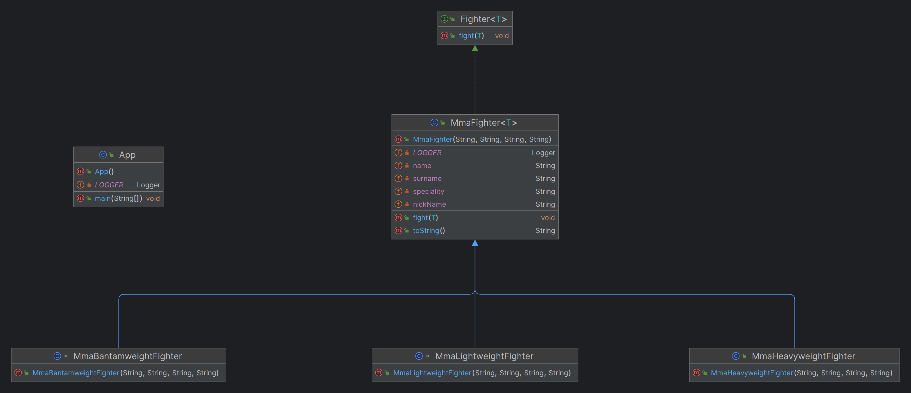

## الاسم / التصنيف

نمط القالب المتكرر بغرابة

## المعروف أيضًا باسم

الحدود النوعية المتكررة، الجينيريك المتكرر

## الهدف

السماح للمكونات المشتقة بالوراثة من بعض الوظائف من مكون أساسي تكون متوافقة مع النوع المشتق.

## الشرح

مثال حقيقي

> لتنظيم حدث للفنون القتالية المختلطة، من المهم التأكد من أن المباريات تتم بين رياضيين في نفس فئة الوزن. هذا يضمن تجنب المواجهات بين مقاتلين من أحجام مختلفة للغاية، مثل الوزن الثقيل ضد الوزن الخفيف.

ببساطة

> جعل بعض الطرق داخل نوع ما تقبل المعاملات الخاصة بأنواعه الفرعية.

تقول ويكيبيديا

> نمط القالب المتكرر بغرابة (CRTP) هو أسلوب برمجي، بدأ في C++، حيث تقوم فئة X بالاشتقاق من تطبيق قالب فئة باستخدام X نفسها كحجة للقالب.

**مثال برمجي**

لنحدد الواجهة العامة Fighter


```java
public interface Fighter<T> {

  void fight(T t);

}
```

تستخدم فئة `MMAFighter` لإنشاء مقاتلين يتميزون بفئة وزنهم.


```java
public class MmaFighter<T extends MmaFighter<T>> implements Fighter<T> {

  private final String name;
  private final String surname;
  private final String nickName;
  private final String speciality;

  public MmaFighter(String name, String surname, String nickName, String speciality) {
    this.name = name;
    this.surname = surname;
    this.nickName = nickName;
    this.speciality = speciality;
  }

  @Override
  public void fight(T opponent) {
    LOGGER.info("{} is going to fight against {}", this, opponent);
  }

  @Override
  public String toString() {
    return name + " \"" + nickName + "\" " + surname;
  }
}
```

فيما يلي بعض الأنواع الفرعية لـ `MMAFighter`:


```java
class MmaBantamweightFighter extends MmaFighter<MmaBantamweightFighter> {

  public MmaBantamweightFighter(String name, String surname, String nickName, String speciality) {
    super(name, surname, nickName, speciality);
  }

}

public class MmaHeavyweightFighter extends MmaFighter<MmaHeavyweightFighter> {

  public MmaHeavyweightFighter(String name, String surname, String nickName, String speciality) {
    super(name, surname, nickName, speciality);
  }

}
```

يمكن للمقاتل أن يواجه خصمًا من نفس فئة الوزن، وإذا كان الخصم من فئة وزن مختلفة يحدث خطأ.


```java
MmaBantamweightFighter fighter1 = new MmaBantamweightFighter("Joe", "Johnson", "The Geek", "Muay Thai");
MmaBantamweightFighter fighter2 = new MmaBantamweightFighter("Ed", "Edwards", "The Problem Solver", "Judo");
fighter1.fight(fighter2); // This is fine

MmaHeavyweightFighter fighter3 = new MmaHeavyweightFighter("Dave", "Davidson", "The Bug Smasher", "Kickboxing");
MmaHeavyweightFighter fighter4 = new MmaHeavyweightFighter("Jack", "Jackson", "The Pragmatic", "Brazilian Jiu-Jitsu");
fighter3.fight(fighter4); // This is fine too

fighter1.fight(fighter3); // This will raise a compilation error
```

## Diagrama de clases



## قابلية التطبيق

استخدم نمط "القالب المتكرر بشكل غريب" عندما:

* تواجه تعارضات في الأنواع عند ربط الأساليب في هيكل الكائنات
* ترغب في استخدام طريقة من الفئة معلمة يمكن أن تقبل الفئات الفرعية كوسائط، مما يسمح بتطبيقها على الكائنات التي ترث من هذه الفئة
* ترغب في أن تعمل بعض الأساليب فقط مع كائنات من نفس النوع، على سبيل المثال، لتحقيق المقارنة المتبادلة.

## دروس تعليمية

* [مدونة NuaH](https://nuah.livejournal.com/328187.html)
* إجابة من Yogesh Umesh Vaity على [ماذا يعني "الحدود التكرارية للنوع" في الأنواع العامة؟](https://stackoverflow.com/questions/7385949/what-does-recursive-type-bound-in-generics-mean)

## الاستخدامات المعروفة

* [java.lang.Enum](https://docs.oracle.com/en/java/javase/17/docs/api/java.base/java/lang/Enum.html)

## الاعتمادات

* [كيف أفك تشفير "Enum<E extends Enum\<E>>"؟](http://www.angelikalanger.com/GenericsFAQ/FAQSections/TypeParameters.html#FAQ106)
* الفصل 5 Generics، العنصر 30 في [Effective Java](https://www.amazon.com/gp/product/0134685997/ref=as_li_tl?ie=UTF8&camp=1789&creative=9325&creativeASIN=0134685997&linkCode=as2&tag=javadesignpat-20&linkId=4e349f4b3ff8c50123f8147c828e53eb)
