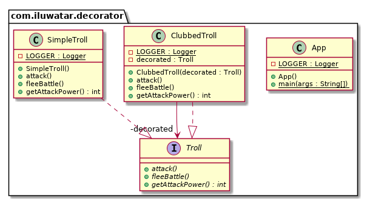

## المعروف أيضا باسم

التغليف

## الهدف

إضافة مسؤوليات إضافية إلى كائن بطريقة ديناميكية. يوفر الزخرفة بديلاً مرنًا للوراثة لتوسيع الوظائف.

## الشرح

مثال من العالم الحقيقي

> في التلال القريبة يعيش تيرول غاضب. عادة ما يكون يده عارية، ولكن في بعض الأحيان يحمل سلاحًا. لتسليح التيرول لا يتطلب الأمر إنشاء تيرول جديد بل تزيينه ديناميكيًا بسلاح مناسب.

ببساطة

> يتيح لك نمط الزخرفة تغيير سلوك كائن ديناميكيًا أثناء وقت التشغيل من خلال تغليفه في كائن من فئة الزخرفة.

يقول Wikipedia

> في البرمجة الكائنية التوجه، يعتبر نمط الزخرفة نمط تصميم يسمح بإضافة سلوك إلى كائن فردي، سواء بطريقة ثابتة أو ديناميكية، دون التأثير على سلوك الكائنات الأخرى من نفس الفئة. يُعتبر نمط الزخرفة مفيدًا للامتثال لمبدأ المسؤولية الفردية، حيث يسمح بتقسيم الوظائف بين الفئات ذات مجالات الاهتمام الفريدة، وكذلك لمبدأ الانفتاح-الإغلاق، من خلال السماح بتمديد وظائف الفئة دون تعديلها.

**مثال برمجي**

لنأخذ مثال التيرول. في البداية لدينا `SimpleTroll` الذي ينفذ الواجهة `Troll`:


```java
public interface Troll {
  void atacar();
  int getPoderAtaque();
  void huirBatalla();
}

@Slf4j
public class SimpleTroll implements Troll {

  @Override
  public void atacar() {
    LOGGER.info("¡El troll intenta atraparte!");
  }

  @Override
  public int getPoderAtaque() {
    return 10;
  }

  @Override
  public void huirBatalla() {
    LOGGER.info("¡El troll chilla de horror y huye!");
  }
}
```

بعد ذلك، نريد إضافة عصا للتيرول. يمكننا فعل ذلك بشكل ديناميكي باستخدام الزخرفة:


```java
@Slf4j
public class TrollConGarrote implements Troll {

  private final Troll decorado;

  public TrollConGarrote(Troll decorado) {
    this.decorado = decorado;
  }

  @Override
  public void atacar() {
    decorado.atacar();
    LOGGER.info("¡El troll te golpea con un garrote!");
  }

  @Override
  public int getPoderAtaque() {
    return decorado.getPoderAtaque() + 10;
  }

  @Override
  public void huirBatalla() {
    decorado.huirBatalla();
  }
}
```

إليك التيرول في العمل:


```java
// التيرول البسيط
LOGGER.info("تيرول ذو مظهر بسيط يقترب.");
var troll = new SimpleTroll();
troll.atacar();
troll.huirBatalla();
LOGGER.info("قوة التيرول البسيط: {}.\n", troll.getPoderAtaque());

// تغيير سلوك التيرول البسيط عن طريق إضافة ديكور
LOGGER.info("تيرول يحمل عصا ضخمة يفاجئك.");
var trollConGarrote = new TrollConGarrote(troll);
trollConGarrote.atacar();
trollConGarrote.huirBatalla();
LOGGER.info("قوة التيرول مع العصا: {}.\n", trollConGarrote.getPoderAtaque());

```

نتيجة البرنامج:

```java
تيرول ذو مظهر بسيط يقترب.
!التيرول يحاول الإمساك بك!
!التيرول يصرخ من الرعب ويهرب!
قوة التيرول البسيط: 10.

تيرول يحمل عصا ضخمة يفاجئك.
!التيرول يحاول الإمساك بك!
!التيرول يضربك بعصا ضخمة!
!التيرول يصرخ من الرعب ويهرب!
قوة التيرول مع العصا: 20.

```

## مخطط الفئات



## القابلية للتطبيق

يُستخدم نمط الديكور لـ:

* إضافة مسؤوليات إلى كائنات فردية بشكل ديناميكي وشفاف، أي دون التأثير على الكائنات الأخرى.
* للمسؤوليات التي يمكن إزالتها.
* عندما يكون التوسيع بواسطة الفئات الفرعية غير عملي. في بعض الأحيان، قد يكون من الممكن إضافة عدد كبير من الامتدادات المستقلة التي قد تؤدي إلى انفجار في الفئات الفرعية لدعم كل مجموعة من التركيبات. أو قد تكون تعريفات الفئات مخفية أو غير متاحة للفئات الفرعية.

## الدروس التعليمية

* [دورة نمط الديكور](https://www.journaldev.com/1540/decorator-design-pattern-in-java-example)

## الاستخدامات المعروفة

* [java.io.InputStream](http://docs.oracle.com/javase/8/docs/api/java/io/InputStream.html)، [java.io.OutputStream](http://docs.oracle.com/javase/8/docs/api/java/io/OutputStream.html)،
  [java.io.Reader](http://docs.oracle.com/javase/8/docs/api/java/io/Reader.html)
  و [java.io.Writer](http://docs.oracle.com/javase/8/docs/api/java/io/Writer.html)
* [java.util.Collections#synchronizedXXX()](http://docs.oracle.com/javase/8/docs/api/java/util/Collections.html#synchronizedCollection-java.util.Collection-)
* [java.util.Collections#unmodifiableXXX()](http://docs.oracle.com/javase/8/docs/api/java/util/Collections.html#unmodifiableCollection-java.util.Collection-)
* [java.util.Collections#checkedXXX()](http://docs.oracle.com/javase/8/docs/api/java/util/Collections.html#checkedCollection-java.util.Collection-java.lang.Class-)

## الاعتمادات

* [تصميم الأنماط: عناصر البرمجيات القابلة لإعادة الاستخدام](https://www.amazon.com/gp/product/0201633612/ref=as_li_tl?ie=UTF8&camp=1789&creative=9325&creativeASIN=0201633612&linkCode=as2&tag=javadesignpat-20&linkId=675d49790ce11db99d90bde47f1aeb59)
* [البرمجة الوظيفية في جافا: تسخير قوة تعبيرات لامبدا في جافا 8](https://www.amazon.com/gp/product/1937785467/ref=as_li_tl?ie=UTF8&camp=1789&creative=9325&creativeASIN=1937785467&linkCode=as2&tag=javadesignpat-20&linkId=7e4e2fb7a141631491534255252fd08b)
* [أنماط تصميم J2EE](https://www.amazon.com/gp/product/0596004273/ref=as_li_tl?ie=UTF8&camp=1789&creative=9325&creativeASIN=0596004273&linkCode=as2&tag=javadesignpat-20&linkId=48d37c67fb3d845b802fa9b619ad8f31)
* [رأس الأنماط: دليل سهل الفهم](https://www.amazon.com/gp/product/0596007124/ref=as_li_tl?ie=UTF8&camp=1789&creative=9325&creativeASIN=0596007124&linkCode=as2&tag=javadesignpat-20&linkId=6b8b6eea86021af6c8e3cd3fc382cb5b)
* [إعادة الهيكلة إلى الأنماط](https://www.amazon.com/gp/product/0321213351/ref=as_li_tl?ie=UTF8&camp=1789&creative=9325&creativeASIN=0321213351&linkCode=as2&tag=javadesignpat-20&linkId=2a76fcb387234bc71b1c61150b3cc3a7)
* [أنماط تصميم J2EE](https://www.amazon.com/gp/product/0596004273/ref=as_li_tl?ie=UTF8&camp=1789&creative=9325&creativeASIN=0596004273&linkCode=as2&tag=javadesignpat-20&linkId=f27d2644fbe5026ea448791a8ad09c94)
