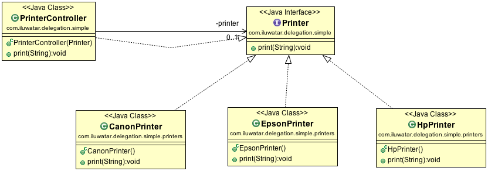

## يُعرف أيضًا بـ

نمط الوكيل (Proxy Pattern)

## الهدف

هي تقنية يتم من خلالها أن يعبر كائن عن سلوك معين للخارج ولكنه في الواقع يفوض مسؤولية تنفيذ ذلك السلوك إلى كائن مرتبط.

## الشرح

مثال من الواقع

> لنتخيل أن لدينا مغامرين يقاتلون ضد وحوش بأسلحة مختلفة حسب مهاراتهم وقدراتهم. يجب أن نكون قادرين على تجهيزهم بأسلحة مختلفة دون الحاجة لتعديل الشيفرة المصدرية لكل سلاح. يقوم نمط التفويض بهذا من خلال تفويض العمل بشكل ديناميكي إلى كائن معين يقوم بتنفيذ واجهة بها الطرق ذات الصلة.

يقول ويكيبيديا

> في البرمجة الشيئية، يشير التفويض إلى تقييم أحد الأعضاء (خاصية أو طريقة) لكائن (المستقبل) في سياق كائن آخر أصلي (المرسل). يمكن أن يتم التفويض بشكل صريح، عن طريق تمرير الكائن المرسل إلى الكائن المستقبل، وهو ما يمكن القيام به في أي لغة برمجة موجهة للكائنات؛ أو ضمنيًا، من خلال قواعد البحث عن الأعضاء في اللغة، وهو ما يتطلب دعم اللغة لهذه الوظيفة.

**مثال برمجي**

لدينا واجهة `Printer` وثلاثة تطبيقات هي `CanonPrinter`، `EpsonPrinter` و `HpPrinter`.

```java
public interface Printer {
  void print(final String message);
}

@Slf4j
public class CanonPrinter implements Printer {
  @Override
  public void print(String message) {
    LOGGER.info("Canon Printer : {}", message);
  }
}

@Slf4j
public class EpsonPrinter implements Printer {
  @Override
  public void print(String message) {
    LOGGER.info("Epson Printer : {}", message);
  }
}

@Slf4j
public class HpPrinter implements Printer {
  @Override
  public void print(String message) {
    LOGGER.info("HP Printer : {}", message);
  }
}
```

El `PrinterController` puede ser utilizado como un `Printer` delegando cualquier trabajo manejado por este
a un objeto que la implemente.

```java
public class PrinterController implements Printer {
  
  private final Printer printer;
  
  public PrinterController(Printer printer) {
    this.printer = printer;
  }
  
  @Override
  public void print(String message) {
    printer.print(message);
  }
}
```

الآن في شفرة العميل، يمكن لوحدات تحكم الطابعة طباعة الرسائل بطرق مختلفة اعتمادًا على الكائن الذي يتم تفويض العمل إليه.


```java
private static final String MESSAGE_TO_PRINT = "hello world";

var hpPrinterController = new PrinterController(new HpPrinter());
var canonPrinterController = new PrinterController(new CanonPrinter());
var epsonPrinterController = new PrinterController(new EpsonPrinter());

hpPrinterController.print(MESSAGE_TO_PRINT);
canonPrinterController.print(MESSAGE_TO_PRINT);
epsonPrinterController.print(MESSAGE_TO_PRINT)
```

مخرجات البرنامج:


```java
HP Printer : hello world
Canon Printer : hello world
Epson Printer : hello world
```

## مخطط الفئات



## القابلية للتطبيق

استخدم نمط التفويض لتحقيق ما يلي:

* تقليل ارتباط الأساليب بالفئة الخاصة بها
* مكونات تتصرف بشكل متطابق، مع مراعاة أن هذا الوضع قد يتغير في المستقبل.

## الاعتمادات

* [نمط التفويض: ويكيبيديا](https://en.wikipedia.org/wiki/Delegation_pattern)
* [نمط الوكيل: ويكيبيديا](https://en.wikipedia.org/wiki/Proxy_pattern)
