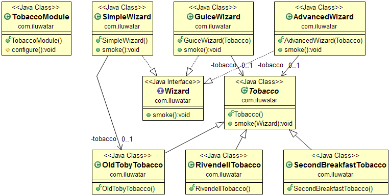

## الغرض

حقن التبعيات هو نمط تصميم برمجي يتم فيه حقن واحدة أو أكثر من التبعيات (أو الخدمات) إلى كائن تابع (أو عميل) وتصبح جزءاً من حالة العميل. يفصل النمط بين إنشاء التبعيات للعميل وسلوكه الخاص، مما يسمح بتصاميم برامج منخفضة الارتباط وتلتزم بمبادئ عكس التحكم والمسؤولية الواحدة.

## الشرح

مثال من العالم الحقيقي

> يحب الساحر العجوز ملء غليونه والتدخين من وقت لآخر. ومع ذلك، لا يريد أن يعتمد على علامة تجارية واحدة من التبغ، بل يحب أن يتمكن من الاستمتاع بها جميعاً بشكل قابل للتبادل.

بكلمات بسيطة

> حقن التبعيات يفصل إنشاء التبعيات للعميل عن سلوكه الخاص.

تقول ويكيبيديا

> في هندسة البرمجيات، حقن التبعيات هو تقنية يحصل فيها كائن على كائنات أخرى يعتمد عليها. تُسمى هذه الكائنات الأخرى بالتبعيات.

**مثال برمجي**

لنقم أولاً بتقديم واجهة التبغ `Tobacco` والعلامات التجارية المحددة.


```java
@Slf4j
public abstract class Tobacco {

  public void smoke(Wizard wizard) {
    LOGGER.info("{} smoking {}", wizard.getClass().getSimpleName(),
        this.getClass().getSimpleName());
  }
}

public class SecondBreakfastTobacco extends Tobacco {
}

public class RivendellTobacco extends Tobacco {
}

public class OldTobyTobacco extends Tobacco {
}
```

التالي هو واجهة `Wizard` وتنفيذها.


```java
public interface Wizard {

  void smoke();
}

public class AdvancedWizard implements Wizard {

  private final Tobacco tobacco;

  public AdvancedWizard(Tobacco tobacco) {
    this.tobacco = tobacco;
  }

  @Override
  public void smoke() {
    tobacco.smoke(this);
  }
}
```

وأخيراً يمكننا أن نثبت مدى سهولة إعطاء التبغ `Tobacco` لأي علامة تجارية قديمة للساحر.


```java
    var advancedWizard = new AdvancedWizard(new SecondBreakfastTobacco());
    advancedWizard.smoke();
```

## Class Diagram



## Applicability

Use the Dependency Injection pattern when:

* You need to eliminate the knowledge of the concrete implementation of the object.
* To allow unit testing of classes in isolation using mock objects or stubs.

## Credits

* [Dependency Injection Principles, Practices, and Patterns](https://www.amazon.com/gp/product/161729473X/ref=as_li_qf_asin_il_tl?ie=UTF8&tag=javadesignpat-20&creative=9325&linkCode=as2&creativeASIN=161729473X&linkId=57079257a5c7d33755493802f3b884bd)
* [Clean Code: A Handbook of Agile Software Craftsmanship](https://www.amazon.com/gp/product/0132350882/ref=as_li_tl?ie=UTF8&camp=1789&creative=9325&creativeASIN=0132350882&linkCode=as2&tag=javadesignpat-20&linkId=2c390d89cc9e61c01b9e7005c7842871)
* [Java 9 Dependency Injection: Write loosely coupled code with Spring 5 and Guice](https://www.amazon.com/gp/product/1788296257/ref=as_li_tl?ie=UTF8&tag=javadesignpat-20&camp=1789&creative=9325&linkCode=as2&creativeASIN=1788296257&linkId=4e9137a3bf722a8b5b156cce1eec0fc1)
* [Google Guice: Agile Lightweight Dependency Injection Framework](https://www.amazon.com/gp/product/1590599977/ref=as_li_qf_asin_il_tl?ie=UTF8&tag=javadesignpat-20&creative=9325&linkCode=as2&creativeASIN=1590599977&linkId=3b10c90b7ba480a1b7777ff38000f956)
