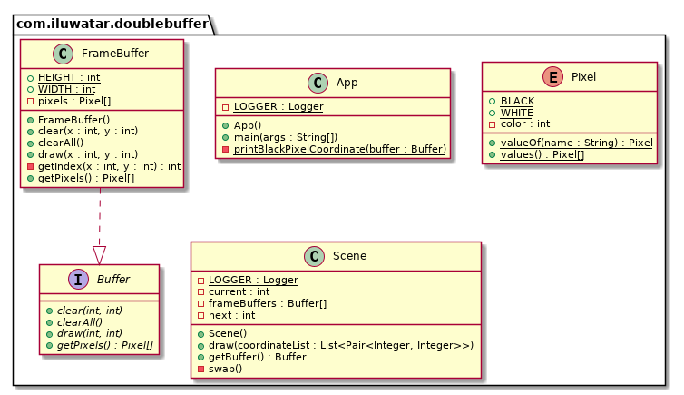

## الهدف

الذاكرة المزدوجة هي مصطلح يُستخدم لوصف جهاز يحتوي على مخزنين. استخدام المخازن المتعددة يزيد من الأداء العام للجهاز ويساعد في تجنب الاختناقات. يُظهر هذا المثال استخدام الذاكرة المزدوجة في الرسومات. يُستخدم لعرض صورة أو إطار بينما يتم تخزين إطار آخر في المخزن ليتم عرضه لاحقًا. هذه الطريقة تجعل الرسوم المتحركة والألعاب تبدو أكثر واقعية مقارنة بتلك التي تُعرض باستخدام الذاكرة الفردية.

## الشرح

مثال من الحياة الواقعية
> مثال نموذجي، ويجب أن تتعامل معه جميع محركات الألعاب، هو التقديم. عندما يرسم اللعبة العالم الذي يراه المستخدمون، تقوم بذلك قطعة قطعة: الجبال البعيدة، التلال المتدحرجة، الأشجار، كل منها على حدة. إذا رأى المستخدم كيف يتم رسم العرض بشكل تدريجي، فسوف تنكسر الوهم لعالم متماسك. يجب تحديث المشهد بسلاسة وسرعة، مع عرض سلسلة من الإطارات المكتملة، يظهر كل منها فورًا. يحل التقديم المزدوج هذه المشكلة.

ببساطة
> يضمن حالة يتم عرضها بشكل صحيح بينما يتم تعديل تلك الحالة تدريجيًا. يتم استخدامه كثيرًا في الرسومات الحاسوبية.

ويكيبيديا تقول
> في علوم الكمبيوتر، التخزين في الذاكرة المتعددة هو استخدام أكثر من مخزن واحد لحمل كتلة من البيانات، بحيث يرى "القارئ" نسخة كاملة (على الرغم من أنها قديمة) من البيانات، بدلاً من نسخة محدثة جزئيًا من البيانات التي يقوم "الكاتب" بإنشائها. يُستخدم ذلك كثيرًا في الصور الحاسوبية.

**مثال برمجي**

واجهة `Buffer` التي تضمن الوظائف الأساسية للمخزن.

```java
/**
 * Buffer interface.
 */
public interface Buffer {

    /**
     * Clear the pixel in (x, y).
     *
     * @param x X coordinate
     * @param y Y coordinate
     */
    void clear(int x, int y);

    /**
     * Draw the pixel in (x, y).
     *
     * @param x X coordinate
     * @param y Y coordinate
     */
    void draw(int x, int y);

    /**
     * Clear all the pixels.
     */
    void clearAll();

    /**
     * Get all the pixels.
     *
     * @return pixel list
     */
    Pixel[] getPixels();

}
```

إحدى تطبيقات واجهة `Buffer`.


```java
/**
 * FrameBuffer implementation class.
 */
public class FrameBuffer implements Buffer {

    public static final int WIDTH = 10;
    public static final int HEIGHT = 8;

    private final Pixel[] pixels = new Pixel[WIDTH * HEIGHT];

    public FrameBuffer() {
        clearAll();
    }

    @Override
    public void clear(int x, int y) {
        pixels[getIndex(x, y)] = Pixel.WHITE;
    }

    @Override
    public void draw(int x, int y) {
        pixels[getIndex(x, y)] = Pixel.BLACK;
    }

    @Override
    public void clearAll() {
        Arrays.fill(pixels, Pixel.WHITE);
    }

    @Override
    public Pixel[] getPixels() {
        return pixels;
    }

    private int getIndex(int x, int y) {
        return x + WIDTH * y;
    }
}
```

```java
/**
 * Pixel enum. Each pixel can be white (not drawn) or black (drawn).
 */
public enum Pixel {

    WHITE, BLACK;
}
```

`Scene` representa la escena del juego en la que ya se ha renderizado el búfer actual.

```java
/**
 * Scene class. Render the output frame.
 */
@Slf4j
public class Scene {

    private final Buffer[] frameBuffers;

    private int current;

    private int next;

    /**
     * Constructor of Scene.
     */
    public Scene() {
        frameBuffers = new FrameBuffer[2];
        frameBuffers[0] = new FrameBuffer();
        frameBuffers[1] = new FrameBuffer();
        current = 0;
        next = 1;
    }

    /**
     * Draw the next frame.
     *
     * @param coordinateList list of pixels of which the color should be black
     */
    public void draw(List<? extends Pair<Integer, Integer>> coordinateList) {
        LOGGER.info("Start drawing next frame");
        LOGGER.info("Current buffer: " + current + " Next buffer: " + next);
        frameBuffers[next].clearAll();
        coordinateList.forEach(coordinate -> {
            var x = coordinate.getKey();
            var y = coordinate.getValue();
            frameBuffers[next].draw(x, y);
        });
        LOGGER.info("Swap current and next buffer");
        swap();
        LOGGER.info("Finish swapping");
        LOGGER.info("Current buffer: " + current + " Next buffer: " + next);
    }

    public Buffer getBuffer() {
        LOGGER.info("Get current buffer: " + current);
        return frameBuffers[current];
    }

    private void swap() {
        current = current ^ next;
        next = current ^ next;
        current = current ^ next;
    }

}
```

```java
public static void main(String[] args) {
    final var scene = new Scene();
    var drawPixels1 = List.of(new MutablePair<>(1, 1), new MutablePair<>(5, 6), new MutablePair<>(3, 2));
    scene.draw(drawPixels1);
    var buffer1 = scene.getBuffer();
    printBlackPixelCoordinate(buffer1);

    var drawPixels2 = List.of(new MutablePair<>(3, 7), new MutablePair<>(6, 1));
    scene.draw(drawPixels2);
    var buffer2 = scene.getBuffer();
    printBlackPixelCoordinate(buffer2);
}

private static void printBlackPixelCoordinate(Buffer buffer) {
    StringBuilder log = new StringBuilder("Black Pixels: ");
    var pixels = buffer.getPixels();
    for (var i = 0; i < pixels.length; ++i) {
        if (pixels[i] == Pixel.BLACK) {
            var y = i / FrameBuffer.WIDTH;
            var x = i % FrameBuffer.WIDTH;
            log.append(" (").append(x).append(", ").append(y).append(")");
        }
    }
    LOGGER.info(log.toString());
}
```

مخرجات وحدة التحكم


```text
[main] INFO com.iluwatar.doublebuffer.Scene - Start drawing next frame
[main] INFO com.iluwatar.doublebuffer.Scene - Current buffer: 0 Next buffer: 1
[main] INFO com.iluwatar.doublebuffer.Scene - Swap current and next buffer
[main] INFO com.iluwatar.doublebuffer.Scene - Finish swapping
[main] INFO com.iluwatar.doublebuffer.Scene - Current buffer: 1 Next buffer: 0
[main] INFO com.iluwatar.doublebuffer.Scene - Get current buffer: 1
[main] INFO com.iluwatar.doublebuffer.App - Black Pixels:  (1, 1) (3, 2) (5, 6)
[main] INFO com.iluwatar.doublebuffer.Scene - Start drawing next frame
[main] INFO com.iluwatar.doublebuffer.Scene - Current buffer: 1 Next buffer: 0
[main] INFO com.iluwatar.doublebuffer.Scene - Swap current and next buffer
[main] INFO com.iluwatar.doublebuffer.Scene - Finish swapping
[main] INFO com.iluwatar.doublebuffer.Scene - Current buffer: 0 Next buffer: 1
[main] INFO com.iluwatar.doublebuffer.Scene - Get current buffer: 0
[main] INFO com.iluwatar.doublebuffer.App - Black Pixels:  (6, 1) (3, 7)
```

## مخطط الفئات



## القابلية للتطبيق

هذا النمط هو أحد الأنماط التي ستعرف متى تحتاج إليها. إذا كان لديك نظام يفتقر إلى المخزن المؤقت المزدوج، فمن المحتمل أن يبدو بشكل غير صحيح مرئيًا (تمزق الصورة، إلخ) أو سيعمل بشكل غير صحيح. ولكن قول "ستعرف متى تحتاج إليه" لا يعطي الكثير من التوضيح. بشكل أكثر تحديدًا، هذا النمط مناسب عندما يكون كل هذا صحيحًا:

- لدينا حالة يتم تعديلها بشكل تدريجي.
- يمكن الوصول إلى نفس الحالة في منتصف التعديل.
- نريد تجنب أن يرى الكود الذي يصل إلى الحالة العمل الجاري.
- نريد أن نتمكن من قراءة الحالة دون الحاجة إلى الانتظار أثناء الكتابة.

## المصادر

* [Game Programming Patterns - Double Buffer](http://gameprogrammingpatterns.com/double-buffer.html)

