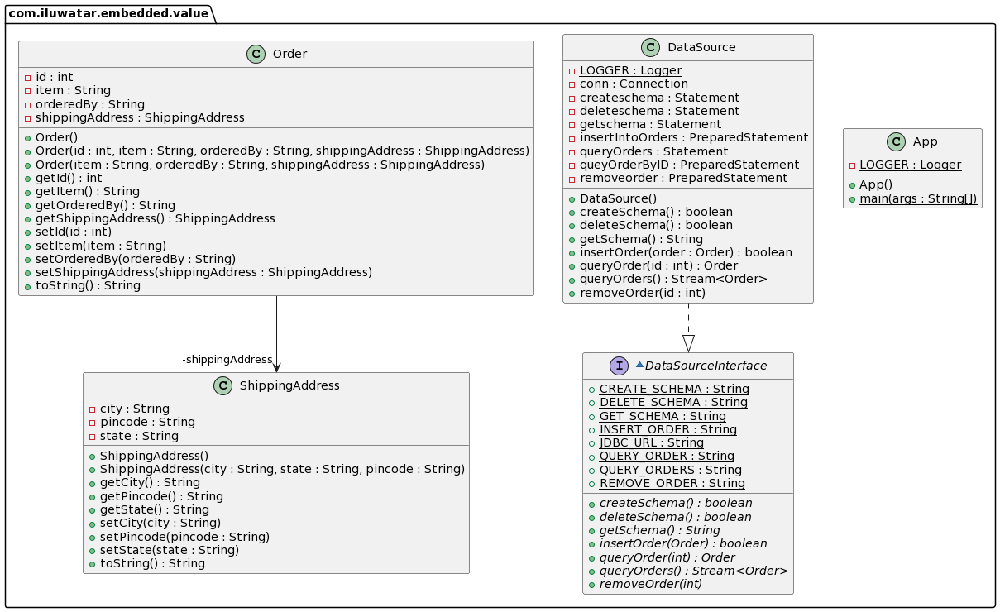

## معروف أيضًا باسم

التخصيص المدمج، المُركب

## الهدف

العديد من الكائنات الصغيرة تكون منطقية في نظام البرمجة الكائنية ولا تكون منطقية كجداول في قاعدة بيانات. القيمة المدمجة تخصيص قيم كائن إلى حقول سجل الكائن المالك.

## الشرح

مثال من الواقع

> بعض الأمثلة تشمل الكائنات النقدية والفترات الزمنية. على الرغم من أن التفكير الافتراضي هو تخزين كائن كجدول، إلا أنه لا أحد في عقله السليم يرغب في جدول للقيم النقدية.
> مثال آخر هو الطلبات عبر الإنترنت التي تحتوي على عنوان الشحن مثل الشارع، المدينة، الدولة. نقوم بتخصيص هذه القيم من كائن عنوان الشحن إلى حقول سجل كائن الطلب.

بكلمات بسيطة

> يسمح نمط القيم المدمجة بتخصيص كائن لعدة حقول في جدول كائن آخر.

**مثال برمجي**

لنأخذ مثالًا من طلب عبر الإنترنت حيث لدينا تفاصيل العنصر المطلوب وعنوان الشحن. لدينا
عنوان الشحن مدمج في كائن الطلب. ولكن في قاعدة البيانات نقوم بتخصيص قيم عنوان الشحن في سجل الطلب بدلاً من إنشاء جدول منفصل لعنوان الشحن واستخدام مفتاح خارجي للإشارة إلى كائن الطلب.

أولاً، لدينا كائنات `Order` و `ShippingAddress`.


```java
public class Order {

    private int id;
    private String item;
    private String orderedBy;
    private ShippingAddress ShippingAddress;

    public Order(String item, String orderedBy, ShippingAddress           ShippingAddress) {
        this.item = item;
        this.orderedBy = orderedBy;
        this.ShippingAddress = ShippingAddress;
    }
}
```

```java
public class ShippingAddress {

    private String city;
    private String state;
    private String pincode;

    public ShippingAddress(String city, String state, String pincode) {
        this.city = city;
        this.state = state;
        this.pincode = pincode;
    }
}
```

الآن، علينا إنشاء جدول واحد فقط للطلب مع الحقول الخاصة بسمات عنوان الشحن.


```Sql
CREATE TABLE Orders (Id INT AUTO_INCREMENT, item VARCHAR(50) NOT NULL, orderedBy VARCHAR(50) city VARCHAR(50), state VARCHAR(50), pincode CHAR(6) NOT NULL, PRIMARY KEY(Id))
```

أثناء إجراء الاستفسارات والإدخالات في قاعدة البيانات، نقوم بتغليف وفك تغليف تفاصيل عناوين الشحن.


```java
final String INSERT_ORDER = "INSERT INTO Orders (item, orderedBy, city, state, pincode) VALUES (?, ?, ?, ?, ?)";

public boolean insertOrder(Order order) throws Exception {
  var insertOrder = new PreparedStatement(INSERT_ORDER);
  var address = order.getShippingAddress();
  conn.setAutoCommit(false);
  insertIntoOrders.setString(1, order.getItem());
  insertIntoOrders.setString(2, order.getOrderedBy());
  insertIntoOrders.setString(3, address.getCity());
  insertIntoOrders.setString(4, address.getState());
  insertIntoOrders.setString(5, address.getPincode());
  
  var affectedRows = insertIntoOrders.executeUpdate();
  if(affectedRows == 1){
    Logger.info("Inserted successfully");
  }else{
    Logger.info("Couldn't insert " + order);
  }
}
```

## مخطط الفئات



## القابلية للتطبيق

استخدم نمط القيمة المدمجة عندما:

* تكون العديد من الكائنات الصغيرة ذات معنى في نظام OO ولكن ليس لها معنى كجداول في قاعدة بيانات.
* الحالات الأبسط للقيمة المدمجة هي الكائنات ذات القيم الواضحة والبسيطة مثل المال ونطاق التواريخ.
* إذا كنت تقوم بربط إلى مخطط موجود، يمكنك استخدام هذا النمط عندما تحتوي إحدى الجداول على بيانات ترغب في تقسيمها إلى أكثر من كائن في الذاكرة. قد يحدث هذا عندما ترغب في استخراج بعض السلوك في نموذج الكائنات.
* في معظم الحالات، ستستخدم القيمة المدمجة فقط في كائن مرجعي عندما تكون العلاقة بينهما ذات قيمة واحدة في كلا الطرفين (علاقة واحد إلى واحد).

## الدروس التعليمية

* [Dzone](https://dzone.com/articles/practical-php-patterns/practical-php-patterns-3)
* [Ram N Java](https://ramj2ee.blogspot.com/2013/08/embedded-value-design-pattern.html)
* [Five's Weblog](https://powerdream5.wordpress.com/2007/10/09/embedded-value/)

## العواقب

* الميزة الكبرى للقيمة المدمجة هي أنها تسمح بإجراء استفسارات SQL ضد قيم الكائن التابع.
* الكائن ذو القيمة المدمجة ليس له سلوك استمرارية.
* عند استخدام هذا، يجب أن تكون حذرًا من أن أي تغيير في التابع سيجعل المالك يعتبره "متسخًا" — وهو ما لا يمثل مشكلة مع الكائنات ذات القيمة التي يتم استبدالها في المالك.
* مشكلة أخرى هي التحميل والحفظ. إذا كنت تقوم بتحميل ذاكرة الكائن المدمج فقط عندما تقوم بتحميل المالك، فهذا حجة لحفظ كلاهما في نفس الجدول.
* قضية أخرى هي ما إذا كنت ترغب في الوصول إلى بيانات الكائنات المدمجة بشكل منفصل عبر SQL. قد يكون هذا مهمًا إذا كنت تقوم بإعداد تقارير عبر SQL وليس لديك قاعدة بيانات منفصلة للتقارير.

## الائتمان

* [Fowler, Martin - Patterns of enterprise application architecture-Addison-Wesley](https://www.amazon.com/Patterns-Enterprise-Application-Architecture-Martin/dp/0321127420)
* [Ram N Java](https://ramj2ee.blogspot.com/2013/08/embedded-value-design-pattern.html)
