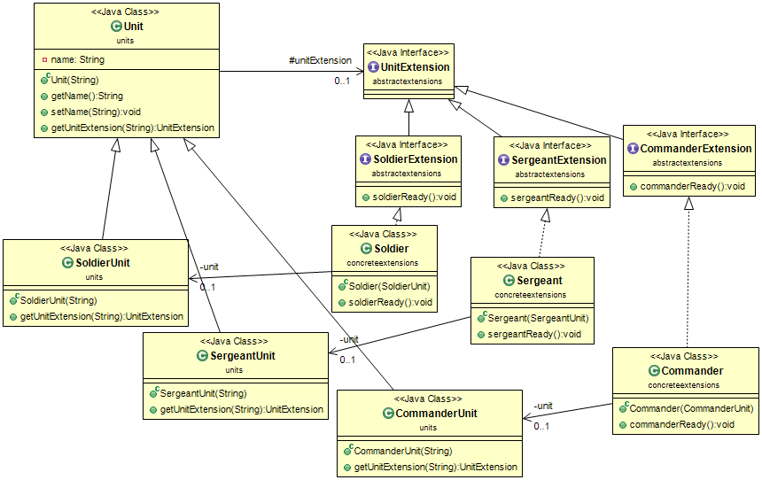

# نمط كائنات التوسيع (Extension Objects Pattern)

## الهدف
التنبؤ بأنه يجب توسيع واجهة كائن ما في المستقبل. يتم تعريف الواجهات الإضافية من خلال كائنات التوسيع (Extension objects).

## الشرح
مثال واقعي

> افترض أنك تطور لعبة تعتمد على Java لعميل، وأثناء عملية التطوير، يُقترح عليك إضافة وظائف جديدة. يسمح لك نمط كائنات التوسيع بتكييف برنامجك مع التغييرات غير المتوقعة مع الحد الأدنى من إعادة الهيكلة، خاصة عند دمج وظائف إضافية في مشروعك.

ببساطة

> يتم استخدام نمط كائنات التوسيع لإضافة وظائف ديناميكيًا إلى الكائنات دون تعديل فئاتها الرئيسية. إنه نمط تصميم سلوكي يستخدم لإضافة وظائف جديدة إلى الفئات والكائنات الموجودة داخل البرنامج. يوفر هذا النمط للمبرمجين القدرة على تمديد/تعديل وظائف الفئات دون الحاجة إلى إعادة هيكلة الكود المصدر الحالي.

تقول ويكيبيديا

> في البرمجة الكائنية التوجه، يعتبر نمط كائنات التوسيع نمط تصميم يضاف إلى كائن بعد أن يتم تجميع الكائن الأصلي. الكائن المعدل غالبًا ما يكون فئة أو نموذجًا أو نوعًا. تعتبر أنماط كائنات التوسيع سمة من سمات بعض لغات البرمجة الكائنية التوجه. لا يوجد فرق نحوي بين استدعاء طريقة توسيع وطريقة معرفة في تعريف النوع.

**مثال برمجي**

الهدف من استخدام نمط كائنات التوسيع (Extension objects) هو تنفيذ ميزات/وظائف جديدة دون الحاجة إلى إعادة هيكلة كل فئة.
توضح الأمثلة التالية استخدام هذا النمط في فئة "العدو" التي تمتد من "الكيان" داخل لعبة:

الفئة الرئيسية للتطبيق التي يتم تشغيل برنامجنا منها.


```java
public class App {
    public static void main(String[] args) {
        Entity enemy = new Enemy("Enemy");
        checkExtensionsForEntity(enemy);
    }

    private static void checkExtensionsForEntity(Entity entity) {
        Logger logger = Logger.getLogger(App.class.getName());
        String name = entity.getName();
        Function<String, Runnable> func = (e) -> () -> logger.info(name + " without " + e);

        String extension = "EnemyExtension";
        Optional.ofNullable(entity.getEntityExtension(extension))
                .map(e -> (EnemyExtension) e)
                .ifPresentOrElse(EnemyExtension::extendedAction, func.apply(extension));
    }
}
```
فئة العدو مع الإجراءات الأولية والتوسعات.


```java
class Enemy extends Entity {
    public Enemy(String name) {
        super(name);
    }

    @Override
    protected void performInitialAction() {
        super.performInitialAction();
        System.out.println("Enemy wants to attack you.");
    }

    @Override
    public EntityExtension getEntityExtension(String extensionName) {
        if (extensionName.equals("EnemyExtension")) {
            return Optional.ofNullable(entityExtension).orElseGet(EnemyExtension::new);
        }
        return super.getEntityExtension(extensionName);
    }
}
```

فئة EnemyExtension مع إعادة كتابة طريقة extendAction().


```java
class EnemyExtension implements EntityExtension {
    @Override
    public void extendedAction() {
        System.out.println("Enemy has advanced towards you!");
    }
}
```

فئة الكائن التي سيتم توسيعها بواسطة العدو.


```java
class Entity {
    private String name;
    protected EntityExtension entityExtension;

    public Entity(String name) {
        this.name = name;
        performInitialAction();
    }

    protected void performInitialAction() {
        System.out.println(name + " performs the initial action.");
    }

    public EntityExtension getEntityExtension(String extensionName) {
        return null;
    }

    public String getName() {
        return name;
    }
}
```
واجهة `EntityExtension` التي ستستخدم `EnemyExtension`.


```java
interface EntityExtension {
    void extendedAction();
}
```
إخراج البرنامج:


```markdown
Enemy performs the initial action.
Enemy wants to attack you.
Enemy has advanced towards you!
```
في هذا المثال، يسمح نمط "كائنات التمديد" (Extension Objects) لكي يقوم الكائن العدو بتنفيذ إجراءات مبدئية فريدة وإجراءات متقدمة عند تطبيق التمديدات الخاصة. يوفر هذا النمط مرونة وقابلية تمديد لقاعدة الشيفرة مع تقليل الحاجة إلى إجراء تغييرات كبيرة في الشيفرة.

## مخطط الفئات


## قابلية التطبيق
استخدم نمط "كائنات التمديد" (Extension objects) عندما:

* تحتاج إلى دعم إضافة واجهات جديدة أو غير متوقعة إلى فئات موجودة ولا تريد التأثير على العملاء الذين لا يحتاجون إلى هذه الواجهة الجديدة. تتيح لك كائنات التمديد الاحتفاظ بالعمليات ذات الصلة معًا عن طريق تعريفها في فئة منفصلة.
* فئة تمثل تجريدًا رئيسيًا تؤدي وظائف مختلفة لعملاء مختلفين. يجب أن يكون عدد الوظائف التي يمكن أن تؤديها الفئة غير محدود. من الضروري الحفاظ على التجريد الرئيسي نفسه. على سبيل المثال، يبقى كائن العميل كائن عميل رغم أن الأنظمة الفرعية المختلفة قد تراها بطريقة مختلفة.
* يجب أن تكون الفئة قابلة للتمديد بسلوكيات جديدة دون الحاجة إلى تصنيفها منها.

## أمثلة من العالم الحقيقي

* [OpenDoc](https://en.wikipedia.org/wiki/OpenDoc)
* [ربط الكائنات وإدماجها](https://en.wikipedia.org/wiki/Object_Linking_and_Embedding)
