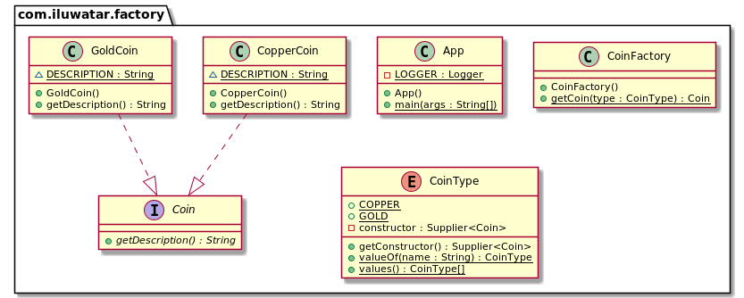

## أيضًا معروف بـ

* المصنع البسيط
* طريقة المصنع الثابتة

## الهدف

توفير طريقة ثابتة محاطة في فئة تسمى المصنع (Factory)، لإخفاء منطق التنفيذ وجعل شفرة العميل تركز على الاستخدام بدلاً من تهيئة الكائنات الجديدة.

## الشرح

مثال من الحياة الواقعية

> تخيل كيميائيًا على وشك تصنيع العملات. يجب أن يكون الكيميائي قادرًا على إنشاء عملات ذهبية وكذلك عملات نحاسية، ويجب أن يكون من الممكن التبديل بينهما دون تعديل الكود المصدري الحالي. يجعل نمط المصنع هذا ممكنًا من خلال توفير طريقة بناء ثابتة يمكن استدعاؤها مع المعلمات ذات الصلة.

تقول ويكيبيديا

> المصنع (Factory) هو كائن لإنشاء كائنات أخرى: بشكل رسمي، المصنع هو دالة أو طريقة تُرجع كائنات من نموذج أو فئة متغيرة.

**مثال برمجي**

لدينا واجهة عملة `Coin` واثنان من تطبيقات العملة: عملة ذهبية `GoldCoin` وعملة نحاسية `CopperCoin`.


```java
public interface Coin {
  String getDescription();
}

public class GoldCoin implements Coin {

  static final String DESCRIPTION = "This is a gold coin.";

  @Override
  public String getDescription() {
    return DESCRIPTION;
  }
}

public class CopperCoin implements Coin {
   
  static final String DESCRIPTION = "This is a copper coin.";

  @Override
  public String getDescription() {
    return DESCRIPTION;
  }
}
```

تُمثل التعداد التالي أنواع العملات التي نقبلها (`GoldCoin` و `CopperCoin`).


```java
@RequiredArgsConstructor
@Getter
public enum CoinType {

  COPPER(CopperCoin::new),
  GOLD(GoldCoin::new);

  private final Supplier<Coin> constructor;
}
```

ثم لدينا الطريقة الثابتة للحصول على العملة `getCoin` لإنشاء كائنات العملة مغلفة داخل فئة المصنع `CoinFactory`.


```java
public class CoinFactory {

  public static Coin getCoin(CoinType type) {
    return type.getConstructor().get();
  }
}
```

الآن في كود العميل يمكننا إنشاء أنواع مختلفة من العملات باستخدام فئة المصنع.


```java
LOGGER.info("The alchemist begins his work.");
var coin1 = CoinFactory.getCoin(CoinType.COPPER);
var coin2 = CoinFactory.getCoin(CoinType.GOLD);
LOGGER.info(coin1.getDescription());
LOGGER.info(coin2.getDescription());
```

### مخرجات البرنامج:


```java
The alchemist begins his work.
This is a copper coin.
This is a gold coin.
```

## المخطط البياني للفئات



## قابلية الاستخدام

استخدم نمط المصنع (Factory) عندما يكون تركيزك على إنشاء الكائنات فقط دون القلق حول كيفية إنشائها وإدارتها.

### المزايا

* يسمح بجمع كل عمليات إنشاء الكائنات في مكان واحد وتجنب نشر الكلمة الأساسية 'new' عبر قاعدة الشيفرة.
* يُمكنك من كتابة شيفرة منخفضة الارتباط. من بين مزاياه الرئيسية: قابلية أفضل للاختبار، شيفرة سهلة الفهم، مكونات قابلة للاستبدال، قابلية التوسع، وميزات معزولة.

### العيوب

* قد يصبح الشيفرة أكثر تعقيدًا مما ينبغي.

## أمثلة استخدام معروفة

* [java.util.Calendar#getInstance()](https://docs.oracle.com/javase/8/docs/api/java/util/Calendar.html#getInstance--)
* [java.util.ResourceBundle#getBundle()](https://docs.oracle.com/javase/8/docs/api/java/util/ResourceBundle.html#getBundle-java.lang.String-)
* [java.text.NumberFormat#getInstance()](https://docs.oracle.com/javase/8/docs/api/java/text/NumberFormat.html#getInstance--)
* [java.nio.charset.Charset#forName()](https://docs.oracle.com/javase/8/docs/api/java/nio/charset/Charset.html#forName-java.lang.String-)
* [java.net.URLStreamHandlerFactory#createURLStreamHandler(String)](https://docs.oracle.com/javase/8/docs/api/java/net/URLStreamHandlerFactory.html) 
  (يعيد كائنات Singleton مختلفة استنادًا إلى بروتوكول معين)
* [java.util.EnumSet#of()](https://docs.oracle.com/javase/8/docs/api/java/util/EnumSet.html#of(E))
* [javax.xml.bind.JAXBContext#createMarshaller()](https://docs.oracle.com/javase/8/docs/api/javax/xml/bind/JAXBContext.html#createMarshaller--)
  وأيضًا طرق مشابهة أخرى.

## الأنماط المرتبطة

* [Factory Method](https://java-design-patterns.com/patterns/factory-method/)
* [Factory Kit](https://java-design-patterns.com/patterns/factory-kit/)
* [Abstract Factory](https://java-design-patterns.com/patterns/abstract-factory/)
