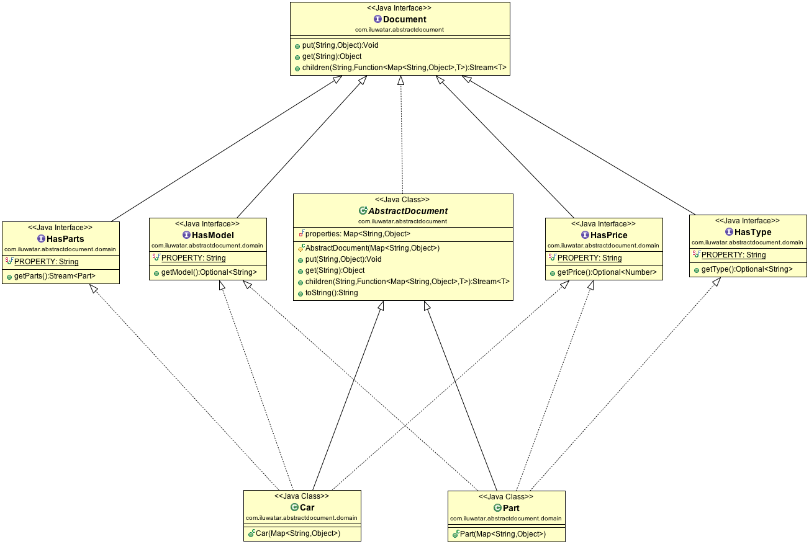

## Absicht des Abstract Document Design Patterns

Das Abstract Document Design Pattern in Java ist ein wichtiges strukturelles Design Pattern, das eine konsistente Möglichkeit bietet, hierarchische und baumartige Datenstrukturen zu handhaben, indem es eine gemeinsame Schnittstelle für verschiedene Dokumenttypen definiert. Es trennt die Kernstruktur des Dokuments von spezifischen Datenformaten und ermöglicht dynamische Aktualisierungen und vereinfachte Wartung.

## Detaillierte Erklärung des Abstract Document Patterns mit realen Beispielen

Das Abstract Document Design Pattern in Java ermöglicht die dynamische Handhabung nicht-statischer Eigenschaften. Dieses Pattern verwendet das Konzept der Traits, um Typsicherheit zu gewährleisten und Eigenschaften verschiedener Klassen in eine Menge von Schnittstellen zu trennen.

Reales Beispiel

> Betrachten Sie ein Bibliothekssystem, das das Abstract Document Design Pattern in Java implementiert, wo Bücher verschiedene Formate und Attribute haben können: physische Bücher, eBooks und Hörbücher. Jedes Format hat einzigartige Eigenschaften, wie Seitenzahl für physische Bücher, Dateigröße für eBooks und Dauer für Hörbücher. Das Abstract Document Design Pattern ermöglicht es dem Bibliothekssystem, diese verschiedenen Formate flexibel zu verwalten. Durch die Verwendung dieses Patterns kann das System Eigenschaften dynamisch speichern und abrufen, ohne dass eine starre Struktur für jeden Buchtyp erforderlich ist, was es einfacher macht, neue Formate oder Attribute in der Zukunft hinzuzufügen, ohne dass wesentliche Änderungen am Codebase erforderlich sind.

In einfachen Worten

> Das Abstract Document Pattern ermöglicht das Anhängen von Eigenschaften an Objekte, ohne dass diese davon wissen.

Wikipedia sagt

> Ein objektorientiertes strukturelles Design Pattern zur Organisation von Objekten in schwach typisierten Schlüssel-Wert-Speichern und zur Bereitstellung der Daten über typisierte Ansichten. Der Zweck des Patterns besteht darin, einen hohen Grad an Flexibilität zwischen Komponenten in einer stark typisierten Sprache zu erreichen, in der neue Eigenschaften zur Objektstruktur dynamisch hinzugefügt werden können, ohne die Unterstützung der Typsicherheit zu verlieren. Das Pattern verwendet Traits, um verschiedene Eigenschaften einer Klasse in verschiedene Schnittstellen zu trennen.

## Programmatisches Beispiel des Abstract Document Patterns in Java

Betrachten Sie ein Auto, das aus mehreren Teilen besteht. Wir wissen jedoch nicht, ob das spezifische Auto wirklich alle Teile hat oder nur einige davon. Unsere Autos sind dynamisch und extrem flexibel.

Lassen Sie uns zunächst die Basisklassen `Document` und `AbstractDocument` definieren. Sie sorgen im Wesentlichen dafür, dass das Objekt eine Eigenschaftsmap und eine beliebige Anzahl von Kindobjekten enthält.

```java
public interface Document {

    Void put(String key, Object value);

    Object get(String key);

    <T> Stream<T> children(String key, Function<Map<String, Object>, T> constructor);
}

public abstract class AbstractDocument implements Document {

    private final Map<String, Object> properties;

    protected AbstractDocument(Map<String, Object> properties) {
        Objects.requireNonNull(properties, "properties map is required");
        this.properties = properties;
    }

    @Override
    public Void put(String key, Object value) {
        properties.put(key, value);
        return null;
    }

    @Override
    public Object get(String key) {
        return properties.get(key);
    }

    @Override
    public <T> Stream<T> children(String key, Function<Map<String, Object>, T> constructor) {
        return Stream.ofNullable(get(key))
                .filter(Objects::nonNull)
                .map(el -> (List<Map<String, Object>>) el)
                .findAny()
                .stream()
                .flatMap(Collection::stream)
                .map(constructor);
    }
    
    // Andere Eigenschaften und Methoden...
}
```
Als nächstes definieren wir ein Enum Property und eine Menge von Schnittstellen für Typ, Preis, Modell und Teile. Dies ermöglicht es uns, eine statisch aussehende Schnittstelle für unsere Car-Klasse zu erstellen.

```java
public enum Property {

    PARTS, TYPE, PRICE, MODEL
}

public interface HasType extends Document {

    default Optional<String> getType() {
        return Optional.ofNullable((String) get(Property.TYPE.toString()));
    }
}

public interface HasPrice extends Document {

    default Optional<Number> getPrice() {
        return Optional.ofNullable((Number) get(Property.PRICE.toString()));
    }
}

public interface HasModel extends Document {

    default Optional<String> getModel() {
        return Optional.ofNullable((String) get(Property.MODEL.toString()));
    }
}

public interface HasParts extends Document {

    default Stream<Part> getParts() {
        return children(Property.PARTS.toString(), Part::new);
    }
}
```

Jetzt sind wir bereit, das `Car` einzuführen.

```java
  public static void main(String[] args) {
    LOGGER.info("Konstruktion von Teilen und Auto");

    var wheelProperties = Map.of(
            Property.TYPE.toString(), "wheel",
            Property.MODEL.toString(), "15C",
            Property.PRICE.toString(), 100L);

    var doorProperties = Map.of(
            Property.TYPE.toString(), "door",
            Property.MODEL.toString(), "Lambo",
            Property.PRICE.toString(), 300L);

    var carProperties = Map.of(
            Property.MODEL.toString(), "300SL",
            Property.PRICE.toString(), 10000L,
            Property.PARTS.toString(), List.of(wheelProperties, doorProperties));

    var car = new Car(carProperties);

    LOGGER.info("Hier ist unser Auto:");
    LOGGER.info("-> Modell: {}", car.getModel().orElseThrow());
    LOGGER.info("-> Preis: {}", car.getPrice().orElseThrow());
    LOGGER.info("-> Teile: ");
    car.getParts().forEach(p -> LOGGER.info("\t{}/{}/{}",
            p.getType().orElse(null),
            p.getModel().orElse(null),
            p.getPrice().orElse(null))
    );
}
```
Die Programmausgabe:

```
07:21:57.391 [main] INFO com.iluwatar.abstractdocument.App -- Konstruktion von Teilen und Auto
07:21:57.393 [main] INFO com.iluwatar.abstractdocument.App -- Hier ist unser Auto:
07:21:57.393 [main] INFO com.iluwatar.abstractdocument.App -- -> Modell: 300SL
07:21:57.394 [main] INFO com.iluwatar.abstractdocument.App -- -> Preis: 10000
07:21:57.394 [main] INFO com.iluwatar.abstractdocument.App -- -> Teile: 
07:21:57.395 [main] INFO com.iluwatar.abstractdocument.App -- 	Rad/15C/100
07:21:57.395 [main] INFO com.iluwatar.abstractdocument.App -- 	Tür/Lambo/300
```
## Abstract Document Pattern Klassendiagramm



## Wann sollte das Abstract Document Pattern in Java verwendet werden?

Das Abstract Document Design Pattern ist besonders vorteilhaft in Szenarien, die eine Verwaltung unterschiedlicher Dokumenttypen in Java erfordern, die einige gemeinsame Attribute oder Verhaltensweisen teilen, aber auch einzigartige Attribute oder Verhaltensweisen haben, die spezifisch für ihren Typ sind. Hier sind einige Szenarien, in denen das Abstract Document Design Pattern anwendbar ist:

* **Content-Management-Systeme (CMS)**: In einem CMS könnten verschiedene Arten von Inhalten wie Artikel, Bilder, Videos usw. vorkommen. Jede Inhaltsart könnte gemeinsame Attribute wie Erstellungsdatum, Autor und Tags haben, aber auch spezifische Attribute wie Bildabmessungen für Bilder oder Videodauer für Videos.

* **Dateisysteme**: Wenn Sie ein Dateisystem entwerfen, in dem unterschiedliche Dateitypen verwaltet werden müssen, wie Dokumente, Bilder, Audiodateien und Verzeichnisse, kann das Abstract Document Pattern helfen, eine konsistente Möglichkeit zum Zugriff auf Attribute wie Dateigröße, Erstellungsdatum usw. zu bieten, während spezifische Attribute wie Bildauflösung oder Audiodauer berücksichtigt werden.

* **E-Commerce-Systeme**: Eine E-Commerce-Plattform könnte verschiedene Produkttypen haben, wie physische Produkte, digitale Downloads und Abonnements. Jeder Typ könnte gemeinsame Attribute wie Name, Preis und Beschreibung haben, aber auch einzigartige Attribute wie Versandgewicht für physische Produkte oder Download-Link für digitale Produkte.

* **Medizinische Aufzeichnungssysteme**: Im Gesundheitswesen könnten Patientenakten verschiedene Datentypen enthalten, wie demografische Daten, medizinische Vorgeschichte, Testergebnisse und Rezepte. Das Abstract Document Pattern kann helfen, gemeinsame Attribute wie Patienten-ID und Geburtsdatum zu verwalten, während spezialisierte Attribute wie Testergebnisse oder verschriebene Medikamente berücksichtigt werden.

* **Konfigurationsmanagement**: Bei der Verwaltung von Konfigurationseinstellungen für Softwareanwendungen gibt es möglicherweise verschiedene Arten von Konfigurationselementen, jedes mit einer eigenen Reihe von Attributen. Das Abstract Document Pattern kann verwendet werden, um diese Konfigurationselemente zu verwalten, während eine konsistente Möglichkeit zum Zugriff auf und Bearbeiten der Attribute sichergestellt wird.

* **Bildungsplattformen**: Bildungssysteme könnten verschiedene Arten von Lernmaterialien wie textbasierte Inhalte, Videos, Quizze und Aufgaben haben. Gemeinsame Attribute wie Titel, Autor und Veröffentlichungsdatum können geteilt werden, während spezifische Attribute wie Videodauer oder Aufgabenfälligkeit für jeden Typ einzigartig sind.

* **Projektmanagement-Tools**: In Projektmanagement-Anwendungen könnten unterschiedliche Aufgabenarten wie To-Do-Items, Meilensteine und Probleme vorliegen. Das Abstract Document Pattern könnte verwendet werden, um allgemeine Attribute wie Aufgabenname und Zuweisung zu handhaben, während spezifische Attribute wie Meilensteindaten oder Problemprioritäten zugelassen werden.

* **Dokumente haben vielfältige und sich entwickelnde Attributstrukturen.**

* **Dynamisches Hinzufügen neuer Eigenschaften ist eine häufige Anforderung.**

* **Entkopplung des Datenzugriffs von spezifischen Formaten ist entscheidend.**

* **Wartbarkeit und Flexibilität sind entscheidend für die Codebasis.**

Die Hauptidee hinter dem Abstract Document Design Pattern ist es, eine flexible und erweiterbare Möglichkeit zur Verwaltung unterschiedlicher Dokumenttypen oder Entitäten mit gemeinsamen und spezifischen Attributen bereitzustellen. Durch die Definition einer gemeinsamen Schnittstelle und deren Implementierung über verschiedene Dokumenttypen hinweg können Sie einen besser organisierten und konsistenteren Ansatz zur Handhabung komplexer Datenstrukturen erreichen.

## Vorteile und Abwägungen des Abstract Document Patterns

**Vorteile:**

* **Flexibilität**: Ermöglicht die Handhabung unterschiedlicher Dokumentstrukturen und -eigenschaften.
* **Erweiterbarkeit**: Neue Attribute können dynamisch hinzugefügt werden, ohne bestehenden Code zu brechen.
* **Wartbarkeit**: Fördert sauberen und anpassungsfähigen Code durch Trennung der Verantwortlichkeiten.
* **Wiederverwendbarkeit**: Typspezifische Ansichten ermöglichen eine Wiederverwendung des Codes zum Zugriff auf bestimmte Attributtypen.

**Abwägungen:**

* **Komplexität**: Erfordert die Definition von Schnittstellen und Ansichten, was zu zusätzlichem Implementierungsaufwand führt.
* **Leistung**: Kann im Vergleich zum direkten Datenzugriff zu leichtem Leistungsaufwand führen.

## Quellen und Danksagungen

* [Design Patterns: Elements of Reusable Object-Oriented Software](https://amzn.to/3w0pvKI)
* [Java Design Patterns: A Hands-On Experience with Real-World Examples](https://amzn.to/3yhh525)
* [Pattern-Oriented Software Architecture Volume 4: A Pattern Language for Distributed Computing (v. 4)](https://amzn.to/49zRP4R)
* [Patterns of Enterprise Application Architecture](https://amzn.to/3WfKBPR)
* [Abstract Document Pattern (Wikipedia)](https://en.wikipedia.org/wiki/Abstract_Document_Pattern)
* [Dealing with Properties (Martin Fowler)](http://martinfowler.com/apsupp/properties.pdf)


