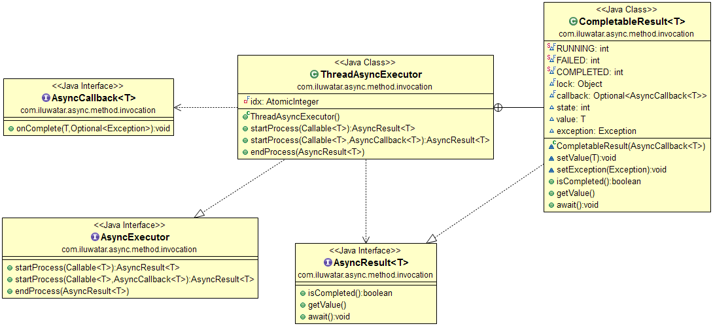

## Propósito

Asynchronous method invocation (invocación de método asincrónico) es un patrón con el que el hilo o subproceso de llamada
no se bloquea mientras espera resultados. El patrón proporciona procesamiento en paralelo de múltiples tareas independientes y recupera los resultados a través de
devoluciones de llamada (callbacks) o esperando hasta que termine el procedimiento.

## Explicación

Ejemplo cotidiano

> Lanzar cohetes espaciales es un negocio apasionante. El comandante de la misión da la orden de lanzamiento y
> después de un tiempo indeterminado, el cohete se lanza con éxito o falla miserablemente.

En otras palabras

> La invocación del método asíncrono inicia el procedimiento y vuelve inmediatamente antes de que la tarea termine
> Los resultados del procedimiento se devuelven a la llamada posteriormente (callback).

Según Wikipedia

> En la programación multiproceso, la invocación de método asíncrono (AMI), también conocida como
> llamadas de método asíncrono o el patrón asíncrono es un patrón de diseño en el que el lugar de la llamada
> no se bloquea mientras espera que termine el código llamado. En cambio, el hilo de llamada es
> notificado cuando llega la respuesta. Sondear para obtener una respuesta es una opción no deseada.

**Ejemplo programático**

En este ejemplo, estamos lanzando cohetes espaciales y desplegando vehículos lunares.

La aplicación demuestra lo que hace el patrón de invocación del método asíncrono. Las partes clave del patrón son
`AsyncResult` que es un contenedor intermedio para un valor evaluado de forma asíncrona,
`AsyncCallback` que se puede proporcionar para que se ejecute al finalizar la tarea y `AsyncExecutor` que
gestiona la ejecución de las tareas asíncronas.

```java
public interface AsyncResult<T> {
  boolean isCompleted();
  T getValue() throws ExecutionException;
  void await() throws InterruptedException;
}
```

```java
public interface AsyncCallback<T> {
  void onComplete(T value, Optional<Exception> ex);
}
```

```java
public interface AsyncExecutor {
  <T> AsyncResult<T> startProcess(Callable<T> task);
  <T> AsyncResult<T> startProcess(Callable<T> task, AsyncCallback<T> callback);
  <T> T endProcess(AsyncResult<T> asyncResult) throws ExecutionException, InterruptedException;
}
```

`ThreadAsyncExecutor` es una implementación de `AsyncExecutor`. Se destacan algunas de sus partes clave a continuación.

```java
public class ThreadAsyncExecutor implements AsyncExecutor {

  @Override
  public <T> AsyncResult<T> startProcess(Callable<T> task) {
    return startProcess(task, null);
  }

  @Override
  public <T> AsyncResult<T> startProcess(Callable<T> task, AsyncCallback<T> callback) {
    var result = new CompletableResult<>(callback);
    new Thread(
            () -> {
              try {
                result.setValue(task.call());
              } catch (Exception ex) {
                result.setException(ex);
              }
            },
            "executor-" + idx.incrementAndGet())
        .start();
    return result;
  }

  @Override
  public <T> T endProcess(AsyncResult<T> asyncResult)
      throws ExecutionException, InterruptedException {
    if (!asyncResult.isCompleted()) {
      asyncResult.await();
    }
    return asyncResult.getValue();
  }
}
```

Ahora está todo preparado para lanzar algunos cohetes y así poder ver cómo funciona todo.

```java
public static void main(String[] args) throws Exception {
  // construye un nuevo objeto executor que ejecutará tareas asíncronas
  var executor = new ThreadAsyncExecutor();

  // inicia algunas tareas asíncronas con diferentes tiempos de procesamiento, las dos últimas con controladores de devolución de llamada
  final var asyncResult1 = executor.startProcess(lazyval(10, 500));
  final var asyncResult2 = executor.startProcess(lazyval("test", 300));
  final var asyncResult3 = executor.startProcess(lazyval(50L, 700));
  final var asyncResult4 = executor.startProcess(lazyval(20, 400), callback("Desplegando el rover lunar"));
  final var asyncResult5 =
      executor.startProcess(lazyval("devolución de llamada callback", 600), callback("Desplegando el rover lunar"));

  // emula el procesamiento en el hilo o subproceso actual mientras las tareas asíncronas se ejecutan en sus propios hilos o subprocesos
  Subproceso.dormir(350); // Oye, estamos trabajando duro aquí
  log("El comandante de la misión está bebiendo café");

  // espera a que se completen las tareas
  final var result1 = executor.endProcess(asyncResult1);
  final var result2 = executor.endProcess(asyncResult2);
  final var result3 = executor.endProcess(asyncResult3);
  asyncResult4.await();
  asyncResult5.await();

  // registra los resultados de las tareas, las devoluciones de las llamadas se registran inmediatamente cuando se completan
  log("Cohete espacial <" + resultado1 + "> ha completado su lanzamiento");
  log("Cohete espacial <" + resultado2 + "> ha completado su lanzamiento");
  log("Cohete espacial <" + result3 + "> ha completado su lanzamiento");
}
```

Aquí está la salida de la consola del programa.

```java
21:47:08.227 [executor-2] INFO com.iluwatar.async.method.invocation.App - Cohete espacial <prueba> lanzado con éxito
21:47:08.269 [main] INFO com.iluwatar.async.method.invocation.App - El comandante de la misión está bebiendo café
21:47:08.318 [executor-4] INFO com.iluwatar.async.method.invocation.App - Cohete espacial <20> lanzado con éxito
21:47:08.335 [executor-4] INFO com.iluwatar.async.method.invocation.App Desplegando el rover lunar <20>
21:47:08.414 [executor-1] INFO com.iluwatar.async.method.invocation.App  - Cohete espacial <10> lanzado con éxito
21:47:08.519 [executor-5] INFO com.iluwatar.async.method.invocation.App - Cohete espacial <devolución de llamada callback> lanzado con éxito
21:47:08.519 [executor-5] INFO com.iluwatar.async.method.invocation.App - Implementando el vehículo lunar <devolución de llamada callback>
21:47:08.616 [executor-3] INFO com.iluwatar.async.method.invocation.App - Cohete espacial <50> lanzado con éxito
21:47:08.617 [main] INFO com.iluwatar.async.method.invocation.App - Lanzamiento del cohete espacial <10> completado
21:47:08.617 [main] INFO com.iluwatar.async.method.invocation.App - Lanzamiento de cohete espacial <prueba> completado
21:47:08.618 [main] INFO com.iluwatar.async.method.invocation.App - Lanzamiento del cohete espacial <50> completado
```

# Diagrama de clase



## Aplicabilidad

Utiliza el patrón de invocación del método asíncrono cuando

* Tienes múltiples tareas independientes que pueden ejecutarse en paralelo
* Necesitas mejorar el desempeño de un grupo de tareas secuenciales
* Tienes una cantidad limitada de capacidad de procesamiento o tareas de ejecución prolongada y la llamada no debe esperar a que las tareas estén listas

## Ejemplos cotidianos

* [FutureTask](http://docs.oracle.com/javase/8/docs/api/java/util/concurrent/FutureTask.html)
* [CompletableFuture](https://docs.oracle.com/javase/8/docs/api/java/util/concurrent/CompletableFuture.html)
* [ExecutorService](http://docs.oracle.com/javase/8/docs/api/java/util/concurrent/ExecutorService.html)
* [Patrón asíncrono basado en tareas](https://msdn.microsoft.com/en-us/library/hh873175.aspx)