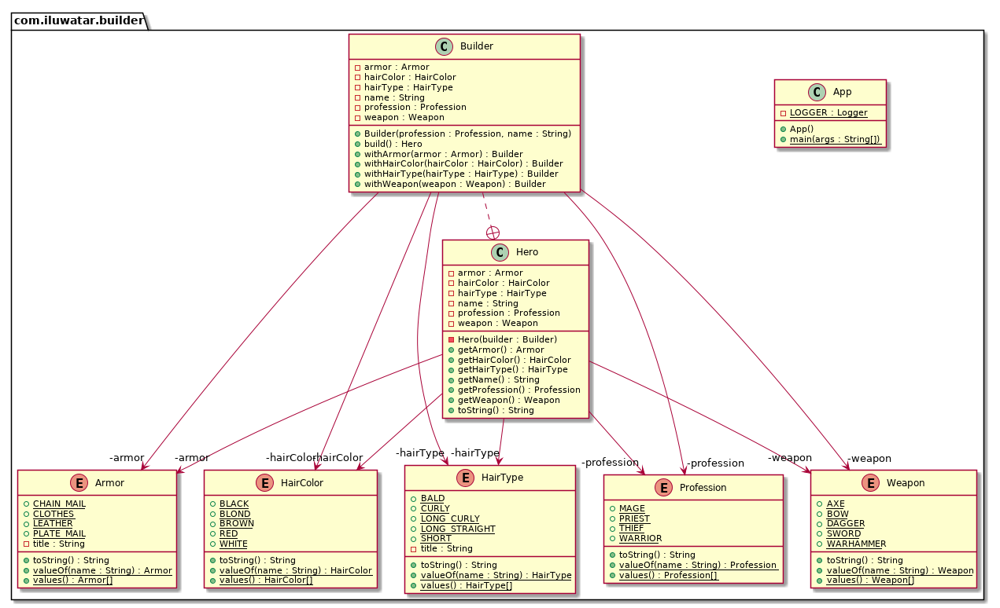

## Propósito

Separar la construcción de un objeto complejo de su representación para que el mismo proceso de
construcción pueda crear diferentes representaciones.

## Explicación

Ejemplo real

> Imagina un generador de personajes para un juego de rol. La opción más fácil es dejar que el ordenador
> cree el personaje por ti. Si quieres seleccionar manualmente los detalles del personaje como
> profesión, sexo, color de pelo, etc. la generación del personaje se convierte en un proceso paso a paso que
> se completa cuando todas las selecciones están listas.

En pocas palabras

> Permite crear diferentes sabores de un objeto evitando la contaminación del constructor. Útil
> cuando puede haber varios sabores de un objeto. O cuando hay muchos pasos involucrados en la creación de un objeto.
> creación de un objeto.

Wikipedia dice

> El patrón constructor es un patrón de diseño de software de creación de objetos con la intención de encontrar
> una solución al anti-patrón del constructor telescópico.


Dicho esto, permíteme agregar un poco sobre qué es el anti-patrón del constructor telescópico. En algún momento  
u otro, todos hemos visto un constructor como el siguiente:

```java
public Hero(Profession profession, String name, HairType hairType, HairColor hairColor, Armor armor, Weapon weapon) {
}
```

Como puedes ver, el número de parámetros del constructor puede salirse rápidamente de control, y puede volverse difícil
entender la disposición de los parámetros. Además, esta lista de parámetros podría seguir creciendo si quisieras agregar
más opciones en el futuro. A esto se le llama anti-patrón del constructor telescópico.

**Ejemplo programático**

La alternativa sensata es utilizar el patrón Builder. En primer lugar, tenemos a nuestro héroe `Hero` que queremos
crear:

```java
public final class Hero {
  private final Profession profession;
  private final String name;
  private final HairType hairType;
  private final HairColor hairColor;
  private final Armor armor;
  private final Weapon weapon;

  private Hero(Builder builder) {
    this.profession = builder.profession;
    this.name = builder.name;
    this.hairColor = builder.hairColor;
    this.hairType = builder.hairType;
    this.weapon = builder.weapon;
    this.armor = builder.armor;
  }
}
```

Luego tenemos al constructor:

```java
  public static class Builder {
    private final Profession profession;
    private final String name;
    private HairType hairType;
    private HairColor hairColor;
    private Armor armor;
    private Weapon weapon;

    public Builder(Profession profession, String name) {
      if (profession == null || name == null) {
        throw new IllegalArgumentException("profession and name can not be null");
      }
      this.profession = profession;
      this.name = name;
    }

    public Builder withHairType(HairType hairType) {
      this.hairType = hairType;
      return this;
    }

    public Builder withHairColor(HairColor hairColor) {
      this.hairColor = hairColor;
      return this;
    }

    public Builder withArmor(Armor armor) {
      this.armor = armor;
      return this;
    }

    public Builder withWeapon(Weapon weapon) {
      this.weapon = weapon;
      return this;
    }

    public Hero build() {
      return new Hero(this);
    }
  }
```

Entonces se puede utilizar como:

```java
var mage = new Hero.Builder(Profession.MAGE, "Riobard").withHairColor(HairColor.BLACK).withWeapon(Weapon.DAGGER).build();
```

## Diagrama de clases



## Aplicabilidad

Utiliza el patrón Builder cuando

* El algoritmo para crear un objeto complejo debe ser independiente de las partes que componen el objeto y cómo se
  ensamblan.
* El proceso de construcción debe permitir diferentes representaciones para el objeto que se construye.

## Tutoriales

* [Refactoring Guru](https://refactoring.guru/design-patterns/builder)
* [Oracle Blog](https://blogs.oracle.com/javamagazine/post/exploring-joshua-blochs-builder-design-pattern-in-java)
* [Journal Dev](https://www.journaldev.com/1425/builder-design-pattern-in-java)

## Usos en el mundo real

* [java.lang.StringBuilder](http://docs.oracle.com/javase/8/docs/api/java/lang/StringBuilder.html)
* [java.nio.ByteBuffer](http://docs.oracle.com/javase/8/docs/api/java/nio/ByteBuffer.html#put-byte-) así como otros
  buffers
  como FloatBuffer, IntBuffer, etc.
* [java.lang.StringBuffer](http://docs.oracle.com/javase/8/docs/api/java/lang/StringBuffer.html#append-boolean-)
* Todas las implementaciones
  de [java.lang.Appendable](http://docs.oracle.com/javase/8/docs/api/java/lang/Appendable.html)
* [Apache Camel builders](https://github.com/apache/camel/tree/0e195428ee04531be27a0b659005e3aa8d159d23/camel-core/src/main/java/org/apache/camel/builder)
* [Apache Commons Option.Builder](https://commons.apache.org/proper/commons-cli/apidocs/org/apache/commons/cli/Option.Builder.html)

## Créditos

* [Design Patterns: Elements of Reusable Object-Oriented Software](https://www.amazon.com/gp/product/0201633612/ref=as_li_tl?ie=UTF8&camp=1789&creative=9325&creativeASIN=0201633612&linkCode=as2&tag=javadesignpat-20&linkId=675d49790ce11db99d90bde47f1aeb59)
* [Effective Java](https://www.amazon.com/gp/product/0134685997/ref=as_li_tl?ie=UTF8&camp=1789&creative=9325&creativeASIN=0134685997&linkCode=as2&tag=javadesignpat-20&linkId=4e349f4b3ff8c50123f8147c828e53eb)
* [Head First Design Patterns: A Brain-Friendly Guide](https://www.amazon.com/gp/product/0596007124/ref=as_li_tl?ie=UTF8&camp=1789&creative=9325&creativeASIN=0596007124&linkCode=as2&tag=javadesignpat-20&linkId=6b8b6eea86021af6c8e3cd3fc382cb5b)
* [Refactoring to Patterns](https://www.amazon.com/gp/product/0321213351/ref=as_li_tl?ie=UTF8&camp=1789&creative=9325&creativeASIN=0321213351&linkCode=as2&tag=javadesignpat-20&linkId=2a76fcb387234bc71b1c61150b3cc3a7)
