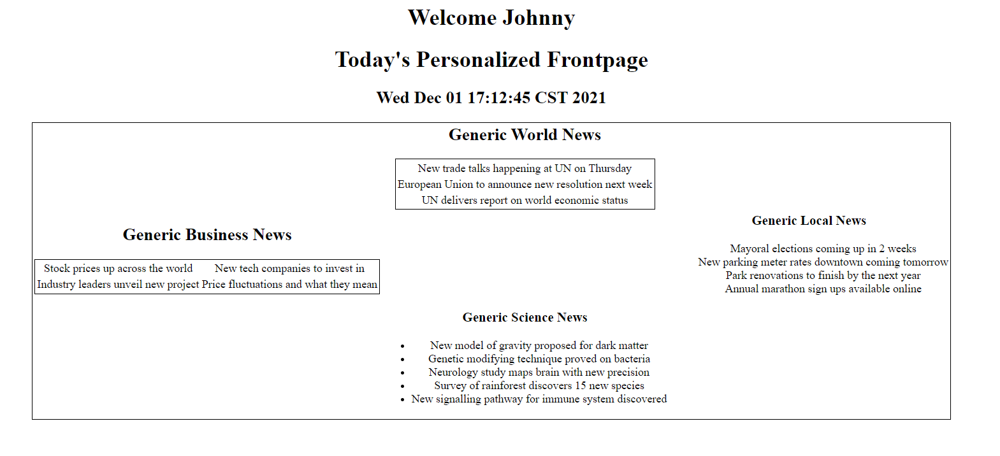

## Propósito

El objetivo principal del patrón de diseño Composite View es componer objetos en estructuras de árbol para representar
jerarquías parte-todo. Esto permite a los clientes tratar objetos individuales y composiciones de objetos de manera
uniforme, simplificando la gestión de estructuras complejas.

## Explicación

Ejemplo del mundo real

> Un sitio de noticias quiere mostrar la fecha actual y las noticias a diferentes usuarios basándose en las preferencias
> de ese usuario. El sitio de noticias sustituirá en diferentes componentes de alimentación de noticias en función de
> los intereses del usuario, por defecto a las noticias locales.

En pocas palabras

> El patrón de vista compuesta consiste en tener una vista principal compuesta por subvistas más pequeñas. El diseño de
> esta vista compuesta se basa en una plantilla. Un View-manager decide entonces qué subvistas incluir en esta
> plantilla.

Wikipedia dice

> Vistas compuestas que están formadas por múltiples subvistas atómicas. Cada componente de la plantilla puede incluirse
> dinámicamente en el conjunto y el diseño de la página puede gestionarse independientemente del contenido. Esta
> solución permite crear una vista compuesta basada en la inclusión y sustitución de fragmentos modulares de plantillas
> dinámicas y estáticas. Promueve la reutilización de porciones atómicas de la vista fomentando el diseño modular.

**Ejemplo programático**

Dado que se trata de un patrón de desarrollo web, se requiere un servidor para demostrarlo. Este ejemplo utiliza Tomcat
10.0.13 para ejecutar el servlet, y este ejemplo programático sólo funcionará con Tomcat 10+.

En primer lugar, existe `AppServlet` que es un `HttpServlet` que se ejecuta en Tomcat 10+.

```java
public class AppServlet extends HttpServlet {
    private String msgPartOne = "<h1>This Server Doesn't Support";
    private String msgPartTwo = "Requests</h1>\n"
            + "<h2>Use a GET request with boolean values for the following parameters<h2>\n"
            + "<h3>'name'</h3>\n<h3>'bus'</h3>\n<h3>'sports'</h3>\n<h3>'sci'</h3>\n<h3>'world'</h3>";

    private String destination = "newsDisplay.jsp";

    public AppServlet() {

    }

    @Override
    public void doGet(HttpServletRequest req, HttpServletResponse resp)
            throws ServletException, IOException {
        RequestDispatcher requestDispatcher = req.getRequestDispatcher(destination);
        ClientPropertiesBean reqParams = new ClientPropertiesBean(req);
        req.setAttribute("properties", reqParams);
        requestDispatcher.forward(req, resp);
    }

    @Override
    public void doPost(HttpServletRequest req, HttpServletResponse resp)
            throws ServletException, IOException {
        resp.setContentType("text/html");
        PrintWriter out = resp.getWriter();
        out.println(msgPartOne + " Post " + msgPartTwo);

    }

    @Override
    public void doDelete(HttpServletRequest req, HttpServletResponse resp)
            throws ServletException, IOException {
        resp.setContentType("text/html");
        PrintWriter out = resp.getWriter();
        out.println(msgPartOne + " Delete " + msgPartTwo);

    }

    @Override
    public void doPut(HttpServletRequest req, HttpServletResponse resp)
            throws ServletException, IOException {
        resp.setContentType("text/html");
        PrintWriter out = resp.getWriter();
        out.println(msgPartOne + " Put " + msgPartTwo);

    }
}

```

Este servlet no forma parte del patrón, y simplemente reenvía las peticiones GET a la JSP correcta. Las peticiones PUT,
POST y DELETE no están soportadas y simplemente mostrarán un mensaje de error.

La gestión de la vista en este ejemplo se realiza a través de una clase javabean: `ClientPropertiesBean`, que almacena
las preferencias del usuario.

```java
public class ClientPropertiesBean implements Serializable {

    private static final String WORLD_PARAM = "world";
    private static final String SCIENCE_PARAM = "sci";
    private static final String SPORTS_PARAM = "sport";
    private static final String BUSINESS_PARAM = "bus";
    private static final String NAME_PARAM = "name";

    private static final String DEFAULT_NAME = "DEFAULT_NAME";
    private boolean worldNewsInterest;
    private boolean sportsInterest;
    private boolean businessInterest;
    private boolean scienceNewsInterest;
    private String name;

    public ClientPropertiesBean() {
        worldNewsInterest = true;
        sportsInterest = true;
        businessInterest = true;
        scienceNewsInterest = true;
        name = DEFAULT_NAME;

    }

    public ClientPropertiesBean(HttpServletRequest req) {
        worldNewsInterest = Boolean.parseBoolean(req.getParameter(WORLD_PARAM));
        sportsInterest = Boolean.parseBoolean(req.getParameter(SPORTS_PARAM));
        businessInterest = Boolean.parseBoolean(req.getParameter(BUSINESS_PARAM));
        scienceNewsInterest = Boolean.parseBoolean(req.getParameter(SCIENCE_PARAM));
        String tempName = req.getParameter(NAME_PARAM);
        if (tempName == null || tempName == "") {
            tempName = DEFAULT_NAME;
        }
        name = tempName;
    }
    // getters and setters generated by Lombok 
}
```

Este javabean tiene un constructor por defecto, y otro que toma un `HttpServletRequest`.

Este segundo constructor toma el objeto de solicitud, analiza los parámetros de la solicitud que contienen las
preferencias del usuario para los diferentes tipos de noticias.

La plantilla para la página de noticias está en `newsDisplay.jsp`.

```html

<html>
<head>
    <style>
        h1 {
            text-align: center;
        }

        h2 {
            text-align: center;
        }

        h3 {
            text-align: center;
        }

        .centerTable {
            margin-left: auto;
            margin-right: auto;
        }

        table {
            border: 1px solid black;
        }

        tr {
            text-align: center;
        }

        td {
            text-align: center;
        }
    </style>
</head>
<body>
<%ClientPropertiesBean propertiesBean = (ClientPropertiesBean) request.getAttribute("properties");%>
<h1>Welcome <%= propertiesBean.getName()%></h1>
<jsp:include page="header.jsp"></jsp:include>
<table class="centerTable">

    <tr>
        <td></td>
        <% if(propertiesBean.isWorldNewsInterest()) { %>
        <td><%@include file="worldNews.jsp"%></td>
        <% } else { %>
        <td><%@include file="localNews.jsp"%></td>
        <% } %>
        <td></td>
    </tr>
    <tr>
        <% if(propertiesBean.isBusinessInterest()) { %>
        <td><%@include file="businessNews.jsp"%></td>
        <% } else { %>
        <td><%@include file="localNews.jsp"%></td>
        <% } %>
        <td></td>
        <% if(propertiesBean.isSportsInterest()) { %>
        <td><%@include file="sportsNews.jsp"%></td>
        <% } else { %>
        <td><%@include file="localNews.jsp"%></td>
        <% } %>
    </tr>
    <tr>
        <td></td>
        <% if(propertiesBean.isScienceNewsInterest()) { %>
        <td><%@include file="scienceNews.jsp"%></td>
        <% } else { %>
        <td><%@include file="localNews.jsp"%></td>
        <% } %>
        <td></td>
    </tr>
</table>
</body>
</html>
```

Esta página JSP es la plantilla. Declara una tabla con tres filas, con un componente en la primera fila, dos componentes
en la segunda fila y un componente en la tercera fila.

Los scriplets en el archivo son parte de la estrategia de gestión de vistas que incluyen diferentes subvistas atómicas
basadas en las preferencias del usuario en el Javabean.

A continuación se muestran dos ejemplos de las subvistas atómicas simuladas utilizadas en el
compuesto: `businessNews.jsp`

```html

<html>
<head>
    <style>
        h2 {
            text-align: center;
        }

        table {
            border: 1px solid black;
        }

        tr {
            text-align: center;
        }

        td {
            text-align: center;
        }
    </style>
</head>
<body>
<h2>
    Generic Business News
</h2>
<table style="margin-right: auto; margin-left: auto">
    <tr>
        <td>Stock prices up across the world</td>
        <td>New tech companies to invest in</td>
    </tr>
    <tr>
        <td>Industry leaders unveil new project</td>
        <td>Price fluctuations and what they mean</td>
    </tr>
</table>
</body>
</html>
```

`localNews.jsp`

```html

<html>
<body>
<div style="text-align: center">
    <h3>
        Generic Local News
    </h3>
    <ul style="list-style-type: none">
        <li>
            Mayoral elections coming up in 2 weeks
        </li>
        <li>
            New parking meter rates downtown coming tomorrow
        </li>
        <li>
            Park renovations to finish by the next year
        </li>
        <li>
            Annual marathon sign ups available online
        </li>
    </ul>
</div>
</body>
</html>
```

Los resultados son los siguientes:

1) El usuario ha puesto su nombre como `Tammy` en los parámetros de la petición y ninguna
   preferencia: 
2) El usuario ha puesto su nombre como `Johnny` en los parámetros de la petición y tiene preferencia por noticias del
   mundo, negocios y ciencia: 

Las distintas subvistas como `worldNews.jsp`, `businessNews.jsp`, etc. se incluyen condicionalmente en función de los
parámetros de la solicitud.

**Cómo utilizarlo**

Para probar este ejemplo, asegúrese de tener Tomcat 10+ instalado. Configure su IDE para construir un archivo WAR a
partir del módulo y despliegue ese archivo en el servidor

IntelliJ:

En `Run` y `edit configurations` Asegúrate de que el servidor Tomcat es una de las configuraciones de ejecución. Vaya a
la pestaña de despliegue y asegúrese de que se está construyendo un artefacto llamado `composite-view:war exploded`. Si
no está presente, añada uno.

Asegúrate de que el artefacto se está construyendo a partir del contenido del directorio `web` y de los resultados de la
compilación del módulo. Apunta la salida del artefacto a un lugar conveniente. Ejecute la configuración y vea la página
de destino, siga las instrucciones de esa página para continuar.

## Diagrama de clases


El diagrama de clases aquí muestra el Javabean que es el gestor de vistas. Las vistas son JSP's dentro del directorio
web.

## Aplicabilidad:

Utiliza el patrón de diseño Composite View cuando:

## Desea representar jerarquías parciales de objetos.

* Esperas que las estructuras compuestas puedan incluir nuevos componentes en el futuro.
* Desea que los clientes puedan ignorar la diferencia entre composiciones de objetos y objetos individuales. Los
  clientes tratarán todos los objetos de la estructura compuesta de manera uniforme.

## Usos conocidos

* Interfaces gráficas de usuario (GUI) en las que los widgets pueden contener otros widgets (por ejemplo, una ventana
  con paneles, botones y campos de texto).
* Estructuras de documentos, como la representación de tablas que contienen filas, que a su vez contienen celdas, todas
  las cuales pueden tratarse como elementos de una jerarquía unificada.

## Consecuencias

Ventajas:

* Gran flexibilidad a la hora de añadir nuevos componentes: Como los compuestos y los nodos hoja se tratan de manera
  uniforme, es más fácil añadir nuevos tipos de componentes.
* Código cliente simplificado: Los clientes pueden tratar las estructuras compuestas y los elementos individuales de
  manera uniforme, lo que reduce la complejidad del código cliente.

Contrapartidas:

* Generalización excesiva: El diseño del sistema puede volverse más complejo si haces que todo sea compuesto,
  especialmente si tu aplicación no lo requiere.
* Dificultad en la aplicación de restricciones: Puede ser más difícil restringir los componentes de un compuesto a sólo
  ciertos tipos.

## Patrones Relacionados

* [Decorator](https://java-design-patterns.com/patterns/decorator/): Mientras que Decorator se utiliza para añadir
  responsabilidades a los objetos, Composite está pensado para construir estructuras de objetos.
* [Flyweight](https://java-design-patterns.com/patterns/flyweight/): Composite puede combinarse a menudo con Flyweight
  para implementar nodos hoja compartidos en una estructura compuesta, reduciendo la huella de memoria.
* [Cadena de responsabilidad](https://java-design-patterns.com/patterns/chain-of-responsibility/): Puede usarse con
  Composite para permitir a los componentes pasar peticiones a través de la jerarquía.
* [Composite](https://java-design-patterns.com/patterns/composite/)
* [Ayudante de vista](https://www.oracle.com/java/technologies/viewhelper.html)

## Créditos

* [Core J2EE Patterns - Composite View](https://www.oracle.com/java/technologies/composite-view.html)
* [Composite View Design Pattern – Core J2EE Patterns](https://www.dineshonjava.com/composite-view-design-pattern/)
* [Patterns of Enterprise Application Architecture](https://amzn.to/49jpQG3)
* [Head First Design Patterns: Building Extensible and Maintainable Object-Oriented Software](https://amzn.to/3xfntGJ)
