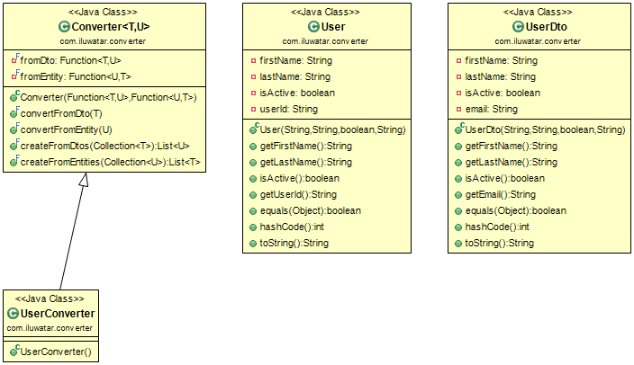

## Propósito

El propósito del patrón Conversor (Converter) es proporcionar una forma genérica y común de conversión bidireccional
entre tipos correspondientes, permitiendo una implementación limpia en la que los tipos no
tienen que conocerse entre sí. Además, el patrón Converter introduce la asignación bidireccional de colecciones
bidireccional, reduciendo al mínimo el código repetitivo.

## Explicación

Ejemplo del mundo real

> En las aplicaciones del mundo real, a menudo se da el caso de que la capa de base de datos consta de entidades que
> necesitan ser mapeadas en DTO para su uso en la capa de lógica de negocio. Un mapeo similar se realiza para
> potencialmente enorme cantidad de clases y necesitamos una forma genérica de lograrlo.

En palabras sencillas

> El patrón de conversión (Converter) facilita la asignación de instancias de una clase a instancias de otra clase.

**Ejemplo programático**

Necesitamos una solución genérica para el problema del mapeo. Para ello, introduzcamos un convertidor genérico.

```java
public class Converter<T, U> {

  private final Function<T, U> fromDto;
  private final Function<U, T> fromEntity;

  public Converter(final Function<T, U> fromDto, final Function<U, T> fromEntity) {
    this.fromDto = fromDto;
    this.fromEntity = fromEntity;
  }

  public final U convertFromDto(final T dto) {
    return fromDto.apply(dto);
  }

  public final T convertFromEntity(final U entity) {
    return fromEntity.apply(entity);
  }

  public final List<U> createFromDtos(final Collection<T> dtos) {
    return dtos.stream().map(this::convertFromDto).collect(Collectors.toList());
  }

  public final List<T> createFromEntities(final Collection<U> entities) {
    return entities.stream().map(this::convertFromEntity).collect(Collectors.toList());
  }
}
```

Los convertidores especializados heredan de esta clase base de la siguiente manera.

```java
public class UserConverter extends Converter<UserDto, User> {

  public UserConverter() {
    super(UserConverter::convertToEntity, UserConverter::convertToDto);
  }

  private static UserDto convertToDto(User user) {
    return new UserDto(user.getFirstName(), user.getLastName(), user.isActive(), user.getUserId());
  }

  private static User convertToEntity(UserDto dto) {
    return new User(dto.getFirstName(), dto.getLastName(), dto.isActive(), dto.getEmail());
  }

}
```

Ahora el mapeo entre `User` y `UserDto` se vuelve trivial.

```java
var userConverter = new UserConverter();
var dtoUser = new UserDto("John", "Doe", true, "whatever[at]wherever.com");
var user = userConverter.convertFromDto(dtoUser);
```

## Diagrama de Clases



## Aplicabilidad

Utilice el patrón de conversión en las siguientes situaciones:

* Cuando tiene tipos que lógicamente se corresponden entre sí y necesita convertir entidades
  entre ellos.
* Cuando quieras proporcionar diferentes formas de conversión de tipos dependiendo del contexto.
* Siempre que introduzca un DTO (Data transfer object), probablemente necesitará convertirlo en la
  equivalencia de dominio.

## Créditos

* [Converter Pattern in Java 8](http://www.xsolve.pl/blog/converter-pattern-in-java-8/)
