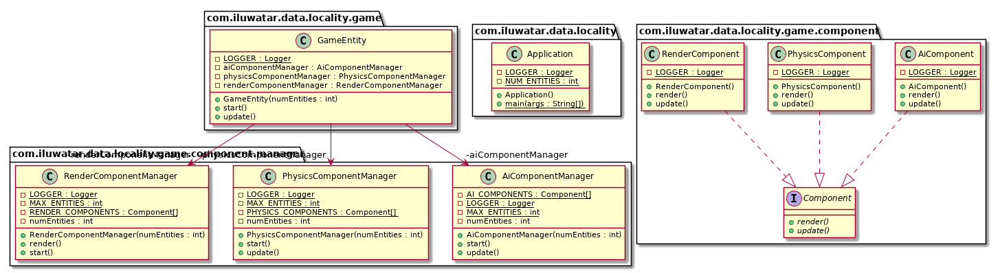

## Propósito
Acelera el acceso a la memoria organizando los datos para aprovechar la caché de la CPU.

Las CPU modernas disponen de cachés para acelerar el acceso a la memoria. Éstas pueden acceder mucho más rápido a la memoria adyacente a la memoria a la que se ha accedido recientemente. Aprovéchate de ello para mejorar el rendimiento aumentando la localidad de los datos, manteniéndolos en memoria contigua en el orden en que los procesas.

## Diagrama de clases

## Aplicabilidad

* Como la mayoría de las optimizaciones, la primera pauta para usar el patrón Data Locality es cuando se tiene un problema de rendimiento.
* Con este patrón específicamente, también querrás estar seguro de que tus problemas de rendimiento son causados por pérdidas de caché.

## Ejemplo del mundo real

* El motor de juego [Artemis](http://gamadu.com/artemis/) es uno de los primeros y más conocidos frameworks que utiliza IDs simples para las entidades del juego.

## Créditos

* [Game Programming Patterns Optimization Patterns: Data Locality](http://gameprogrammingpatterns.com/data-locality.html)