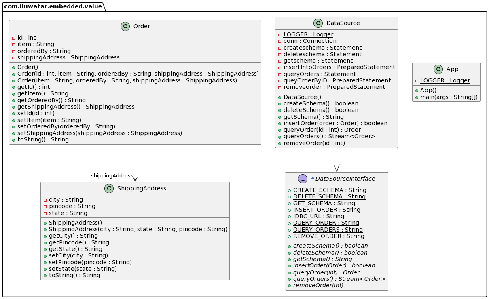

## También conocido como

Asignación agregada, Compositor

## Propósito

Muchos objetos pequeños tienen sentido en un sistema OO que no tienen sentido como tablas en una base de datos. Un valor
incrustado asigna los valores de un objeto a campos del registro del propietario del objeto.

## Explicación

Ejemplo real

> Algunos ejemplos son los objetos monetarios y los intervalos de fechas. Aunque el pensamiento por defecto es guardar
> un objeto como una tabla, ninguna persona en su sano juicio querría una tabla de valores monetarios.
> Otro ejemplo serían los pedidos online que tienen una dirección de envío como calle, ciudad, estado. Asignamos estos
> valores del objeto Dirección de envío a los campos del registro del objeto Pedido.

En pocas palabras

> El patrón de valores incrustados permite asignar un objeto a varios campos de la tabla de otro objeto.

**Ejemplo programático**

Consideremos el ejemplo de un pedido online donde tenemos detalles del artículo pedido y la dirección de envío. Tenemos
la dirección de envío incrustada en el objeto Pedido. Pero en la base de datos asignamos los valores de la dirección de
envío en el registro del pedido en lugar de crear una tabla separada para la dirección de envío y utilizar una clave
externa para hacer referencia al objeto del pedido.

Primero, tenemos POJOs `Order` y `ShippingAddress`.

```java
public class Order {

    private int id;
    private String item;
    private String orderedBy;
    private ShippingAddress ShippingAddress;

    public Order(String item, String orderedBy, ShippingAddress           ShippingAddress) {
        this.item = item;
        this.orderedBy = orderedBy;
        this.ShippingAddress = ShippingAddress;
    }
```

```java
public class ShippingAddress {

    private String city;
    private String state;
    private String pincode;

    public ShippingAddress(String city, String state, String pincode) {
        this.city = city;
        this.state = state;
        this.pincode = pincode;
    }
}
```

Ahora, tenemos que crear sólo una tabla para el Pedido junto con los campos para los atributos de la dirección de envío.

```Sql
CREATE TABLE Orders (Id INT AUTO_INCREMENT, item VARCHAR(50) NOT NULL, orderedBy VARCHAR(50) city VARCHAR(50), state VARCHAR(50), pincode CHAR(6) NOT NULL, PRIMARY KEY(Id))
```

Mientras realizamos las consultas e inserciones en la base de datos, encasillamos y desencasillamos los detalles de las
direcciones de envío.

```java
final String INSERT_ORDER = "INSERT INTO Orders (item, orderedBy, city, state, pincode) VALUES (?, ?, ?, ?, ?)";

public boolean insertOrder(Order order) throws Exception {
  var insertOrder = new PreparedStatement(INSERT_ORDER);
  var address = order.getShippingAddress();
  conn.setAutoCommit(false);
  insertIntoOrders.setString(1, order.getItem());
  insertIntoOrders.setString(2, order.getOrderedBy());
  insertIntoOrders.setString(3, address.getCity());
  insertIntoOrders.setString(4, address.getState());
  insertIntoOrders.setString(5, address.getPincode());
  
  var affectedRows = insertIntoOrders.executeUpdate();
  if(affectedRows == 1){
    Logger.info("Inserted successfully");
  }else{
    Logger.info("Couldn't insert " + order);
  }
}
```

## Diagrama de clases



## Aplicabilidad

Utilice el patrón Valor incrustado cuando

* Muchos objetos pequeños tienen sentido en un sistema OO que no tienen sentido como tablas en una base de datos.
* Los casos más simples para Embedded Value son los claros y simples Value Objects como dinero y rango de fechas.
* Si está mapeando a un esquema existente, puede utilizar este patrón cuando una tabla contiene datos que desea dividir
  en más de un objeto en memoria. Esto puede ocurrir cuando se desea factorizar algún comportamiento en el modelo de
  objetos.
* En la mayoría de los casos, sólo utilizará el valor incrustado en un objeto de referencia cuando la asociación entre
  ellos tenga un único valor en ambos extremos (una asociación uno a uno).

## Tutoriales

* [Dzone](https://dzone.com/articles/practical-php-patterns/practical-php-patterns-3)
* [Ram N Java](https://ramj2ee.blogspot.com/2013/08/embedded-value-design-pattern.html)
* [Five's Weblog](https://powerdream5.wordpress.com/2007/10/09/embedded-value/)

## Consecuencias

* La gran ventaja del valor incrustado es que permite realizar consultas SQL contra los valores del objeto dependiente.
* El objeto valor incrustado no tiene ningún comportamiento de persistencia.
* Al usar esto, tienes que tener cuidado de que cualquier cambio en el dependiente marque al propietario como sucio-lo
  cual no es un problema con los Objetos de Valor que son reemplazados en el propietario.
* Otro problema es la carga y el guardado. Si sólo carga la memoria del objeto incrustado cuando carga el propietario,
  eso es un argumento para guardar ambos en la misma tabla.
* Otra cuestión es si querrás acceder a los datos de los objetos incrustados por separado a través de SQL. Esto puede
  ser importante si estás haciendo informes a través de SQL y no tienes una base de datos separada para los informes.

## Créditos

* [Fowler, Martin - Patterns of enterprise application architecture-Addison-Wesley](https://www.amazon.com/Patterns-Enterprise-Application-Architecture-Martin/dp/0321127420)
* [Ram N Java](https://ramj2ee.blogspot.com/2013/08/embedded-value-design-pattern.html)