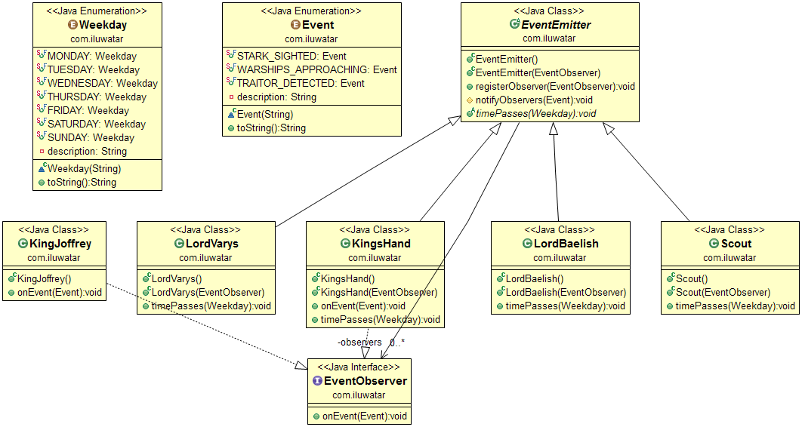

## Nombre

Agregador de eventos

## Intención

Un sistema con muchos objetos puede resultar complejo cuando un cliente quiere suscribirse a eventos. El cliente tiene
que encontrar y registrarse para
cada objeto individualmente, si cada objeto tiene múltiples eventos entonces cada evento requiere una suscripción
separada. Un Agregador de Eventos actúa como una única fuente
de eventos para muchos objetos. Se registra para todos los eventos de los muchos objetos permitiendo a los clientes
registrarse sólo con el agregador.

## Explicación

Un ejemplo real

> El rey Joffrey se sienta en el trono de hierro y gobierna los siete reinos de Poniente. Recibe la mayor parte de su
> información crítica de Mano del Rey, el segundo al mando. La Mano del Rey tiene muchos consejeros cercanos que le
> proporcionan información relevante sobre los acontecimientos que ocurren en el reino.

En pocas palabras

> El Agregador de Eventos es un mediador de eventos que recoge eventos de múltiples fuentes y los entrega a los
> observadores registrados.

**Ejemplo programático**

En nuestro ejemplo programático, demostramos la implementación de un patrón agregador de eventos. Algunos de los objetos
son escuchadores de eventos, otros son emisores de eventos, y el agregador de eventos hace ambas cosas.

```java
public interface EventObserver {
  void onEvent(Event e);
}

public abstract class EventEmitter {

  private final Map<Event, List<EventObserver>> observerLists;

  public EventEmitter() {
    observerLists = new HashMap<>();
  }

  public final void registerObserver(EventObserver obs, Event e) {
    ...
  }

  protected void notifyObservers(Event e) {
    ...
  }
}
```

`KingJoffrey` está escuchando eventos de `KingsHand`.

```java
@Slf4j
public class KingJoffrey implements EventObserver {
  @Override
  public void onEvent(Event e) {
    LOGGER.info("Received event from the King's Hand: {}", e.toString());
  }
}
```

El `ReyMano` está escuchando los acontecimientos de sus subordinados `LordBaelish`, `LordVarys` y `Scout`.
Lo que escuche de ellos, se lo entrega al "Rey Joffrey".

```java
public class KingsHand extends EventEmitter implements EventObserver {

  public KingsHand() {
  }

  public KingsHand(EventObserver obs, Event e) {
    super(obs, e);
  }

  @Override
  public void onEvent(Event e) {
    notifyObservers(e);
  }
}
```

Por ejemplo, `LordVarys` encuentra un traidor cada domingo y lo notifica al `KingsHand`.

```java
@Slf4j
public class LordVarys extends EventEmitter implements EventObserver {
  @Override
  public void timePasses(Weekday day) {
    if (day == Weekday.SATURDAY) {
      notifyObservers(Event.TRAITOR_DETECTED);
    }
  }
}
```

El siguiente fragmento muestra cómo se construyen y conectan los objetos.

```java
    var kingJoffrey = new KingJoffrey();

    var kingsHand = new KingsHand();
    kingsHand.registerObserver(kingJoffrey, Event.TRAITOR_DETECTED);
    kingsHand.registerObserver(kingJoffrey, Event.STARK_SIGHTED);
    kingsHand.registerObserver(kingJoffrey, Event.WARSHIPS_APPROACHING);
    kingsHand.registerObserver(kingJoffrey, Event.WHITE_WALKERS_SIGHTED);

    var varys = new LordVarys();
    varys.registerObserver(kingsHand, Event.TRAITOR_DETECTED);
    varys.registerObserver(kingsHand, Event.WHITE_WALKERS_SIGHTED);

    var scout = new Scout();
    scout.registerObserver(kingsHand, Event.WARSHIPS_APPROACHING);
    scout.registerObserver(varys, Event.WHITE_WALKERS_SIGHTED);

    var baelish = new LordBaelish(kingsHand, Event.STARK_SIGHTED);

    var emitters = List.of(
        kingsHand,
        baelish,
        varys,
        scout
    );

    Arrays.stream(Weekday.values())
        .<Consumer<? super EventEmitter>>map(day -> emitter -> emitter.timePasses(day))
        .forEachOrdered(emitters::forEach);
```

La salida de la consola después de ejecutar el ejemplo.

```
18:21:52.955 [main] INFO com.iluwatar.event.aggregator.KingJoffrey - Received event from the King's Hand: Warships approaching
18:21:52.960 [main] INFO com.iluwatar.event.aggregator.KingJoffrey - Received event from the King's Hand: White walkers sighted
18:21:52.960 [main] INFO com.iluwatar.event.aggregator.KingJoffrey - Received event from the King's Hand: Stark sighted
18:21:52.960 [main] INFO com.iluwatar.event.aggregator.KingJoffrey - Received event from the King's Hand: Traitor detected
```

## Diagrama de clases



## Aplicabilidad

Utilice el patrón Agregador de eventos cuando

* El Agregador de Eventos es una buena opción cuando tienes muchos objetos que son fuentes potenciales de eventos. En
  lugar de hacer que el observador se ocupe de registrarse con todos ellos, puedes centralizar la lógica de registro en
  el Agregador de Eventos. Además de simplificar el registro, un Agregador de Eventos también simplifica los problemas
  de gestión de memoria en el uso de observadores.

## Patrones relacionados

* [Observer](https://java-design-patterns.com/patterns/observer/)

## Créditos

* [Martin Fowler - Event Aggregator](http://martinfowler.com/eaaDev/EventAggregator.html)
