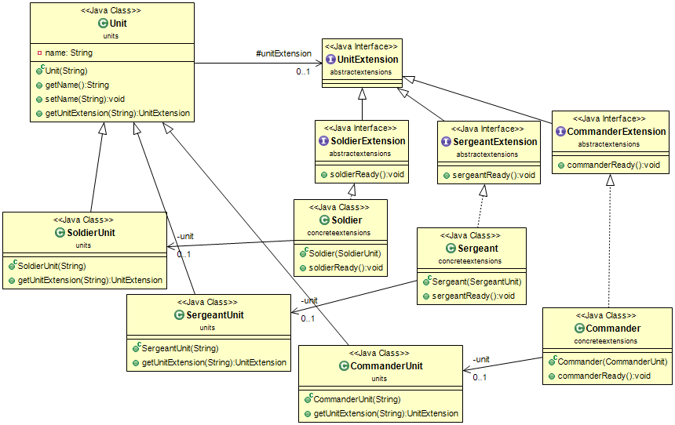

# Extention Objects Pattern

## Propósito
Anticipar que la interfaz de un objeto debe ampliarse en el futuro. Las interfaces adicionales se definen mediante objetos de extensión (Extension objects).

## Explicación
Ejemplo real

> Suponga que está desarrollando un juego basado en Java para un cliente y, en mitad del proceso de desarrollo, le sugieren nuevas funcionalidades. El patrón Extension Objects permite a su programa adaptarse a cambios imprevistos con una refactorización mínima, especialmente al integrar funcionalidades adicionales en su proyecto.

En palabras sencillas

> El patrón Extension Objects se utiliza para añadir dinámicamente funcionalidad a los objetos sin modificar sus clases principales. Es un patrón de diseño de comportamiento utilizado para añadir nuevas funcionalidades a clases y objetos existentes dentro de un programa. Este patrón proporciona a los programadores la capacidad de extender/modificar la funcionalidad de las clases sin tener que refactorizar el código fuente existente.

Wikipedia dice

> En la programación informática orientada a objetos, un patrón de objetos de extensión es un patrón de diseño añadido a un objeto después de que el objeto original fue compilado. El objeto modificado es a menudo una clase, un prototipo o un tipo. Los patrones de objetos de extensión son características de algunos lenguajes de programación orientados a objetos. No hay diferencia sintáctica entre llamar a un método de extensión y llamar a un método declarado en la definición del tipo.

**Ejemplo programático**

El objetivo de utilizar el patrón de objetos de extensión (Extension objects) es implementar nuevas características/funcionalidades sin tener que refactorizar cada clase.
Los siguientes ejemplos muestran la utilización de este patrón para una clase Enemigo que extiende Entidad dentro de un juego:

Clase App primaria desde la que ejecutar nuestro programa.

```java
public class App {
    public static void main(String[] args) {
        Entity enemy = new Enemy("Enemy");
        checkExtensionsForEntity(enemy);
    }

    private static void checkExtensionsForEntity(Entity entity) {
        Logger logger = Logger.getLogger(App.class.getName());
        String name = entity.getName();
        Function<String, Runnable> func = (e) -> () -> logger.info(name + " without " + e);

        String extension = "EnemyExtension";
        Optional.ofNullable(entity.getEntityExtension(extension))
                .map(e -> (EnemyExtension) e)
                .ifPresentOrElse(EnemyExtension::extendedAction, func.apply(extension));
    }
}
```
Clase de enemigo con acciones iniciales y extensiones.

```java
class Enemy extends Entity {
    public Enemy(String name) {
        super(name);
    }

    @Override
    protected void performInitialAction() {
        super.performInitialAction();
        System.out.println("Enemy wants to attack you.");
    }

    @Override
    public EntityExtension getEntityExtension(String extensionName) {
        if (extensionName.equals("EnemyExtension")) {
            return Optional.ofNullable(entityExtension).orElseGet(EnemyExtension::new);
        }
        return super.getEntityExtension(extensionName);
    }
}
```

Clase EnemyExtension con sobreescritura del método extendAction().

```java
class EnemyExtension implements EntityExtension {
    @Override
    public void extendedAction() {
        System.out.println("Enemy has advanced towards you!");
    }
}
```

Clase de entidad que será extendida por Enemy.

```java
class Entity {
    private String name;
    protected EntityExtension entityExtension;

    public Entity(String name) {
        this.name = name;
        performInitialAction();
    }

    protected void performInitialAction() {
        System.out.println(name + " performs the initial action.");
    }

    public EntityExtension getEntityExtension(String extensionName) {
        return null;
    }

    public String getName() {
        return name;
    }
}
```
Interfaz EntityExtension que utilizará EnemyExtension.

```java
interface EntityExtension {
    void extendedAction();
}
```
Salida del programa:

```markdown
Enemy performs the initial action.
Enemy wants to attack you.
Enemy has advanced towards you!
```
En este ejemplo, el patrón de Objetos de Extensión permite a la entidad enemiga realizar acciones iniciales únicas y acciones avanzadas cuando se aplican extensiones específicas. Este patrón proporciona flexibilidad y extensibilidad a la base de código a la vez que minimiza la necesidad de realizar cambios importantes en el código.

## Diagrama de clases


## Aplicabilidad
Utilice el patrón de Objetos de Extensión (Extension objects) cuando:

* Necesita soportar la adición de interfaces nuevas o imprevistas a clases existentes y no quieres impactar a clientes que no necesitan esta nueva interfaz. Los objetos de extensión te permiten mantener juntas operaciones relacionadas definiéndolas en una clase separada
* Una clase que representa una abstracción clave desempeña diferentes funciones para diferentes clientes. El número de funciones que puede desempeñar la clase debe ser ilimitado. Es necesario preservar la propia abstracción clave. Por ejemplo, un objeto cliente sigue siendo un objeto cliente aunque distintos subsistemas lo vean de forma diferente.
* Una clase debe ser extensible con nuevos comportamientos sin necesidad de subclasificar a partir de ella.

## Ejemplos del mundo real

* [OpenDoc](https://en.wikipedia.org/wiki/OpenDoc)
* [Object Linking and Embedding](https://en.wikipedia.org/wiki/Object_Linking_and_Embedding)
