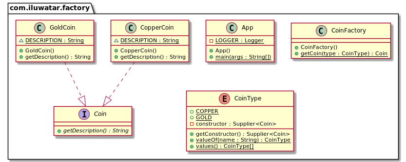

## También conocido como

* Simple Factory
* Static Factory Method

## Propósito

Proporcionar un método estático encapsulado en una clase llamada fábrica (Factory), para ocultar la lógica de
implementación y
hacer que el código del cliente se centre en el uso en lugar de inicializar nuevos objetos.

## Explicación

Ejemplo del mundo real

> Imagina un alquimista que está a punto de fabricar monedas. El alquimista debe ser capaz de crear tanto monedas de oro
> como de cobre y cambiar entre ellas debe ser posible sin modificar el código fuente existente. El patrón de fábrica lo
> hace posible proporcionando un método de construcción estático que puede ser llamado con los parámetros relevantes.

Wikipedia dice

> La fábrica (Factory) es un objeto para crear otros objetos: formalmente, una fábrica es una función o método que
> devuelve objetos de un prototipo o clase variable.

**Ejemplo programático**

Tenemos una interfaz moneda `Coin` y dos implementaciones moneda de oro `GoldCoin` y moneda de cobre `CopperCoin`.

```java
public interface Coin {
  String getDescription();
}

public class GoldCoin implements Coin {

  static final String DESCRIPTION = "This is a gold coin.";

  @Override
  public String getDescription() {
    return DESCRIPTION;
  }
}

public class CopperCoin implements Coin {
   
  static final String DESCRIPTION = "This is a copper coin.";

  @Override
  public String getDescription() {
    return DESCRIPTION;
  }
}
```

La siguiente enumeración representa los tipos de monedas que admitimos (`GoldCoin` y `CopperCoin`).

```java
@RequiredArgsConstructor
@Getter
public enum CoinType {

  COPPER(CopperCoin::new),
  GOLD(GoldCoin::new);

  private final Supplier<Coin> constructor;
}
```

Luego tenemos el método estático obtener moneda `getCoin` para crear objetos moneda encapsulados en la clase fábrica
`CoinFactory`.

```java
public class CoinFactory {

  public static Coin getCoin(CoinType type) {
    return type.getConstructor().get();
  }
}
```

Ahora en el código cliente podemos crear diferentes tipos de monedas utilizando la clase fábrica.

```java
LOGGER.info("The alchemist begins his work.");
var coin1 = CoinFactory.getCoin(CoinType.COPPER);
var coin2 = CoinFactory.getCoin(CoinType.GOLD);
LOGGER.info(coin1.getDescription());
LOGGER.info(coin2.getDescription());
```

Salida del programa:

```java
The alchemist begins his work.
This is a copper coin.
This is a gold coin.
```

## Diagrama de clases



## Aplicabilidad

Utilice el patrón de fábrica cuando solo se preocupe por la creación de un objeto, no de cómo crearlo
y gestionarlo.

Ventajas

* Permite mantener toda la creación de objetos en un solo lugar y evitar la propagación de la palabra clave 'new' a
  través de la base de código.
* Permite escribir código poco acoplado. Algunas de sus principales ventajas incluyen mejor testabilidad, código fácil
  de entender, componentes intercambiables, escalabilidad y características aisladas.

Contras

* El código se vuelve más complicado de lo que debería.

## Usos conocidos

* [java.util.Calendar#getInstance()](https://docs.oracle.com/javase/8/docs/api/java/util/Calendar.html#getInstance--)
* [java.util.ResourceBundle#getBundle()](https://docs.oracle.com/javase/8/docs/api/java/util/ResourceBundle.html#getBundle-java.lang.String-)
* [java.text.NumberFormat#getInstance()](https://docs.oracle.com/javase/8/docs/api/java/text/NumberFormat.html#getInstance--)
* [java.nio.charset.Charset#forName()](https://docs.oracle.com/javase/8/docs/api/java/nio/charset/Charset.html#forName-java.lang.String-)
* [java.net.URLStreamHandlerFactory#createURLStreamHandler(String)](https://docs.oracle.com/javase/8/docs/api/java/net/URLStreamHandlerFactory.html) (
  devuelve diferentes objetos singleton, en función de un protocolo)
* [java.util.EnumSet#of()](https://docs.oracle.com/javase/8/docs/api/java/util/EnumSet.html#of(E))
* [javax.xml.bind.JAXBContext#createMarshaller()](https://docs.oracle.com/javase/8/docs/api/javax/xml/bind/JAXBContext.html#createMarshaller--)
  y otros métodos similares.

## Patrones relacionados

* [Factory Method](https://java-design-patterns.com/patterns/factory-method/)
* [Factory Kit](https://java-design-patterns.com/patterns/factory-kit/)
* [Abstract Factory](https://java-design-patterns.com/patterns/abstract-factory/)
