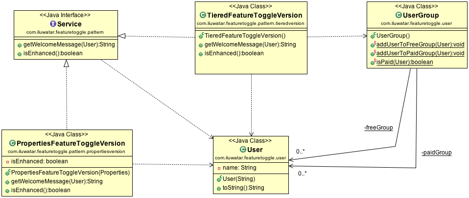

## También conocido como
Feature Flag

## Propósito
Técnica utilizada en el desarrollo de software para controlar y gestionar el despliegue de características o funcionalidades específicas en un programa sin cambiar el código. Puede actuar como un interruptor de encendido/apagado de funciones en función del estado o las propiedades de otros valores del programa. Esto es similar a las pruebas A/B, en las que las funciones se despliegan en función de propiedades como la ubicación o el dispositivo. La implementación de este patrón de diseño puede aumentar la complejidad del código, y es importante recordar eliminar el código redundante si este patrón de diseño se utiliza para eliminar gradualmente un sistema o característica.

## Explicación
Ejemplo del mundo real
> Este patrón de diseño funciona realmente bien en cualquier tipo de desarrollo, en particular en el desarrollo móvil. Digamos que quieres introducir una característica como el modo oscuro, pero quieres asegurarte de que la característica funciona correctamente y no quieres desplegar la característica a todo el mundo inmediatamente. Escribes el código y lo desactivas por defecto. A partir de aquí, es fácil activar el código para usuarios específicos basándose en criterios de selección, o aleatoriamente. Esto también permitirá que la función se desactive fácilmente sin ningún cambio drástico en el código, o cualquier necesidad de redistribución o actualizaciones.

En pocas palabras
> Feature Toggle es una forma de introducir nuevas funciones gradualmente en lugar de desplegarlas todas a la vez.

Wikipedia dice
> Una función de conmutación en el desarrollo de software proporciona una alternativa al mantenimiento de múltiples ramas de características en el código fuente. Una condición dentro del código activa o desactiva una característica durante el tiempo de ejecución. En un entorno ágil, el conmutador se utiliza en producción, para activar la función bajo demanda, para algunos o todos los usuarios.

**Ejemplo programático**
Este ejemplo muestra código Java que permite mostrar una funcionalidad cuando es activada por el desarrollador, y cuando un usuario es miembro Premium de la aplicación. Esto es útil para características bloqueadas por suscripción.

```java
public class FeatureToggleExample {
    // Bool for feature enabled or disabled
    private static boolean isNewFeatureEnabled = false;

    public static void main(String[] args) {
        boolean userIsPremium = true; // Example: Check if the user is a premium user

        // Check if the new feature should be enabled for the user
        if (userIsPremium && isNewFeatureEnabled) {
            // User is premium and the new feature is enabled
            showNewFeature();
        }
    }

    private static void showNewFeature() {
        // If user is allowed to see locked feature, this is where the code would go
    }
}
```
El código muestra lo sencillo que es aplicar este patrón de diseño, y los criterios pueden refinarse o ampliarse aún más si los desarrolladores así lo deciden.

## Diagrama de clases


## Aplicabilidad
Utilice el patrón de alternancia de funciones cuando

* Dar diferentes características a diferentes usuarios.
* Desplegar una nueva característica de forma incremental.
* Cambiar entre entornos de desarrollo y producción.
* Desactivar rápidamente funciones problemáticas.
* Gestión externa del despliegue de características.
* Capacidad de mantener múltiples versiones de una característica.
* Despliegue "oculto", liberando una característica en código para pruebas designadas, pero sin ponerla a disposición del público.

## Consecuencias
Consecuencias del uso del patrón de alternancia de funciones

* Aumenta la complejidad del código
* Probar múltiples estados es más difícil y consume más tiempo
* Confusión entre amigos sobre por qué faltan características
* Mantener la documentación actualizada con todas las características puede ser difícil.

## Créditos

* [Martin Fowler 29 October 2010 (2010-10-29).](http://martinfowler.com/bliki/FeatureToggle.html)
* [Feature Toggle - Java Design Patterns](https://java-design-patterns.com/patterns/feature-toggle/)
