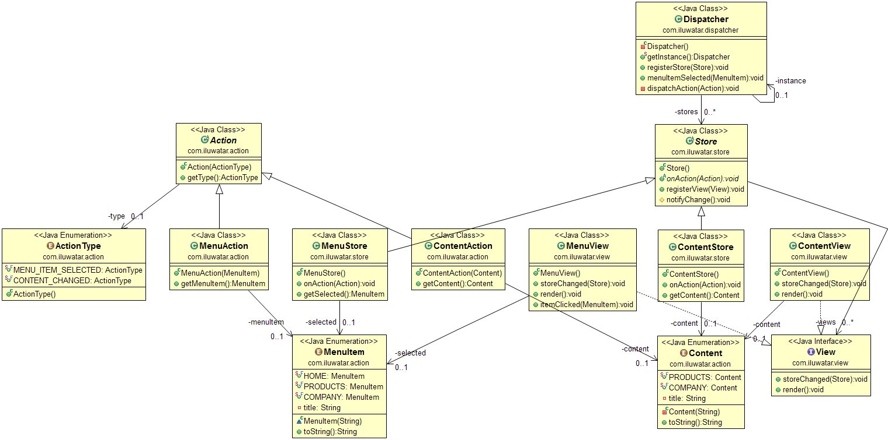

## Propósito
Flux evita MVC en favor de un flujo de datos unidireccional. Cuando un usuario
usuario interactúa con una vista, ésta propaga una acción a través de un
central, a los distintos almacenes que contienen los datos de la aplicación y la
que actualiza todas las vistas afectadas.

## Diagrama de clases

## Aplicabilidad
Utilice el patrón Flux cuando

* Debes centrarte en crear rutas de actualización explícitas y comprensibles para los datos de tu aplicación, lo que simplifica el seguimiento de los cambios durante el desarrollo y facilita la localización y corrección de errores.

## Créditos

* [Flux - Application architecture for building user interfaces](http://facebook.github.io/flux/)
