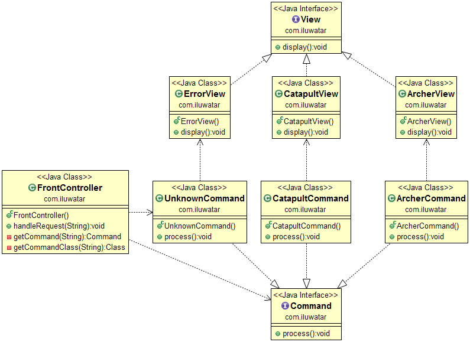

## Propósito
Introducir un gestor común para todas las solicitudes de un sitio web. De esta
manera podemos encapsular funcionalidad común como la seguridad,
internacionalización, enrutamiento y registro en un solo lugar.

## Diagrama de clases

## Aplicabilidad
Utilice el patrón del controlador frontal cuando

* Desea encapsular la funcionalidad común de gestión de peticiones en un único lugar.
* Desea implementar la gestión dinámica de peticiones, es decir, cambiar el enrutamiento sin modificar el código.
* hacer portable la configuración del servidor web, sólo necesitas registrar el manejador de forma específica para el servidor web

## Ejemplos del mundo real

* [Apache Struts](https://struts.apache.org/)

## Créditos

* [J2EE Design Patterns](https://www.amazon.com/gp/product/0596004273/ref=as_li_tl?ie=UTF8&camp=1789&creative=9325&creativeASIN=0596004273&linkCode=as2&tag=javadesignpat-20&linkId=48d37c67fb3d845b802fa9b619ad8f31)
* [Presentation Tier Patterns](http://www.javagyan.com/tutorials/corej2eepatterns/presentation-tier-patterns)
* [Patterns of Enterprise Application Architecture](https://www.amazon.com/gp/product/0321127420/ref=as_li_tl?ie=UTF8&camp=1789&creative=9325&creativeASIN=0321127420&linkCode=as2&tag=javadesignpat-20&linkId=d9f7d37b032ca6e96253562d075fcc4a)
* [J2EE Design Patterns](https://www.amazon.com/gp/product/0596004273/ref=as_li_tl?ie=UTF8&camp=1789&creative=9325&creativeASIN=0596004273&linkCode=as2&tag=javadesignpat-20&linkId=f27d2644fbe5026ea448791a8ad09c94)
